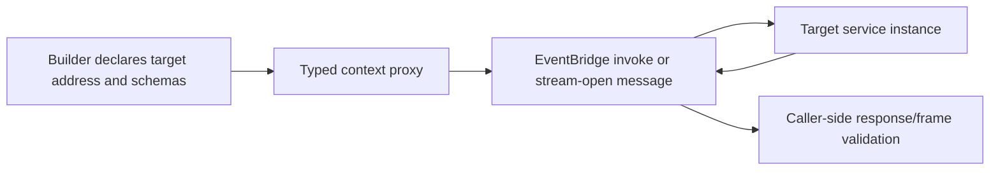

Choose the boundary before adding code. A subscription already reacts
asynchronously to an event; a synchronous downstream call adds latency and
availability coupling. Use the event payload or a local resource first when it
contains the needed fact.

The declaration is address-first; it does not import the target service or call
its handler directly. PURISTA sends the request through the EventBridge so a
local or distributed target instance can handle it. The original message's
`traceId`, `principalId`, and `tenantId` are propagated to downstream command,
stream, and queue operations. The target must still enforce its own business
authorization.

| Need | Choose | What the subscription waits for |
| --- | --- | --- |
| A typed bounded answer now | [Invoke a command](/handbook/framework/build-services/subscriptions/call-other-capabilities/invoke-command/) | The downstream command response. |
| Progressive frames and a deliberate cancellation boundary | [Consume a stream](/handbook/framework/build-services/subscriptions/call-other-capabilities/consume-a-stream/) | Each frame while the session is open. |
| Durable work with independent retry and worker operation | [Queue work from an event](/handbook/framework/build-services/subscriptions/call-other-capabilities/queue-work-from-an-event/) | Queue acceptance only. |
| An independent fact with no direct result | [Publish a custom event](/handbook/framework/build-services/subscriptions/publish-result-and-custom-events/) | The local emit operation, not another subscriber. |

Subscriptions can declare
[`canInvoke`](/handbook/api/classes/_purista_core.SubscriptionDefinitionBuilder/#caninvoke),
[`canConsumeStream`](/handbook/api/classes/_purista_core.SubscriptionDefinitionBuilder/#canconsumestream),
[`canEmit`](/handbook/api/classes/_purista_core.SubscriptionDefinitionBuilder/#canemit),
[`canInvokeAgent`](/handbook/api/classes/_purista_core.SubscriptionDefinitionBuilder/#caninvokeagent),
[`canInvokeWorkflow`](/handbook/api/classes/_purista_core.SubscriptionDefinitionBuilder/#caninvokeworkflow),
and
[`canUseHarnessModel`](/handbook/api/classes/_purista_core.SubscriptionDefinitionBuilder/#canuseharnessmodel).
The Harness capabilities remain address-first or mount-bound and are available
only when the service mounts and publishes the corresponding contracts.
They do **not** have `canEnqueue`: calling `context.queue.enqueue(...)` from a
normal subscription is rejected at runtime. Use the service-level
event-to-queue binding when an event must start durable work.

The exact normal-handler failure is `UnhandledError(403, 'queue "<name>" is
not allowed in this handler')`. Subscription input/output transforms currently
receive an unrestricted base queue namespace; keep transforms side-effect free
and do not use that implementation detail as an enqueue path.

`canInvoke(...)` rejects a blank service, version, or target with the plain
error `canInvoke requires non-empty service name, version and target`.
`canConsumeStream(...)` currently has no equivalent definition-time check, so
validate configuration-derived address parts before passing them.

For definitions and callback types, see [SubscriptionDefinitionBuilder](/handbook/api/classes/_purista_core.SubscriptionDefinitionBuilder/).
