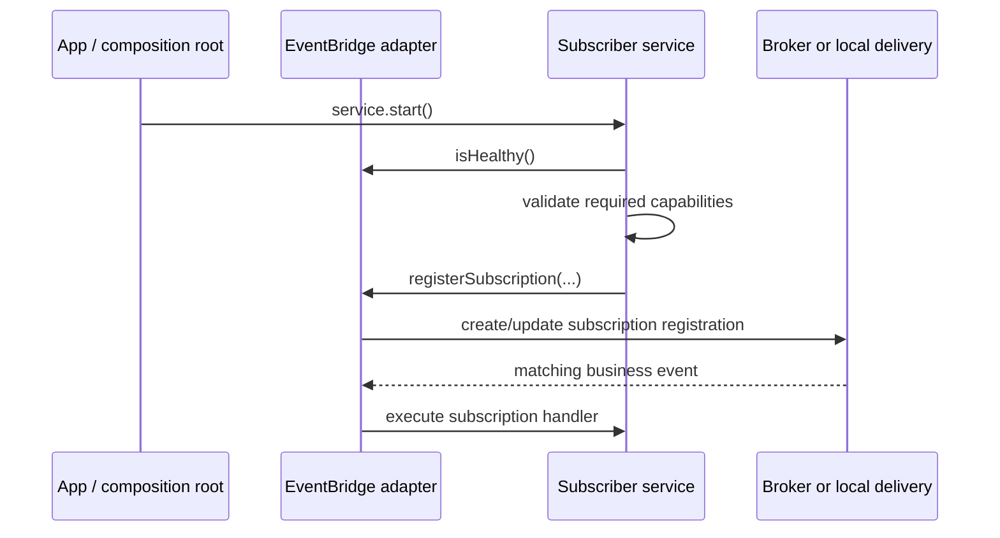
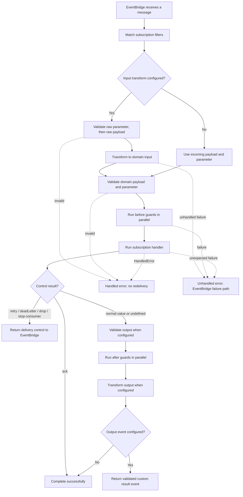

Use a subscription when an event describes a fact and another service must react
without the publisher waiting: an invoice is created, a shipment is delivered,
or an account is closed. The publisher completes its own work; the selected
EventBridge matches and delivers the event to independent subscribers.

Subscriptions are not HTTP endpoints and do not return a result to the event
publisher. They are a good fit for independent reactions. Use a command when a
caller needs a bounded reply, a queue when work acceptance and later completion
must be operated separately, and a stream when one caller needs incremental
output.

| Contract question | Subscription answer |
| --- | --- |
| Who initiates it? | A publisher emits a message or named command result; the EventBridge performs matching. |
| What is selected? | Zero, one, or multiple matching subscription registrations. |
| Who waits? | The publisher does not wait for subscription completion. Delivery acknowledgement/recovery remains between the subscriber and EventBridge. |
| What is the normal result? | Successful acknowledgement, optional delivery control, and optionally a separately named result/custom event. |
| What stays decoupled? | The publisher does not declare subscribers or know whether, when, or how many complete. |

The smallest useful definition subscribes to one named fact, validates its
payload, and performs one observable reaction:

```ts title="src/service/accounting/v1/subscription/logInvoiceCreated.ts"
import { z } from 'zod'
import { accountingV1ServiceBuilder } from '../../accountingV1ServiceBuilder.js'

export const logInvoiceCreated = accountingV1ServiceBuilder
  .getSubscriptionBuilder('logInvoiceCreated', 'Log accepted invoice events')
  .subscribeToEvent('billing.invoiceCreated', '1')
  .addPayloadSchema(z.object({ invoiceId: z.string().min(1) }))
  .setSubscriptionFunction(async function (context, payload) {
    context.logger.info({ invoiceId: payload.invoiceId }, 'invoice event received')
  })
```

After the definition is added to the service and the service is ready, a
matching event produces the `invoice event received` log and increments
`purista.subscription.executions` with `purista.outcome=success`.

[`getSubscriptionBuilder(...)`](/handbook/api/classes/_purista_core.ServiceBuilder/#getsubscriptionbuilder)
creates the service-owned definition. The chain then
[`subscribeToEvent(...)`](/handbook/api/classes/_purista_core.SubscriptionDefinitionBuilder/#subscribetoevent),
validates through
[`addPayloadSchema(...)`](/handbook/api/classes/_purista_core.SubscriptionDefinitionBuilder/#addpayloadschema),
and installs the handler with
[`setSubscriptionFunction(...)`](/handbook/api/classes/_purista_core.SubscriptionDefinitionBuilder/#setsubscriptionfunction).

## Register before an event can be delivered

The composition root calls `service.start()`. The service checks EventBridge
health, publishes service-init metadata, then registers commands,
subscriptions, and streams in that order. It initializes queues before it
publishes service-ready metadata. Each subscription is checked against the
selected bridge's capabilities before registration. In a single process, the
same EventBridge instance owns registration and delivery. In a distributed
deployment, each running subscriber registers with its own bridge adapter;
broker retention, consumer groups, and late subscriber behavior are
adapter-owned. Start the EventBridge before the subscriber service, and wait
for service readiness before relying on a subscription to receive production
events.



## See the delivery lifecycle

The normal path below is framework behavior after a bridge has selected the
message. `DefaultEventBridge` evaluates all subscription predicates in process.
Broker adapters translate the subscription record into their routing and
consumer primitives; verify the adapter-specific mapping in the
[EventBridge guide](/handbook/framework/connect-distributed-infrastructure/event-delivery/).
The adapter also determines what durable storage, redelivery, and dead-letter
capabilities it can honor.



`undefined` is a valid successful completion. `{ status: 'ack' }` is the
explicit equivalent. The other control results ask the EventBridge for a
specific action and skip output validation, after guards, and result-event
creation. A `HandledError` also completes the delivery without redelivery;
an unexpected error reaches the bridge failure path.

A transform can deliberately throw `HandledError`; that remains on the handled
path. Other transform failures are wrapped as unhandled errors.

AMQP and NATS are the shipped EventBridges that act on subscription control
errors. The default, MQTT, and HTTP/Dapr bridges log those errors without
retrying, dead-lettering, dropping, or pausing the delivery. Choose the adapter
before making a control result part of a business recovery path.

## Choose the right shape

| Need | Choose | Why |
| --- | --- | --- |
| Another service must react to a fact without delaying the producer | Subscription | The producer does not know or wait for the consumer. |
| The original caller needs a bounded result now | Command | A command has request/response semantics. |
| Work needs a backlog, lease, long retry window, or controlled replay | Queue and worker | A queue makes acceptance, retry, and recovery operationally visible. |
| A browser needs visible incremental progress | Stream | A stream stays connected to one caller and is not a durable completion guarantee. |

## Continue with the focused guide

| You need to | Read |
| --- | --- |
| Build the first validated reaction and handler | [Create and validate a subscription](/handbook/framework/build-services/subscriptions/create-and-validate/) |
| Restrict delivery to the event/message you own | [Match and filter events](/handbook/framework/build-services/subscriptions/match-and-filter-events/) |
| Convert a supported wire shape or enforce a fast invariant | [Transform and guard a subscription](/handbook/framework/build-services/subscriptions/transform-and-guard/) |
| Complete, retry, dead-letter, drop, or pause deliberately | [Acknowledge and control delivery](/handbook/framework/build-services/subscriptions/acknowledge-and-control-delivery/) |
| Publish a result event or another business fact | [Publish result and custom events](/handbook/framework/build-services/subscriptions/publish-result-and-custom-events/) |
| Invoke a command, consume a stream, or hand an event to a queue | [Call other capabilities](/handbook/framework/build-services/subscriptions/call-other-capabilities/) |
| Use stores, resources, identity, logging, metrics, and tracing | [Use subscription resources, stores, and context](/handbook/framework/build-services/subscriptions/resources-stores-and-context/) |
| Configure consumer advice, recovery, and idempotency | [Configure delivery failures and idempotency](/handbook/framework/build-services/subscriptions/delivery-failures-and-idempotency/) |
| Test logic, framework flow, and a selected EventBridge | [Test subscriptions](/handbook/framework/build-services/subscriptions/test-subscriptions/) |

For the complete API, see [SubscriptionDefinitionBuilder](/handbook/api/classes/_purista_core.SubscriptionDefinitionBuilder/).
