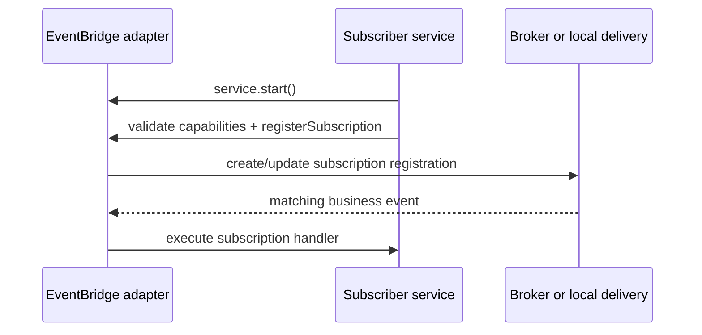
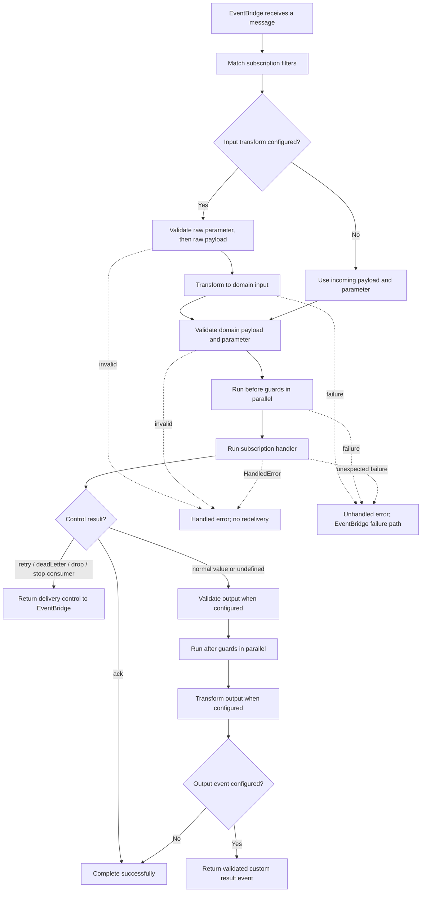

Use a subscription when an event describes a fact and another service must react
without the publisher waiting: an invoice is created, a shipment is delivered,
or an account is closed. The publisher completes its own work; the selected
EventBridge matches and delivers the event to independent subscribers.

Subscriptions are not HTTP endpoints and do not return a result to the event
publisher. They are a good fit for independent reactions. Use a command when a
caller needs a bounded reply, a queue when work acceptance and later completion
must be operated separately, and a stream when one caller needs incremental
output.

## Register before an event can be delivered

`service.start()` first checks EventBridge health, publishes service-init
metadata, then registers each subscription after validating the bridge
capabilities the definition requires. Only then does it publish service-ready
metadata. In a single process, the same EventBridge instance owns registration
and delivery. In a distributed deployment, each running subscriber registers
with its own bridge adapter; broker retention, consumer groups, and late
subscriber behavior are adapter-owned. Start the EventBridge before the
subscriber service, and wait for service readiness before relying on a
subscription to receive production events.

## See the delivery lifecycle

The normal path below is framework behavior. The EventBridge adapter determines
what delivery, durable storage, redelivery, and dead-letter capabilities it can
honor.

`undefined` is a valid successful completion. `{ status: 'ack' }` is the
explicit equivalent. The other control results ask the EventBridge for a
specific action and skip output validation, after guards, and result-event
creation. A `HandledError` also completes the delivery without redelivery;
an unexpected error reaches the bridge failure path.

## Choose the right shape

| Need | Choose | Why |
| --- | --- | --- |
| Another service must react to a fact without delaying the producer | Subscription | The producer does not know or wait for the consumer. |
| The original caller needs a bounded result now | Command | A command has request/response semantics. |
| Work needs a backlog, lease, long retry window, or controlled replay | Queue and worker | A queue makes acceptance, retry, and recovery operationally visible. |
| A browser needs visible incremental progress | Stream | A stream stays connected to one caller and is not a durable completion guarantee. |

## Continue with the focused guide

| You need to | Read |
| --- | --- |
| Build the first validated reaction and handler | [Create and validate a subscription](/handbook/framework/build-services/subscriptions/create-and-validate/) |
| Restrict delivery to the event/message you own | [Match and filter events](/handbook/framework/build-services/subscriptions/match-and-filter-events/) |
| Convert a supported wire shape or enforce a fast invariant | [Transform and guard a subscription](/handbook/framework/build-services/subscriptions/transform-and-guard/) |
| Complete, retry, dead-letter, drop, or pause deliberately | [Acknowledge and control delivery](/handbook/framework/build-services/subscriptions/acknowledge-and-control-delivery/) |
| Publish a result event or another business fact | [Publish result and custom events](/handbook/framework/build-services/subscriptions/publish-result-and-custom-events/) |
| Invoke a command, consume a stream, or hand an event to a queue | [Call other capabilities](/handbook/framework/build-services/subscriptions/call-other-capabilities/) |
| Use stores, resources, identity, logging, metrics, and tracing | [Use subscription resources, stores, and context](/handbook/framework/build-services/subscriptions/resources-stores-and-context/) |
| Configure consumer advice, recovery, and idempotency | [Configure delivery failures and idempotency](/handbook/framework/build-services/subscriptions/delivery-failures-and-idempotency/) |
| Test logic, framework flow, and a selected EventBridge | [Test subscriptions](/handbook/framework/build-services/subscriptions/test-subscriptions/) |

For the complete API, see [SubscriptionDefinitionBuilder](/handbook/api/classes/_purista_core.SubscriptionDefinitionBuilder/).
