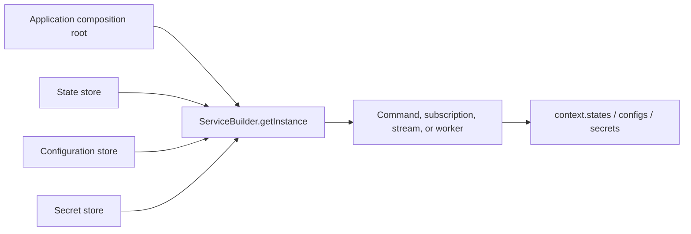

Services often need more than an incoming message: they need a durable record,
an environment-owned setting, or a sensitive value. Make that choice before
writing the handler. Fixed technical credentials belong in deployment
configuration and composition-root wiring; PURISTA provides the three store
families for values a handler actually needs at runtime.



## Choose the boundary first

| The handler needs | Store API | Correct owner | Start here |
| --- | --- | --- | --- |
| A service-owned value that must survive restart or be shared across instances | `context.states` | The application and its service contract | [Persist application state](/handbook/framework/persist-application-state/) |
| A non-sensitive operational value controlled outside a deployment | `context.configs` | Platform/application configuration | [Configuration stores](/handbook/framework/configure-applications/configuration-stores/) |
| A tenant/principal credential or another sensitive value managed while the service runs | `context.secrets` | The secret-management system and its authorization policy | [Secret stores](/handbook/framework/configure-applications/secret-stores/) |

Do not use state as a hidden configuration database or a secret store. A key
prefix does not create a tenant boundary, a transaction, encryption, retention,
or an access policy.

## Wire a store at the composition root

`ServiceBuilder.getInstance(eventBridge, options)` accepts `stateStore`,
`configStore`, and `secretStore`. When an option is omitted, PURISTA creates its
included in-memory default. That keeps local development and deterministic
tests runnable, but it is not a durable or production security boundary.

```ts title="src/application/createBillingService.ts"
import { DefaultStateStore, type EventBridge } from '@purista/core'

import { billingV1ServiceBuilder } from '../service/billing/v1/billingServiceBuilder.js'

export const createBillingService = async (eventBridge: EventBridge) => {
  const stateStore = new DefaultStateStore()

  return billingV1ServiceBuilder.getInstance(eventBridge, {
    stateStore,
  })
}
```

The default state store intentionally warns that it is for development or test
use. For a deployed service, install and wire a supported state-store adapter
or use a custom implementation. Adapter pages state their external
prerequisites, capability limits, and verification path.

## Read and write a small state record

Store operations are available to every handler as a runtime capability. The
state API has three operations; state stores enable all three by default, while
the composition root can disable one with `enableGet`, `enableSet`, or
`enableRemove`.

| Call | Signature | Result / failure boundary |
| --- | --- | --- |
| Read | `getState(...names)` | Returns an object keyed by each requested name; a missing value is `undefined`. A disabled operation rejects with an authorization error. |
| Write | `setState(name, value)` | Replaces the named value. It is not a compare-and-set or multi-key transaction. |
| Remove | `removeState(name)` | Removes one named value; make cleanup and retention explicit in the selected backend. |

```ts title="src/service/billing/v1/command/recordPayment/recordPaymentCommandBuilder.ts"
import { z } from 'zod'
import { billingV1ServiceBuilder } from '../../billingV1ServiceBuilder.js'

const recordPaymentInput = z.object({ paymentId: z.string().min(1) })
const recordPaymentOutput = z.object({ status: z.enum(['completed', 'already-completed']) })

export const recordPaymentCommandBuilder = billingV1ServiceBuilder
  .getCommandBuilder('recordPayment', 'Records one payment with a simple duplicate check')
  .addPayloadSchema(recordPaymentInput)
  .addOutputSchema(recordPaymentOutput)
  .setCommandFunction(async function (context, payload) {
    const paymentKey = `billing:v1:payment:${payload.paymentId}`
    const stored = await context.states.getState(paymentKey)

    if (stored[paymentKey]?.status === 'completed') {
      return { status: 'already-completed' }
    }

    await context.states.setState(paymentKey, { status: 'completed' })
    return { status: 'completed' }
  })
```

The first four builder calls declare the command boundary around the store
access; they do not configure the store itself. `getCommandBuilder(name,
description, eventName?)` gives the operation its stable service-local name and
optional canonical success-event name. It creates a definition builder only;
register the completed command in the service before it can execute.
[`getCommandBuilder(name, description, eventName?)`](/handbook/api/classes/_purista_core.ServiceBuilder/#getcommandbuilder)
has the exact signature and generated reference.
[`addPayloadSchema(...)`](/handbook/api/classes/_purista_core.CommandDefinitionBuilder/#addpayloadschema)
and [`addOutputSchema(...)`](/handbook/api/classes/_purista_core.CommandDefinitionBuilder/#addoutputschema)
validate the input and returned outcome. [`setCommandFunction(...)`](/handbook/api/classes/_purista_core.CommandDefinitionBuilder/#setcommandfunction)
installs the service-bound handler that receives `context`. Add a parameter
schema as well when the store key or operation is selected by a route/query
value; the complete command contract and its validation order are in [Create
and validate a command](/handbook/framework/build-services/commands/create-and-validate/).

Validate stored values before using them and derive tenant identifiers from the
trusted message context—not a request payload. Read the full handler contract
in [handler inputs and context](/handbook/framework/build-services/handler-context/),
then design the key, race, migration, and recovery strategy in [keys,
namespaces, isolation, and consistency](/handbook/framework/persist-application-state/keys-namespaces-isolation-and-consistency/).

## Continue with the selected store

Use [state stores](/handbook/framework/persist-application-state/) for durable
records, [configuration stores](/handbook/framework/configure-applications/configuration-stores/)
for non-sensitive external settings, or [secret stores](/handbook/framework/configure-applications/secret-stores/)
for runtime-managed sensitive values.
