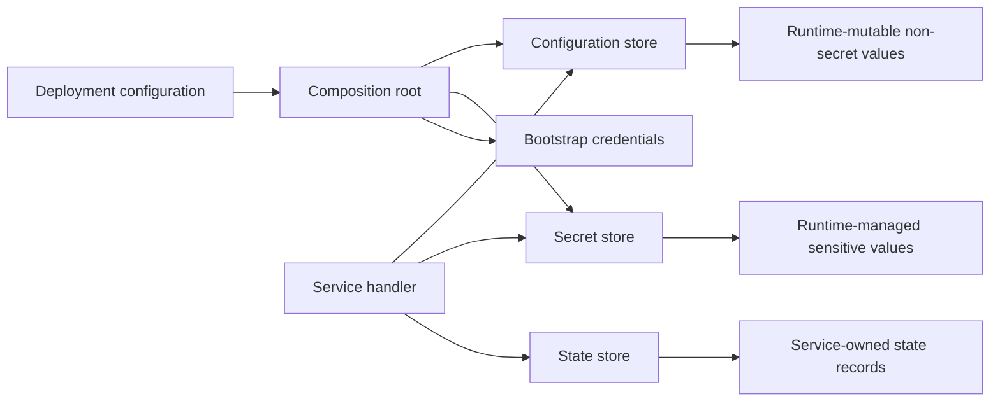

PURISTA separates deployment configuration, configuration stores, secret
stores, and state stores. Choose the boundary by who owns a value and who may
change it—not merely by whether the value is confidential. Wire concrete
adapters at the composition root and keep each responsibility narrow.

| Data | Start here | Use it for | Never use it for |
| --- | --- | --- | --- |
| Deployment and bootstrap configuration, including fixed technical credentials | [Service configuration](/handbook/framework/build-services/services/configuration/) and composition-root wiring | Database, broker, provider, and secret-store access needed to start this deployment | Tenant/principal-owned secrets or values that must be managed while the service runs |
| Runtime-mutable non-secret configuration | [Configuration stores](/handbook/framework/configure-applications/configuration-stores/) | Feature settings, limits, public endpoints, or controlled operational values | Credentials, tokens, private keys, or business records |
| Runtime-managed sensitive values | [Secret stores](/handbook/framework/configure-applications/secret-stores/) | Tenant/principal API keys, delegated credentials, or other sensitive business data that services create, rotate, revoke, or resolve at runtime | General business records, ad-hoc configuration, or a replacement for deployment bootstrap credentials |
| Service-owned state | [State stores](/handbook/framework/configure-applications/state-stores/) | Idempotency records, checkpoints, small durable workflow state | Ad-hoc configuration or secrets |

Deployment configuration is supplied through the platform’s approved secret
delivery mechanism (for example workload identity or injected process
configuration). PURISTA must not log it, place it in message contracts, or
mistake it for a Configuration Store. A Secret Store is the explicit runtime
boundary for sensitive values whose lifecycle is part of application or
business behavior.

The in-memory defaults in `@purista/core` make generated projects runnable
locally. They are not a production security or durability boundary. Replace
them deliberately, wire them at service creation, and verify the external
service before deploying. Use the [handler context reference](/handbook/framework/build-services/handler-context/)
to see exactly how `context.configs`, `context.secrets`, and `context.states`
are exposed to a command, subscription, stream, or worker.

## Continue with the next decision

| You need to | Read |
| --- | --- |
| Construct adapters once and make every service use the intended boundary | [Wire stores at the composition root](/handbook/framework/configure-applications/wire-stores-at-the-composition-root/) |
| Restrict store operations or make an explicit secret-cache decision | [Configure store operations and secret caching](/handbook/framework/configure-applications/configure-store-operations-and-secret-cache/) |
| Read or update a store inside a command, subscription, stream, or worker | [Use stores from handlers](/handbook/framework/configure-applications/use-stores-from-handlers/) |
| Validate a stable service setting or choose an environment-owned value | [Configuration defaults, validation, and precedence](/handbook/framework/configure-applications/configuration-model-defaults-validation-and-precedence/) |
| Choose a runtime configuration adapter | [Configuration stores](/handbook/framework/configure-applications/configuration-stores/) |
| Choose a runtime secret adapter | [Secret stores](/handbook/framework/configure-applications/secret-stores/) |
| Persist a service-owned record safely | [State stores](/handbook/framework/configure-applications/state-stores/) |
