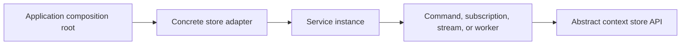

A PURISTA service is the logical container for its commands, subscriptions,
streams, and workers. The application supplies concrete store adapters when it
creates the service instance; every handler then uses the same abstract store
interfaces through `context.states`, `context.configs`, and `context.secrets`.
The handler stays independent of Redis, Vault, AWS, or another provider.

Before using these APIs, [choose the correct store boundary](/handbook/framework/configure-applications/)
and [wire its adapter at the composition root](/handbook/framework/configure-applications/wire-stores-at-the-composition-root/).



## Choose the context member

| The handler needs | Context member | Value ownership | Default operation policy |
| --- | --- | --- | --- |
| A small service-owned record that survives beyond one message | `context.states` | Application/service | Read, write, and remove are enabled. |
| A non-sensitive value managed outside the deployment | `context.configs` | Platform/application configuration | Read is enabled; write and remove are disabled. |
| A runtime-managed credential or other sensitive value | `context.secrets` | Secret-management system and its authorization policy | Read is enabled; write and remove are disabled. |

The defaults come from the PURISTA store base classes. A configured adapter can
disable an operation, in which case the call rejects with an authorization
error. Enable writes or removals only when the business flow owns that
lifecycle; see [configure store operations and secret caching](/handbook/framework/configure-applications/configure-store-operations-and-secret-cache/).

## Use the store methods

All three store families return an object keyed by every requested name. State
and configuration values are `unknown`; validate them before use. Secret values
are `string | undefined` and must never enter logs, traces, metrics, messages,
or error data.

| Context API | Purpose | Result |
| --- | --- | --- |
| `states.getState(...names)` | Read one or more state values. | Object keyed by the requested names; a missing value is `undefined`. |
| `states.setState(name, value)` | Store or replace one state value. | `Promise<void>`; this is not a transaction or compare-and-set operation. |
| `states.removeState(name)` | Remove one state value. | `Promise<void>`. |
| `configs.getConfig(...names)` | Read one or more non-sensitive configuration values. | Object keyed by the requested names. Validate the unknown values. |
| `configs.setConfig(name, value)` / `removeConfig(name)` | Change configuration when the selected policy permits it. | `Promise<void>`; disabled by default. |
| `secrets.getSecret(...names)` | Resolve one or more sensitive string values. | Object keyed by the requested names; a missing value is `undefined`. |
| `secrets.setSecret(name, value)` / `removeSecret(name)` | Manage a secret only when the service owns rotation or revocation. | `Promise<void>`; disabled by default. |

## Read configuration and state safely

This command validates the configuration-store value before applying it and
keeps the internal state key outside its public contract.

```ts title="src/service/billing/v1/command/recordPayment/recordPaymentCommandBuilder.ts"
import { z } from 'zod'

import { billingV1ServiceBuilder } from '../../billingV1ServiceBuilder.js'

const recordPaymentInput = z.object({ paymentId: z.string().min(1) })
const recordPaymentOutput = z.object({ status: z.enum(['completed', 'already-completed']) })
const paymentConfiguration = z.object({ duplicateWindowMs: z.number().int().positive() })

export const recordPaymentCommandBuilder = billingV1ServiceBuilder
  .getCommandBuilder('recordPayment', 'Records a payment once')
  .addPayloadSchema(recordPaymentInput)
  .addOutputSchema(recordPaymentOutput)
  .setCommandFunction(async function (context, payload) {
    const rawConfiguration = await context.configs.getConfig('duplicateWindowMs')
    const { duplicateWindowMs } = paymentConfiguration.parse(rawConfiguration)
    const paymentKey = `billing:v1:payment:${payload.paymentId}`
    const stored = await context.states.getState(paymentKey)

    if (stored[paymentKey] !== undefined) {
      return { status: 'already-completed' }
    }

    await context.states.setState(paymentKey, { recordedAt: Date.now(), duplicateWindowMs })
    return { status: 'completed' }
  })
```

The command contract is created with
[`getCommandBuilder(...)`](/handbook/api/classes/_purista_core.ServiceBuilder/#getcommandbuilder),
[`addPayloadSchema(...)`](/handbook/api/classes/_purista_core.CommandDefinitionBuilder/#addpayloadschema),
[`addOutputSchema(...)`](/handbook/api/classes/_purista_core.CommandDefinitionBuilder/#addoutputschema),
and [`setCommandFunction(...)`](/handbook/api/classes/_purista_core.CommandDefinitionBuilder/#setcommandfunction).
The [command creation guide](/handbook/framework/build-services/commands/create-and-validate/)
owns those builder options; this page owns the store operations used by the
handler.

This is a duplicate check, not a concurrency guarantee: separate reads and
writes can race. Use the consistency and transaction capabilities of the
selected backend when correctness depends on atomicity. Design keys, tenant
isolation, migrations, and recovery in [keys, namespaces, isolation, and consistency](/handbook/framework/configure-applications/state-stores/keys-namespaces-isolation-and-consistency/).

## Resolve secrets without exposing them

Read only the names required for the current operation and fail internally when
a required secret is absent. Pass the value directly to an injected client;
never include it in a `HandledError` or return value.

```ts title="src/service/billing/v1/command/recordPayment/recordPaymentCommandBuilder.ts"
const { paymentProviderToken } = await context.secrets.getSecret('paymentProviderToken')

if (!paymentProviderToken) {
  throw new Error('Required payment provider credential is unavailable')
}

await context.resources.paymentProvider.capture({
  paymentId: payload.paymentId,
  token: paymentProviderToken,
})
```

Prefer a narrow service resource that owns provider calls when several handlers
share the client. [Provide service resources](/handbook/framework/build-services/services/provide-resources-and-metrics/)
explains the declaration and runtime injection boundary.

## Continue with the selected adapter

- [State stores](/handbook/framework/configure-applications/state-stores/) for durable service-owned records.
- [Configuration stores](/handbook/framework/configure-applications/configuration-stores/) for non-sensitive externally managed values.
- [Secret stores](/handbook/framework/configure-applications/secret-stores/) for sensitive runtime-managed values.
- [Handler context reference](/handbook/framework/build-services/handler-context/) for the other capabilities available to each primitive.
