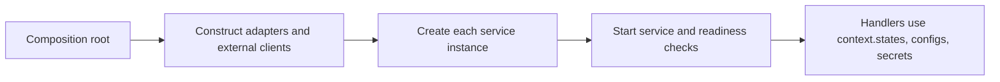

Create store adapters where the application owns infrastructure wiring—not in
a service definition or a handler. `ServiceBuilder.getInstance(eventBridge,
options)` accepts `stateStore`, `configStore`, and `secretStore`. Omitting any
one creates PURISTA's included in-memory default, which is appropriate for a
local result or deterministic test but is not a durable or production-security
boundary.



## Wire all three deliberately

The example uses local in-memory stores to make the ownership visible. Replace
only the adapter constructors—not the service definition—when the deployment
needs a supported external backend.

```ts title="src/application/createBillingService.ts"
import {
  DefaultConfigStore,
  DefaultSecretStore,
  DefaultStateStore,
  type EventBridge,
} from '@purista/core'

import { billingV1ServiceBuilder } from '../service/billing/v1/billingV1ServiceBuilder.js'

export const createBillingApplication = async (eventBridge: EventBridge) => {
  const stateStore = new DefaultStateStore()
  const configStore = new DefaultConfigStore()
  const secretStore = new DefaultSecretStore()

const service = await billingV1ServiceBuilder.getInstance(eventBridge, {
    stateStore,
    configStore,
    secretStore,
  })

  return {
    service,
    start: () => service.start(),
    destroy: async () => {
      await service.destroy()
      await Promise.all([stateStore.destroy(), configStore.destroy(), secretStore.destroy()])
    },
  }
}
```

| Call | Parameters, defaults, and intent | Runtime boundary |
| --- | --- | --- |
| [`new DefaultStateStore(options?)`](/handbook/api/classes/_purista_core.DefaultStateStore/) | The included in-memory state adapter enables reads, writes, and removal by default. | It makes a local result deterministic but is not durable or shared across processes. |
| [`new DefaultConfigStore(options?)`](/handbook/api/classes/_purista_core.DefaultConfigStore/) / [`new DefaultSecretStore(options?)`](/handbook/api/classes/_purista_core.DefaultSecretStore/) | The included configuration and secret adapters are in-memory. Both default to reads enabled and writes/removals disabled. | They are local/test fallbacks, not a production configuration or secret-management boundary. |
| [`serviceBuilder.getInstance(eventBridge, options)`](/handbook/api/classes/_purista_core.ServiceBuilder/#getinstance) | `stateStore`, `configStore`, and `secretStore` are independent optional runtime bindings. `resources`, `serviceConfig`, queue and telemetry bindings are separate options. | A supplied adapter becomes available through the matching handler-context member. The Framework does not own its `destroy()` lifecycle. |

`resources` and `serviceConfig` are separate `getInstance` options. A store
does not replace a repository resource, and a service config schema does not
turn a value into a runtime-mutable config-store entry. Read
[configuration defaults, validation, and precedence](/handbook/framework/configure-applications/configuration-model-defaults-validation-and-precedence/)
before choosing either.

## Replace a default only when the capability fits

| Store kind | Included default | Replace it when | Verify before readiness |
| --- | --- | --- | --- |
| State | In-memory; process-local | State must survive restart or be shared across instances. | Write a known record, create a fresh service/process, and read/recover it. |
| Configuration | In-memory; local/test | An environment-owned non-secret setting must be shared or changed outside deployment. | Read a known allowed key using the deployed identity and expected namespace. |
| Secret | In-memory; local/test | A runtime-managed secret needs backend policy, audit, encryption, or rotation. | Resolve only a non-sensitive test secret with the workload identity; do not log its value. |

Installing an adapter package only makes its constructor importable. Provision
the external backend, grant the narrow identity/policy, configure the adapter,
pass it into every relevant service instance, and test the adapter boundary.
Each adapter guide supplies its package and platform prerequisites.

## Keep lifecycle ownership explicit

When a store or its client owns sockets, timers, or buffered work, initialize
it before services start and close it during the application shutdown path.
Do not construct a new adapter per message: doing so loses connection reuse,
makes shutdown incomplete, and can bypass intended cache or identity behavior.

`service.destroy()` stops the service and its queue work; it does not destroy
the state, configuration, or secret stores supplied to `getInstance`. The
composition root owns every shared adapter, stops every dependent service, and
then calls each adapter's `destroy()` exactly once. For a remote store that
connects lazily, perform a safe, provider-appropriate readiness probe before
the service accepts traffic rather than assuming construction proved
connectivity.

The exact handler methods and operation flags remain on the owning guides:
[configuration stores](/handbook/framework/configure-applications/configuration-stores/),
[secret stores](/handbook/framework/configure-applications/secret-stores/), and
[state stores](/handbook/framework/persist-application-state/). For handler
context and safe value use, continue with
[Use stores in a service](/handbook/framework/build-services/use-stores-in-a-service/).
