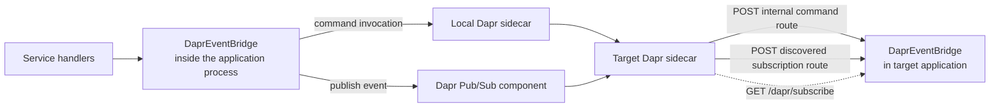

Use `DaprEventBridge` when Dapr is the chosen boundary for calling another
PURISTA service and publishing domain events. It hosts the HTTP routes that a
Dapr sidecar calls; the sidecar owns cross-process invocation and the selected
Pub/Sub component owns event delivery. It is not a QueueBridge and does not
support PURISTA streams.



The application owns the bridge and its HTTP listener. Dapr owns the sidecar
and the configured components. A target service must use the app-ID convention
that the bridge generates: by default it is `app-<kebab-service>-v<kebab-version>`.
For example, `support` version `1` becomes `app-support-v1`.

## Enable the bridge and register services first

`@purista/dapr-sdk` is an optional runtime package. Node applications also need
the Hono Node listener adapter because `DaprEventBridge` hosts callback routes.

```bash title="Install the Dapr EventBridge dependencies"
npm install @purista/dapr-sdk @hono/node-server
```

Provision a Dapr sidecar and a Pub/Sub component before starting the process.
The component name must match `clientConfig.pubSubName` (`pubsub` by default),
and it must be scoped and authorized for this workload. Package installation
does not create the sidecar, component, identity, or network policy.

```ts title="src/application/startSupportService.ts"
import { serve } from '@hono/node-server'
import { DaprEventBridge } from '@purista/dapr-sdk'

import { supportV1Service } from '../service/support/v1/supportV1Service.js'

const eventBridge = new DaprEventBridge({ serve })

const service = await supportV1Service.getInstance(eventBridge)
await service.start()

// Subscription routes and Dapr's discovery endpoints now exist.
await eventBridge.start()
```

Start every service before the bridge when any service registers a
subscription. The HTTP bridge rejects subscription registration after it has
started, and the Dapr discovery response only includes subscriptions already
registered at that point. After `eventBridge.start()` the listener exposes
`/healthz`, `/dapr/subscribe`, `/dapr/config`, internal PURISTA command and
subscription routes, and eligible REST command projections.

Use the bridge readiness methods during deployment checks:

| Check | What it proves | What it does not prove |
| --- | --- | --- |
| `eventBridge.isReady()` | The hosted bridge has started and is not shutting down. | The sidecar or its components are reachable. |
| `eventBridge.isHealthy()` | The bridge is started and the sidecar metadata endpoint responds. | Pub/Sub delivery, component authorization, or a remote service round trip. |
| `GET /healthz` | The bridge is started and the sidecar metadata endpoint responds; it returns `500` otherwise. | The sidecar can access every selected component. |

Run a protected command invocation and publish/receive one event as the final
deployment verification. A healthy sidecar metadata endpoint is necessary but
not sufficient evidence for those business paths.

## Understand the supported boundary

| PURISTA capability | Dapr EventBridge behavior | Design consequence |
| --- | --- | --- |
| Commands | Sends the full PURISTA command envelope through Dapr service invocation and receives the response over HTTP. | The caller is coupled to target availability and response latency. |
| Custom events | Publishes the event to `v1.0/publish/<pubSubName>/<eventName>`. | The selected Pub/Sub component determines retention, redelivery, ordering, and durability. |
| Event-name subscriptions | Registers a Dapr-discoverable topic and an application callback route. Only subscriptions with an `eventName` can register. | Keep handlers idempotent; routing by other subscription criteria is not supported by this adapter. |
| REST-exposed commands | Hosts the projection when the command declares HTTP exposure and `enableRestApiExpose` is enabled. | Put authentication and ingress policy in front of the application listener. |
| PURISTA streams | Unsupported; the bridge advertises `supportsStreams: false`. | A service that contains a stream cannot start on this bridge. Use a queue plus persisted status/updates instead. |
| Queues and workers | Not supplied by this EventBridge. | Select and wire a QueueBridge separately when work must outlive the request. |
| Strict command validation | `commandHandling.strictMode` is `false`. | A successful service start does not prove every requested command-delivery guarantee is supported; test the real sidecar invocation boundary. |

The bridge uses HTTP request/response transport for commands. It does not add
durable commands or durable subscriptions, manual acknowledgement, bounded
retry, delayed retry, or dead-letter handling to PURISTA. Those properties, if
available, belong to the selected Dapr Pub/Sub component and its policy; test
the real component before making a delivery promise.

## Configure the application listener and sidecar client

The default listener is `127.0.0.1:8080` (`SERVER_HOST` overrides the host and
`APP_PORT` overrides the port). The
default sidecar endpoint is `http://127.0.0.1:3500`, using `DAPR_HOST` and
`DAPR_HTTP_PORT` when they are set. The defaults are useful for a local sidecar
only; they do not make Dapr available in a container or production cluster.

| Setting | Default | Use it when |
| --- | --- | --- |
| `serverHost`, `serverPort` | `SERVER_HOST` or `127.0.0.1`; `APP_PORT` or `8080` | The sidecar, ingress, or platform runs the application listener at another address. |
| `pathPrefix` | `purista` | Internal Dapr invocation routes need a different prefix. Update the matching sidecar/ingress route as well. |
| `apiPrefix` | `api` | Public REST projections need a different mount path. This does not expose a command by itself. |
| `enableRestApiExpose` | `true` | Disable every generated REST command projection; command metadata still controls which commands are eligible. |
| `subscriptionPayloadAsCloudEvent` | `true` | Set `false` only if the calling Pub/Sub path sends the raw PURISTA envelope instead of a CloudEvent. |
| `commandPayloadAsCloudEvent` | `false` | Set `true` only if the sidecar or proxy wraps internal command envelopes in CloudEvents. |
| `enableHttpCompression` | `true` | Disable compression only when an upstream policy or workload makes it unsuitable. |
| `clientConfig.pubSubName` | `pubsub` | The deployed Dapr Pub/Sub component has another name. |
| `clientConfig.appPrefix` | `app-` | Your Dapr app IDs use a different common prefix. Keep the service/version suffix convention. |
| `clientConfig.daprHost`, `clientConfig.daprPort` | `DAPR_HOST` / `DAPR_HTTP_PORT`, otherwise `http://127.0.0.1` / `3500` | The local sidecar is reachable at another endpoint. |
| `clientConfig.daprApiVersion`, `clientConfig.isKeepAlive` | `v1.0`, `true` | A compatible sidecar endpoint requires another API version or connection-reuse policy. |
| `clientConfig.daprApiToken` | Unset | Dapr API-token authentication is enabled. Inject it through deployment secret delivery and never log it. |

When supplying `clientConfig`, provide a complete
[`DaprClientConfig`](/handbook/api/) object. The bridge's constructor selects a
default client configuration only when the nested object is omitted; it does
not merge a partial nested object with those defaults. Prefer `DAPR_HOST` and
`DAPR_HTTP_PORT` for the usual deployment-specific endpoint change.

```ts title="src/application/daprEventBridge.ts"
import { serve } from '@hono/node-server'
import { DaprEventBridge, type DaprClientConfig } from '@purista/dapr-sdk'

const clientConfig = {
  daprApiVersion: 'v1.0',
  daprHost: process.env.DAPR_HOST ?? 'http://127.0.0.1',
  daprPort: process.env.DAPR_HTTP_PORT ?? '3500',
  appPrefix: 'app-',
  pubSubName: 'support-events',
  isKeepAlive: true,
} satisfies DaprClientConfig

export const eventBridge = new DaprEventBridge({ serve, clientConfig })
```

Do not change `pathPrefix`, `apiPrefix`, `appPrefix`, or `pubSubName` in one
workload alone: each changes an address shared with Dapr routing, other
services, or the deployed component.

## Operate the boundary safely

The bridge's `destroy()` path starts HTTP shutdown, rejects new requests with
`503`, waits for in-flight requests, then closes the hosted server. Place it
before services in graceful shutdown so the process stops accepting Dapr calls
before handlers and their dependencies are torn down.

Do not assume a sidecar gives business exactly-once delivery. Make event
handlers idempotent, configure Dapr component retries/dead letters outside the
application, and monitor both application `/healthz` and sidecar/component
health. Keep sidecar tokens and component credentials out of logs, traces, and
source control.

Next: configure the [Dapr platform integration](/handbook/framework/connect-distributed-infrastructure/platform-integrations/dapr/), review [subscription delivery and idempotency](/handbook/framework/build-services/subscriptions/delivery-failures-and-idempotency/), or choose [queue delivery](/handbook/framework/connect-distributed-infrastructure/queue-delivery/) for durable work.
