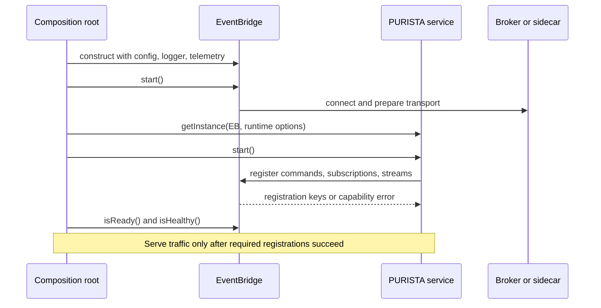

The EventBridge is PURISTA's typed message transport. A service registers its
commands, subscriptions, and streams with the selected bridge during startup.
Callers use the same bridge to invoke commands, emit events, and open supported
streams. Changing the adapter can move the same service definitions from one
process to distributed runtimes, but it changes real delivery and failure
guarantees.



For Default, AMQP, NATS, and MQTT, start the bridge before instantiating and
starting services. `DaprEventBridge` is the deliberate exception: services
register routes and subscriptions before its hosted listener starts, because
Dapr discovery is built from those registrations. A custom adapter must state
which lifecycle it implements. Follow the adapter page instead of applying one
startup order blindly.

Stop intake before service shutdown, wait for supported drain, then destroy the
bridge. A service that requests strict command, consumer-failure, or stream
behavior fails startup when `eventBridge.capabilities` cannot honor it.

## Choose the runtime boundary first

| Bridge | Availability | Choose when | Important limit |
| --- | --- | --- | --- |
| Default | Included in `@purista/core` | One process, local development, deterministic integration tests, incremental streams | No cross-process delivery or broker-backed durability |
| AMQP | `@purista/amqpbridge` plus RabbitMQ/AMQP broker | Broker-confirmed command/reply and durable consumer operations fit existing AMQP operations | No PURISTA streams; default payload encrypter is pass-through |
| NATS | `@purista/natsbridge` plus NATS | NATS request/reply and JetStream-backed durable subscriptions fit the platform | No PURISTA streams; durable guarantees depend on JetStream and strict configuration |
| MQTT | `@purista/mqttbridge` plus MQTT 5 broker | IoT/pub-sub interoperability is the primary boundary | No PURISTA streams or full broker-managed retry/DLQ consumer contract |
| Dapr | `@purista/dapr-sdk` plus deployed sidecar/components | The platform owns pub/sub and invocation adapters | No PURISTA streams; package installation does not deploy or authorize the sidecar |
| Custom | Application-owned implementation | An unsupported transport can implement and prove the complete contract | You own correlation, registration, capabilities, drain, recovery, telemetry, and compatibility |

Do not choose by broker brand alone. Decide whether commands and subscriptions
must survive restarts, whether consumers need bounded/delayed retry or dead
letters, how responses are confirmed, how late responses are handled, and
whether a stream must cross processes.

## Read the capability matrix as a startup contract

Every bridge exposes [`EventBridgeCapabilities`](/handbook/api/types/_purista_core.EventBridgeCapabilities/).
PURISTA uses it for strict validation rather than silently weakening a service
definition.

| Capability family | Questions it answers |
| --- | --- |
| Commands | Transport shape, restart durability, local cancellation, response confirmation, late responses, strict-mode support |
| Subscriptions | Durable delivery, manual acknowledgement, bounded/delayed retry, drop/stop/dead-letter choices, pause/resume, fatal classification |
| Streams | Incremental frames, consumer cancellation, aggregate final, graceful drain, late-frame handling |
| Lifecycle | Readiness, health, in-flight counts, graceful drain, paused consumers, resume control |

Transport durability is not exactly-once business execution. A consumer can
receive a message again after timeout, reconnect, redelivery, or crash. Keep
side effects idempotent and make retry/dead-letter policy explicit in the
subscription or command design.

## Wire the selected bridge at the composition root

The smallest local composition uses the included bridge:

```ts title="src/bootstrap.ts"
import { DefaultEventBridge } from '@purista/core'
import { invoiceV1Service } from './service/invoice/v1/invoiceV1Service.js'

const eventBridge = new DefaultEventBridge()
await eventBridge.start()

const invoiceService = await invoiceV1Service.getInstance(eventBridge)
await invoiceService.start()

if (!(await eventBridge.isReady())) {
  throw new Error('EventBridge did not become ready after service registration.')
}
```

All first-party bridges inherit shared configuration for `instanceId`,
`defaultCommandTimeout` (30 seconds), logger/log level, tracing, and metrics.
Each adapter adds broker-specific connection, subject/queue, retry, security,
and lifecycle options. Use its focused page instead of copying configuration
from another bridge.

## Decide stream support before designing a distributed stream

Only `DefaultEventBridge` currently advertises PURISTA incremental delivery,
consumer cancellation, graceful stream drain, and aggregate-final support.
AMQP, NATS, MQTT, and Dapr advertise `supportsStreams: false`; registering a
service that contains a stream fails at startup. Hono cannot bypass that
transport contract. For distributed work, use a queue plus persisted result or
progress events until the deployed EventBridge explicitly supports streams.

## Verify the behavior you will depend on

After configuration, using the selected adapter's registration/start order:

1. start the real broker or sidecar and satisfy its external dependencies;
2. start/register the bridge and services in the adapter's documented order;
3. invoke one command and emit one event;
4. fail a consumer intentionally and observe the configured retry, pause, drop, or dead-letter result;
5. restart or disconnect the relevant process and verify only the durability guarantees you selected;
6. inspect readiness, health, in-flight counts, safe logs, traces, and metrics;
7. drain and shut down without accepting new work.

The core mock proves service logic against a declared capability set. It does
not prove broker ACLs, routing, retention, reconnect behavior, ordering, or
dead-letter operations.

Continue with the [default bridge](/handbook/framework/connect-distributed-infrastructure/event-delivery/default/),
[AMQP](/handbook/framework/connect-distributed-infrastructure/event-delivery/amqp-rabbitmq/),
[NATS](/handbook/framework/connect-distributed-infrastructure/event-delivery/nats/),
[MQTT](/handbook/framework/connect-distributed-infrastructure/event-delivery/mqtt/),
[Dapr](/handbook/framework/connect-distributed-infrastructure/event-delivery/dapr/), or
[build a custom EventBridge](/handbook/framework/connect-distributed-infrastructure/event-delivery/custom-event-bridge/).
