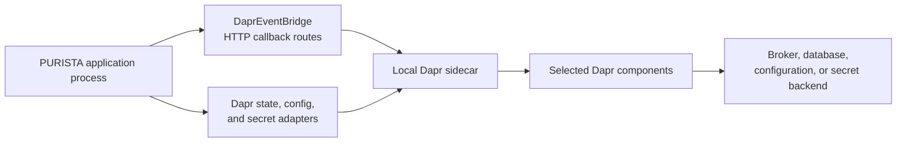

`@purista/dapr-sdk` is the optional adapter package for a Dapr-operated
application. It can provide command/event delivery and Dapr-backed state,
configuration, and secret stores. Each capability is independent: selecting
the package does not automatically create a sidecar, deploy a component, or
wire every store into a service.



Choose Dapr when the platform team already operates this sidecar and its
components, and you want business services to stay independent of the backing
broker and stores. Do not use it merely to defer decisions about retention,
access control, backup, or delivery guarantees: those are still component and
platform decisions.

## Choose only the components you need

```bash title="Install the Dapr SDK"
npm install @purista/dapr-sdk
```

Add `@hono/node-server` when a Node application uses `DaprEventBridge`, because
the bridge needs a listener for Dapr callbacks:

```bash title="Install the Node callback listener"
npm install @hono/node-server
```

| Application need | PURISTA adapter | Dapr prerequisite | Important limit |
| --- | --- | --- | --- |
| Call commands across services and publish/receive events | `DaprEventBridge` | Sidecar and a scoped Pub/Sub component | No PURISTA streams, queues, bridge-managed retry, or dead letters. |
| Persist service state | `DaprStateStore` | Sidecar and a named state component | Uses basic get, set, and delete; no transaction or ETag controls through `context.states`. |
| Read application configuration | `DaprConfigStore` | Sidecar and a named configuration component | Read-only; it has no mutation implementation (`setConfig`/`removeConfig` throw `NotImplemented` if their operation is enabled). |
| Read secrets | `DaprSecretStore` | Sidecar and a named secret component with workload authorization | Read-only; rotation and mutation remain platform-owned. |

The stores use the local sidecar endpoint by default. Their constructors merge
the supplied `clientConfig` over the Dapr defaults, so set only the fields that
differ from `DAPR_HOST`, `DAPR_HTTP_PORT`, API version, or keep-alive policy.
The EventBridge has a stricter nested-client rule; see [Dapr event delivery](/handbook/framework/connect-distributed-infrastructure/event-delivery/dapr/#configure-the-application-listener-and-sidecar-client) before replacing its `clientConfig`.

## Compose a service with the selected Dapr adapters

This application uses all four adapters. Remove any store that the service does
not need; an adapter affects the service only when it is passed to
`getInstance(...)`.

```ts title="src/application/startSupportService.ts"
import { serve } from '@hono/node-server'
import {
  DaprConfigStore,
  DaprEventBridge,
  DaprSecretStore,
  DaprStateStore,
} from '@purista/dapr-sdk'

import { supportV1Service } from '../service/support/v1/supportV1Service.js'

const eventBridge = new DaprEventBridge({ serve })
const stateStore = new DaprStateStore({ stateStoreName: 'support-state' })
const configStore = new DaprConfigStore({ configStoreName: 'support-config' })
const secretStore = new DaprSecretStore({ secretStoreName: 'support-secrets' })

const service = await supportV1Service.getInstance(eventBridge, {
  stateStore,
  configStore,
  secretStore,
})

await service.start()
await eventBridge.start()
```

Starting the service before the EventBridge is required when the service has
subscriptions: the bridge must add their callback routes before its listener
starts and Dapr discovers them. The listener then exposes `/healthz`,
`/dapr/subscribe`, and `/dapr/config` in addition to PURISTA command and
subscription routes. Dapr actor configuration returns no entities because this
adapter does not use Dapr actors.

## Provision and verify the real boundary

Provision each named component in the workload namespace before deploying the
application. Its component policy must grant exactly the service's required
operations; a Dapr component name is not an authorization boundary by itself.

| Before accepting traffic | Evidence |
| --- | --- |
| Sidecar can reach the configured component | Sidecar metadata and one least-privilege read/invocation succeed. |
| Component is scoped to this app and namespace | An unrelated workload cannot access it by name. |
| App IDs match command routing | One command reaches the expected service/version through Dapr service invocation. |
| Pub/Sub topic and subscription discovery match | A test event reaches the expected registered subscription exactly as the deployed component delivers it. |
| State, config, and secrets meet their distinct policies | A restart preserves required state; config reads the expected value; a permitted secret read succeeds without revealing the value in telemetry. |
| Shutdown stops new callback requests first | During termination, the bridge reports unavailable before service dependencies are destroyed. |

Keep backing-store retention, Dapr component retries/dead letters, encryption,
identity, namespace rules, and component version compatibility under platform
change control. The SDK forwards requests through the sidecar; it does not
turn an unavailable component into an in-memory fallback or make a component's
delivery guarantees uniform across providers.

## Continue with the focused guide

- [Deliver events through Dapr](/handbook/framework/connect-distributed-infrastructure/event-delivery/dapr/) explains Dapr command/event routing, listener settings, and startup order.
- [Persist state through Dapr](/handbook/framework/persist-application-state/dapr/) covers state component wiring and limits.
- [Store configuration through Dapr](/handbook/framework/configure-applications/configuration-stores/dapr/) covers read-only configuration access.
- [Store secrets through Dapr](/handbook/framework/configure-applications/secret-stores/dapr/) covers secret component identity and namespace metadata.
