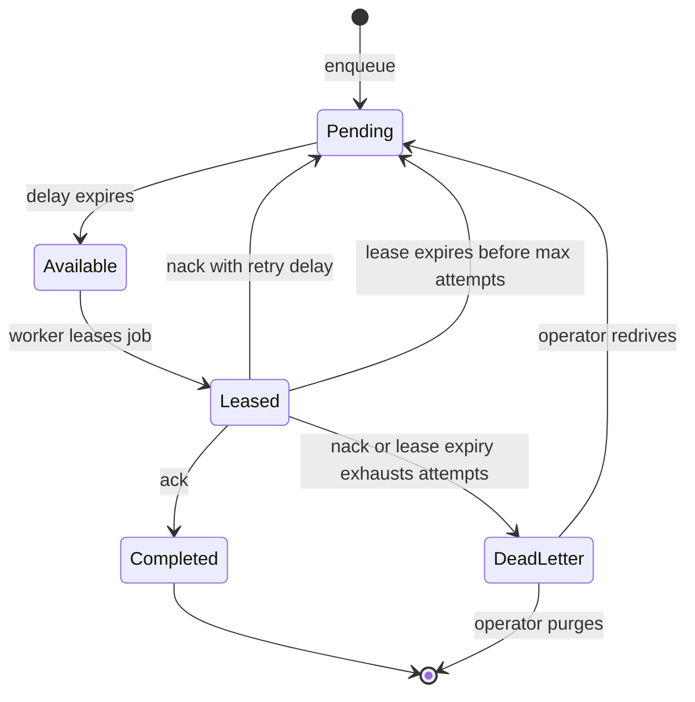

A QueueBridge stores jobs, leases work to workers, and can provide retries, delayed delivery, dead-letter handling, and idempotency. The queue definition remains service-owned; the bridge is application infrastructure.



The bridge owns visibility, leasing, settlement, and recovery. The service owns
the typed queue and worker definitions. A worker must acknowledge only after
its business effect is safely complete; lease expiry can cause the same job to
run again.

| Bridge | Availability | What it can prove | Main limit |
| --- | --- | --- | --- |
| Default | Included in core | Local FIFO, delay, lease recovery, and dead-letter flow | Everything disappears with the process; no idempotency-key enforcement |
| Redis | `@purista/redis-queue-bridge` + Redis | Durable jobs, leases, delayed jobs, inspectable/replayable DLQ, duplicate enqueue returns the original job ID | Still at-least-once worker execution; external side effects must be idempotent |
| NATS | `@purista/nats-queue-bridge` + JetStream | Durable pull workers, delayed jobs, inspectable/replayable DLQ, duplicate enqueue returns the original job ID | Still at-least-once worker execution; JetStream is mandatory |
| Custom | Application-owned adapter | A provider with complete, verified leasing and recovery semantics | You own persistence, settlement, capability truthfulness, and repair support |

Pass the selected bridge when creating the service. Installing it without this runtime wiring leaves the service on its default QueueBridge.

```ts title="src/index.ts"
import { DefaultEventBridge, DefaultQueueBridge } from '@purista/core'
import { reportingV1Service } from './service/reporting/v1/reportingV1Service.js'

const eventBridge = new DefaultEventBridge()
await eventBridge.start()

const queueBridge = new DefaultQueueBridge()
const reportingService = await reportingV1Service.getInstance(eventBridge, { queueBridge })
await reportingService.start()
```

[`ServiceBuilder.getInstance(eventBridge, { queueBridge })`](/handbook/api/classes/_purista_core.ServiceBuilder/#getinstance)
binds the adapter to that service instance. `service.start()` starts and checks
the QueueBridge, validates queue requirements against its advertised
capabilities, and registers workers. Verify the smallest path by enqueueing one
job, observing the worker's effect, and checking that a successful lease is
acknowledged. Then force a worker failure and confirm the configured retry or
dead-letter result.

`idempotencyEnforcement` means the **enqueue** boundary deduplicates the same
queue/idempotency key. It does not make a later provider call, database write,
or worker execution exactly once. Keep the worker's business effect
idempotent, then select [Redis](/handbook/framework/connect-distributed-infrastructure/queue-delivery/redis/)
or [NATS JetStream](/handbook/framework/connect-distributed-infrastructure/queue-delivery/nats/)
when that enqueue guarantee is required.

Next: [chapter overview](/handbook/framework/connect-distributed-infrastructure/), or return to [queues and workers](/handbook/framework/build-services/queues-and-workers/) to define the job and worker contract.

When the supported adapters do not fit, see [Build a custom QueueBridge](/handbook/framework/connect-distributed-infrastructure/queue-delivery/custom-queue-bridge/). Do not wrap an in-memory queue as a production bridge; restart recovery and idempotency must be implemented by the selected provider boundary.
