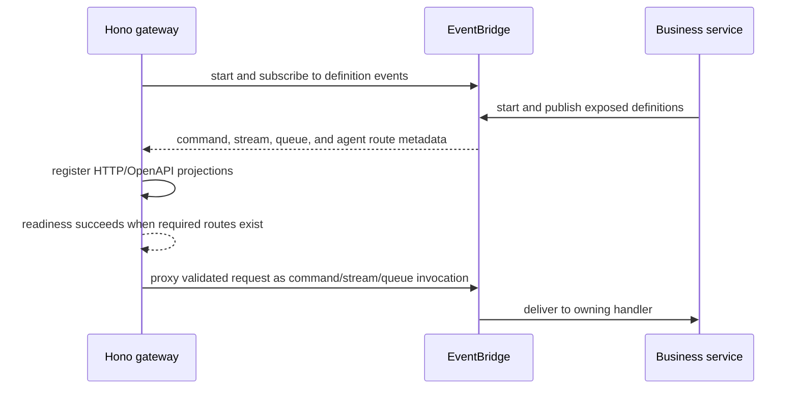

Hono is a projection service. It owns public HTTP transport, authentication,
OpenAPI, request/response mapping, and health. Business commands, streams,
queues, and attached agents remain in their owning PURISTA services.

| Mode | Route source | Startup consequence |
| --- | --- | --- |
| Monolith | Service definitions passed directly during startup | Start services, collect definitions, then create/listen with Hono |
| Independent gateway | Definition events consumed through the EventBridge | Start the gateway bridge listener before or coordinate with service registration; readiness depends on required route discovery |

If the transport does not retain/replay definition events for late consumers,
starting Hono after services can leave the route table incomplete. Use the
documented adapter mode and readiness policy rather than treating process
health as route readiness.

Compile the gateway as its own entry point in a distributed topology. Give it
only EventBridge access, authentication/secret material, public listener
configuration, and telemetry it needs. Do not inject business stores or service
resources into the gateway.

The [HTTP runtime architecture guide](/handbook/framework/expose-and-consume-services/http-and-rest/runtime-architecture/)
owns exact Hono construction, direct-definition and event-driven modes,
configuration, authentication, error mapping, and OpenAPI. Primitive exposure
pages own their command/stream/queue/agent projection options.
