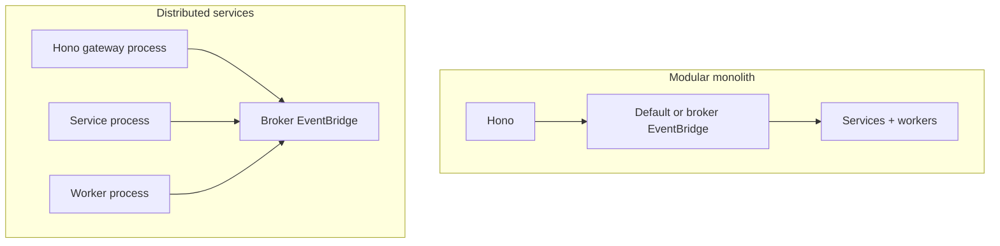

PURISTA service definitions do not decide the deployment topology. The
composition root decides which services share a process, which EventBridge and
QueueBridge connect them, where Hono runs, and which stores, credentials,
telemetry, and shutdown policy each workload owns.

## Choose the smallest sufficient topology

| Shape | Choose when | Main operational consequence |
| --- | --- | --- |
| Modular monolith | One release, failure domain, and scaling unit is sufficient | Lowest coordination cost; all local participants start and drain together |
| Distributed services | A service needs independent ownership, scaling, security, or release | Broker, discovery, identity, contract compatibility, partial failure, and cross-process telemetry become production dependencies |
| Kubernetes/Dapr | The platform already owns workload scheduling or sidecars | Probes, workload identity, component scoping, network policy, and rollout ordering must be configured explicitly |
| Serverless/edge | The runtime supports the required Node/Bun APIs and lifecycle | Do not assume a long-lived connection, local durable files, background drain, native addon, or process signal |

A distributed deployment is not automatically more reliable. Extract one
service only when the network boundary solves an ownership, scale, isolation,
or release problem worth its new failure modes.

## Follow the deployment path

1. [Compile and run a modular monolith](/handbook/framework/deploy-applications/modular-monolith/) for the first production-shaped process.
2. [Compile and run distributed services](/handbook/framework/deploy-applications/distributed-services/) when a service must become an independent workload.
3. [Deploy the HTTP gateway](/handbook/framework/deploy-applications/http-gateway/) with the correct monolith or EventBridge discovery mode and startup order.
4. [Deploy workers and scheduled entry points](/handbook/framework/deploy-applications/workers-and-scheduled-entry-points/) as separately scalable workloads and external triggers.
5. [Deploy to Kubernetes or Dapr](/handbook/framework/deploy-applications/kubernetes-and-dapr/) when those platforms own the runtime.
6. [Deploy to serverless and edge runtimes](/handbook/framework/deploy-applications/serverless-and-edge/) only within their connection, process, and durability constraints.

Before release, replace local-only stores and bridges where the business needs
shared state or durability, inject credentials through the selected secret
boundary, configure one telemetry pipeline per process, and test graceful
shutdown plus the selected real adapters.
