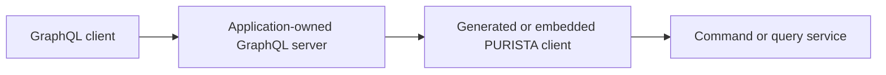

Use GraphQL when a client needs a deliberately shaped read graph or flexible
field selection. PURISTA does not ship a GraphQL builder, schema generator, or
server adapter. Your application owns the GraphQL runtime, schema, transport
security, query cost limits, and deployment; PURISTA continues to own the
business command and service contracts.



## Enable GraphQL deliberately

Install `graphql` and a server/runtime selected by your application. They are
optional application dependencies, not PURISTA adapters. Their exact package
and setup belong to the server you choose; no `@purista/*` package enables
GraphQL automatically.

Before adding a resolver, generate or compose the PURISTA client it will call.
For a separate service runtime, use an EventBridge client as shown in [service
clients](/handbook/framework/expose-and-consume-services/service-clients/). A
generated `EventBridgeClient` exposes a camel-cased service getter and a
versioned member such as `billing['v1'].createInvoice(payload, parameter)`.

## Map one resolver to one business contract

Keep GraphQL input and output focused on the consumer. Convert that shape at
the resolver boundary, then call a small PURISTA command. The generated client
still validates the service contract at the receiving service; GraphQL
validation does not replace command validation.

```ts title="src/graphql/resolvers/invoice.ts"
import type { EventBridgeClient } from '@acme/billing-client'

type GraphqlContext = {
  principalId: string
  tenantId: string
  billingClient: EventBridgeClient
}

export const invoiceResolvers = {
  Mutation: {
    createInvoice: async (
      _parent: unknown,
      args: { input: { customerId: string; amountCents: number } },
      context: GraphqlContext,
    ) =>
      context.billingClient.billing['v1'].createInvoice(
        {
          customerId: args.input.customerId,
          amountCents: args.input.amountCents,
        },
        {},
        {
          principalId: context.principalId,
          tenantId: context.tenantId,
        },
      ),
  },
}
```

The `EventBridgeClient` name, service getter, version, and method come from
your generated definitions. Do not copy the example names into a schema; use
the generated client package as the source of truth.

For an embedded modular monolith, inject the application's service caller in
the same context shape. Do not create a fresh service instance or an anonymous
bridge in each resolver: that bypasses composition, resource lifecycle, and
observability controls.

## Design the public graph separately

| Requirement | Recommendation | Why |
| --- | --- | --- |
| A write with a single business outcome | GraphQL mutation → one command | The command remains the authoritative write contract. |
| A client-specific aggregate read | Dedicated read/query service or projection | Avoid turning a resolver into cross-service orchestration. |
| Nested fields across many records | Batch at the application adapter | Prevent N+1 calls; keep batching logic outside domain handlers. |
| A long-running operation | Mutation accepts work → queue/result query | A GraphQL request is not a durable job lease. |

Do not expose every command. Keep administration, internal repair operations,
and implementation-only payload fields out of the GraphQL schema. A public
GraphQL type is a consumer compatibility commitment even when its backing
command remains internal.

## Propagate identity, limit cost, and map errors

Authenticate once at the GraphQL server and create a trusted context. Pass the
principal and tenant through the selected PURISTA client invocation, as in the
example. Reject a missing tenant before the resolver calls a service. Keep
authorization in the command/service boundary as well: the GraphQL adapter is
not a substitute for domain authorization.

Apply depth, complexity, pagination, and request-size limits in the GraphQL
runtime you selected. Map expected domain errors to stable, deliberately
documented GraphQL errors; log and trace unexpected failures without returning
internal error details. Test resolvers as adapters with a deterministic client
fake, then test authorization and query limits through the actual GraphQL
server.

Next: [service clients](/handbook/framework/expose-and-consume-services/service-clients/), [HTTP and REST](/handbook/framework/expose-and-consume-services/http-and-rest/), and [secure and operate](/handbook/framework/secure-and-operate/).
