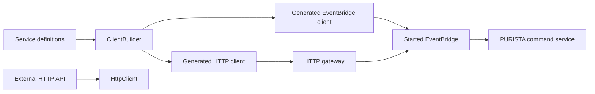

## Choose a focused client task

| You need to | Continue with |
| --- | --- |
| Produce or load the contract artifact | [Obtain, export, and load definitions](/handbook/framework/expose-and-consume-services/service-clients/obtain-export-and-load-definitions/) |
| Decide between direct, EventBridge, REST, and generic fetch | [Choose a client boundary](/handbook/framework/expose-and-consume-services/service-clients/choose-a-client-boundary/) |
| Call within one process without bypassing routing | [Use a direct or embedded client](/handbook/framework/expose-and-consume-services/service-clients/use-a-direct-or-embedded-client/) |
| Generate typed address-first command calls | [Use an EventBridge client](/handbook/framework/expose-and-consume-services/service-clients/use-an-eventbridge-client/) |
| Generate a browser/external HTTP package | [Generate and use a REST client](/handbook/framework/expose-and-consume-services/service-clients/generate-and-use-a-rest-client/) |
| Call a non-PURISTA external HTTP API | [Use the fetch-based client](/handbook/framework/expose-and-consume-services/service-clients/use-the-fetch-based-client/) |
| Verify generated and runtime behavior | [Test client behavior](/handbook/framework/expose-and-consume-services/service-clients/test-client-behavior/) |

Use a client to invoke a service contract from another application component.
Choose the boundary first: a generated EventBridge client invokes a PURISTA
command through the application's EventBridge; a generated HTTP client calls
only commands exposed through the HTTP server; `HttpClient` wraps an external
HTTP API that PURISTA does not own. The choice changes deployment coupling,
authentication, failure modes, and observability.



| Client | Use when | Do not use when | Contract and failure boundary |
| --- | --- | --- | --- |
| Generated EventBridge client | A TypeScript consumer can use the same configured EventBridge contract as the provider—either in one process or through the selected broker. | A browser, partner, or generic HTTP client needs a public API. | It invokes declared commands through an already-started EventBridge. The provider remains responsible for command validation and authorization. |
| Generated HTTP client | A TypeScript consumer calls selected commands that are already exposed through PURISTA HTTP. | You need streams, queues, agents, subscriptions, or an asynchronous `202` response contract. | It calls the gateway's HTTP contract; gateway availability, authentication, and timeout behavior apply. |
| [`HttpClient`](/handbook/api/classes/_purista_core.HttpClient/) | A service resource calls a non-PURISTA HTTP API. | You need generated command names and schemas from PURISTA definitions. | Your application owns URL, authentication, response type, retries, and compatibility with that external API. |

Keep retries and timeouts at the client boundary. Retry only an idempotent
command or external operation, and do not treat a timeout as proof that the
provider did not receive a request.

## Generate a typed client from service definitions

`ClientBuilder` is included in `@purista/core`. It is a build-time generator:
it reads definitions and writes a separate TypeScript package. It does not
start a provider, discover live services, or make an endpoint public. Building
the generated source dynamically imports `typescript`, so install that compiler
as a development dependency before the first `build()` call.

```bash title="Install the client-generation compiler"
npm install --save-dev typescript
```

Use one configuration object for a reusable client package. The public
[`Config`](/handbook/api/types/_purista_core.Config/) type checks the accepted
file and package settings while retaining literal values for `ClientBuilder`.

```ts title="tools/invoice-client.config.ts"
import type { Config } from '@purista/core'

export const invoiceClientConfig = {
  definitionPath: './definitions',
  outputPath: './packages/invoice-client',
  httpClient: {
    clientName: 'InvoiceHttpClient',
  },
  package: {
    name: '@acme/invoice-client',
    description: 'Typed client for the invoice service contract',
    private: false,
  },
} as const satisfies Partial<Config>
```

| Setting | Default | Use it for | Important constraint |
| --- | --- | --- | --- |
| [`rootPath`](/handbook/api/classes/_purista_core.ClientBuilder/#rootpath) | `process.cwd()` | Resolving relative config, definition, and output paths from a monorepo tool. | Set it before calling any path-based method. It is a public mutable property, not a constructor option. |
| `definitionPath` | `./definitions` | The directory [`loadDefinitionFiles()`](#generate-from-a-published-contract) uses without an argument. | It is resolved below `rootPath`. |
| `outputPath` | `./dist` | The generated-only directory that [`cleanDistFolder()`](#run-the-generator-in-order) removes and recreates. | Its parent must already exist; never point it at hand-written source. |
| `buildAs` | `esm` | The generated package format. | The public configuration currently accepts only `esm`. |
| `httpClient.clientName` / `eventBridgeClient.clientName` | `HttpClient` / `EventBridgeClient` | Renaming the generated exported classes to avoid a local collision. | These are generated API names; changing either is a consumer source migration. |
| `package.name`, `description`, `private` | `my-custom-client-package`, a default description, `true` | Naming and publishing policy for the generated `package.json`. | The generator does not set a version or a compatible `@purista/core` range. Own those in a post-generation packaging step before publishing. |

## Generate from a published contract

Use a JSON definition artifact when provider and consumer are released from
different repositories or pipelines. Export only the service builders whose
contract you intend to support. The export describes definitions; it neither
starts the service nor exposes HTTP.

```ts title="tools/export-invoice-client-definitions.ts"
import { mkdir, writeFile } from 'node:fs/promises'
import { join } from 'node:path'
import { exportServiceDefinitions } from '@purista/core'
import { invoiceV1Service } from '../src/service/invoice/v1/invoiceV1Service.js'

const definitions = await exportServiceDefinitions([invoiceV1Service])

await mkdir('definitions', { recursive: true })
await writeFile(join('definitions', 'invoice-v1.json'), JSON.stringify(definitions, null, 2))
```

[`exportServiceDefinitions(serviceBuilders)`](/handbook/api/functions/_purista_core.exportServiceDefinitions/)
resolves each builder's full definition and returns one versioned JSON object
with a `services` member. Run it after changing a consumer-visible command and
review the JSON diff as a contract change. Definitions also include streams,
queues, schedules, and subscriptions, but the two generators deliberately use
only the command data described below.

### Run the generator in order

This build script turns the artifact into an HTTP client package. An error
event means one JSON file could not be read or parsed; collect it and fail the
release rather than publishing a partial client. A missing definition directory
rejects [`loadDefinitionFiles()`](/handbook/api/classes/_purista_core.ClientBuilder/#loaddefinitionfiles)
before it can emit a per-file error.

```ts title="tools/generate-invoice-http-client.ts"
import { ClientBuilder } from '@purista/core'
import { invoiceClientConfig } from './invoice-client.config.js'

const clientBuilder = new ClientBuilder(invoiceClientConfig)
const definitionErrors: Array<Error | string> = []

clientBuilder.on('error', error => definitionErrors.push(error))

try {
  const definitions = await clientBuilder.loadDefinitionFiles()

  if (definitionErrors.length > 0) {
    throw new AggregateError(definitionErrors, 'Unable to load every client definition')
  }

  await clientBuilder.cleanDistFolder()
  await clientBuilder.generateHttpClient(definitions)
  await clientBuilder.createIndex()
  await clientBuilder.createPackageJson()
  await clientBuilder.build()
} finally {
  clientBuilder.destroy()
}
```

| Step | Purpose and input | Runtime effect and failure boundary |
| --- | --- | --- |
| [`new ClientBuilder(config?)`](/handbook/api/classes/_purista_core.ClientBuilder/#constructor) | Accepts a partial public `Config`; omitted fields receive the defaults above. | Zod validates the resolved configuration at construction. Invalid values, such as a non-ESM `buildAs`, throw before files are written. |
| [`on('error', listener)`](/handbook/api/classes/_purista_core.ClientBuilder/#on) | Receives [`ClientBuilderEvents.error`](/handbook/api/types/_purista_core.ClientBuilderEvents/) as an `Error` or message. | `loadDefinitionFiles()` continues after an individual invalid JSON file; `build()` also emits errors. Make the listener turn those diagnostics into a failed build. |
| [`loadDefinitionFiles(path?)`](/handbook/api/classes/_purista_core.ClientBuilder/#loaddefinitionfiles) | An optional directory path; otherwise `rootPath/definitionPath`. | Reads each `.json` file with a `services` member and merges it. A missing directory rejects; a bad individual file emits `error` and is skipped. |
| [`cleanDistFolder()`](/handbook/api/classes/_purista_core.ClientBuilder/#cleandistfolder) | No parameters. | Recursively deletes `rootPath/outputPath`, then creates that directory and `src`. This is intentionally destructive. |
| [`generateHttpClient(definitions)`](/handbook/api/classes/_purista_core.ClientBuilder/#generatehttpclient) | The merged `FullServiceDefinition` returned by the load step. | Writes `src/http_client.ts` and `src/types_http_client.ts`. It includes only commands whose metadata has HTTP exposure. |
| [`createIndex()`](/handbook/api/classes/_purista_core.ClientBuilder/#createindex) | No parameters; call once after all client generators. | Reads the generated `src/*.ts` files and writes the public `src/index.ts` exports. |
| [`createPackageJson()`](/handbook/api/classes/_purista_core.ClientBuilder/#createpackagejson) | Uses the configured `package` fields. | Writes `package.json` into the output directory. It currently writes `@purista/core: latest` under `devDependencies`; do not publish that unreviewed manifest as a compatibility policy. |
| [`build()`](/handbook/api/classes/_purista_core.ClientBuilder/#build) | No parameters. | Dynamically loads `typescript` and emits ESM JavaScript plus declarations below `outputPath/dist`. Compiler diagnostics emit `warn`; an emit failure emits `error` and rejects. |
| [`destroy()`](/handbook/api/classes/_purista_core.ClientBuilder/#destroy) | No parameters. | Removes the builder's event listeners. It does not delete generated output. |

The expected result is a generated package at
`packages/invoice-client/` with `src/`, compiled `dist/`, and `package.json`.
Run your normal package test and publish steps after reviewing that output.

### Choose the generated transport

| Generator | Generated command surface | Choose it when | Do not expect it to provide |
| --- | --- | --- | --- |
| [`generateHttpClient(definitions)`](/handbook/api/classes/_purista_core.ClientBuilder/#generatehttpclient) | Only HTTP-exposed commands. A generated method carries the HTTP payload and any declared path/query parameters. | The consumer should call the public Hono HTTP contract. | Streams, queues, workers, schedules, subscriptions, agents, unexposed commands, or a live stream client. |
| [`generateEventBridgeClient(definitions)`](/handbook/api/classes/_purista_core.ClientBuilder/#generateeventbridgeclient) | Every declared command. Each method takes `payload`, a parameter object (use `{}` when the command has none), and optional generated `InvokeOptions`. | The consumer is a trusted application component with an already-started compatible EventBridge. | A broker connection, service discovery, browser-safe transport, or authorization bypass. |

The HTTP generator defaults each generated client to
`http://localhost:3000/api`, a 30-second timeout, keep-alive, JSON content
headers, and `x-trace-id`. Pass its generated constructor options for the real
gateway. An asynchronous command is typed as the normalized queue acceptance
result returned with `202`. A generated `DELETE` method never sends a body;
client generation fails when such an endpoint declares a non-empty payload,
so move required input to declared path or query parameters.

For an EventBridge client, the generated package imports `EventBridge` from
`@purista/core` and calls `eventBridge.invoke(...)`. The EventBridge must be
started and have the provider registered before the first call. In an embedded
modular monolith, that can be the same `DefaultEventBridge`; in a distributed
deployment it is the configured broker-backed bridge. The generator does not
create either one.

```ts title="src/client/createInvoiceEventBridgeClient.ts"
import type { EventBridge } from '@purista/core'
import { EventBridgeClient } from '@acme/invoice-client'

export const createInvoiceEventBridgeClient = (eventBridge: EventBridge) =>
  new EventBridgeClient(eventBridge)
```

The generated service getter, version, command method, payload, and parameter
types come from the definition artifact. For example, a service named
`invoice`, version `1`, with `createInvoice` becomes
`client.invoice['v1'].createInvoice(payload, parameter, options?)`. The optional
third argument carries generated `traceId`, `principalId`, and `tenantId` into
the EventBridge invocation. Pass only identity established at the application
boundary; command authorization must still run in the receiving service.

### Keep embedded production calls on the EventBridge

Using one Node.js process does not change the service contract. Start a
`DefaultEventBridge`, register the provider service, and give the generated
EventBridge client that same bridge. The call still follows address-based
routing, schema validation, identity propagation, tracing, and the command
lifecycle. This also keeps the caller unchanged if the service later moves to
a broker-backed deployment.

Do not import a command handler and call it directly from another production
service. [`getCommandFunction()`](/handbook/api/classes/_purista_core.CommandDefinitionBuilder/#getcommandfunction)
and [`getCommandFunctionPlain()`](/handbook/api/classes/_purista_core.CommandDefinitionBuilder/#getcommandfunctionplain)
are narrow testing helpers. The first validates command input and output and
runs before guards; the second returns the raw handler. Neither reproduces the
full service lifecycle: input/output transforms, after guards, EventBridge
delivery, command-result event publication, and transport behavior are outside
that direct call. See [test a command](/handbook/framework/build-services/commands/test-a-command/)
for the supported unit-test boundary.

### Handle generated HTTP failures explicitly

The generated HTTP client includes its own `HttpError` class. A non-successful
HTTP response rejects with the response status in `errorCode`, the request
method and URL, the parsed JSON or text response in `data`, and the trace ID.
An aborted request rejects with status `408`. `getErrorResponse()`, `toString()`,
and `toJSON()` provide stable serializable forms, but applications should map
them to their own user-facing error contract instead of showing upstream data
unchanged.

The generated client sends fetch requests with `credentials: 'include'`, so a
browser can attach cookies allowed by its origin and cookie policy. It can also
send basic authentication or a bearer token configured on the client. Those
transport credentials establish identity only when the HTTP server's
authentication middleware validates them; business authorization still
belongs to command guards. Generated command methods do not expose arbitrary
per-request options; configure `defaultTimeout`, headers, and credentials on the
client instance (or wrap a special-case call in application-owned code).

### Generate directly in a controlled monorepo

If the provider builder is importable in the same build workspace, avoid a
temporary JSON artifact. This removes artifact synchronization, but it is not a
release compatibility record for independently deployed repositories.

```ts title="tools/generate-invoice-http-client.ts"
import { ClientBuilder } from '@purista/core'
import { invoiceV1Service } from '../src/service/invoice/v1/invoiceV1Service.js'
import { invoiceClientConfig } from './invoice-client.config.js'

const clientBuilder = new ClientBuilder(invoiceClientConfig)

try {
  const definitions = await clientBuilder.getDefinitionsFromServiceBuilders([invoiceV1Service])
  await clientBuilder.cleanDistFolder()
  await clientBuilder.generateHttpClient(definitions)
  await clientBuilder.createIndex()
  await clientBuilder.createPackageJson()
  await clientBuilder.build()
} finally {
  clientBuilder.destroy()
}
```

[`getDefinitionsFromServiceBuilders(serviceBuilders)`](/handbook/api/classes/_purista_core.ClientBuilder/#getdefinitionsfromservicebuilders)
accepts importable `ServiceBuilder` instances and returns the same merged
definition shape as the JSON load step. It resolves definitions only: it does
not require an EventBridge, service instance, provider credential, database, or
live HTTP server. Use [`writeConfig(path?)`](/handbook/api/classes/_purista_core.ClientBuilder/#writeconfig)
to create a complete `purista.client.json` starting point, and
[`loadConfig(path?)`](/handbook/api/classes/_purista_core.ClientBuilder/#loadconfig)
when a tool should read that file. Both use `rootPath/purista.client.json` when
their optional path is omitted; unreadable JSON, an absent file, or a schema
violation rejects the method. Neither method creates a missing parent folder.

## Call an external HTTP API deliberately

`HttpClient` is a resource-level wrapper for an external API. It serializes
object payloads as JSON, parses JSON responses when the content type begins
with `application/json`, propagates the active OpenTelemetry context, records
HTTP client metrics when a recorder is supplied, and normalizes failed requests
to [`UnhandledError`](/handbook/api/classes/_purista_core.UnhandledError/).
It does not make the remote API a typed PURISTA command contract.

```ts title="src/resource/crmClient.ts"
import { HttpClient } from '@purista/core'

const baseUrl = process.env.CRM_URL

if (!baseUrl) {
  throw new Error('CRM_URL is required to call the CRM API')
}

const crm = new HttpClient({
  baseUrl,
  defaultTimeout: 5_000,
  bearerToken: process.env.CRM_TOKEN,
})

export const findCustomer = (customerId: string) =>
  crm.get<{ id: string; status: 'active' | 'blocked' }>(`/customers/${customerId}`)
```

Inject this wrapper as a [service resource](/handbook/framework/build-services/services/),
not as an ad-hoc client constructed in a handler. The application owns the
external API's authentication scope, response type, availability target, and
retry policy.

| `HttpClient` call or option | Purpose, default, and choice | Runtime behavior or risk |
| --- | --- | --- |
| [`new HttpClient(config)`](/handbook/api/classes/_purista_core.HttpClient/#constructor) and [`HttpClientConfig`](/handbook/api/types/_purista_core.HttpClientConfig/) | `baseUrl` is optional in the type, but provide an absolute URL whenever methods use relative paths. Defaults include `isKeepAlive: true` and `defaultTimeout: 30000`. | An invalid configured URL throws during construction; a relative request without a base URL cannot be resolved. |
| `defaultHeaders`, `basicAuth`, `bearerToken` | Set stable API-required headers or authentication. Use [`setBearerToken(token)`](/handbook/api/classes/_purista_core.HttpClient/#setbearertoken) when a bearer token rotates during process lifetime. | Credentials stay in memory and are sent over the wire. Never put secrets in URLs or in headers exposed to telemetry processors. |
| `logger`, `logLevel`, `name` | Supply the application's logger, or let PURISTA construct one with the selected level; `name` scopes logs, spans, and metrics. | Do not use customer data or secrets for the name or trace ID. |
| `spanProcessor`, `metricsRecorder`, `traceId` | Connect to application telemetry and optionally set a custom trace identifier. | The constructor creates and registers a tracer provider. Do not present `enableOpentelemetry` as an off switch: it is accepted by the type but does not currently control that construction. |
| [`get`](/handbook/api/classes/_purista_core.HttpClient/#get), [`post`](/handbook/api/classes/_purista_core.HttpClient/#post), [`put`](/handbook/api/classes/_purista_core.HttpClient/#put), [`patch`](/handbook/api/classes/_purista_core.HttpClient/#patch), [`delete`](/handbook/api/classes/_purista_core.HttpClient/#delete) | Use the HTTP verb required by the external API. `post`, `put`, `patch`, and `delete` can carry a payload; all return parsed JSON or text. | Non-2xx responses and transport failures reject as `UnhandledError`; `204` resolves `undefined`. |
| [`HttpClientRequestOptions`](/handbook/api/types/_purista_core.HttpClientRequestOptions/) | Per-call `headers`, `query`, `hash`, and `timeout`. A supplied timeout overrides `defaultTimeout` for that request. | Headers and query values can reach telemetry or logs. Choose a finite timeout for each remote dependency and make retries an explicit caller policy. |
| [`getTracer()`](/handbook/api/classes/_purista_core.HttpClient/#gettracer) / [`startActiveSpan(...)`](/handbook/api/classes/_purista_core.HttpClient/#startactivespan) | Access the client's configured OpenTelemetry tracer or run application work in one active child span. | Prefer automatic request spans for normal calls. Use these methods only when an application-owned operation needs an explicit span and keep sensitive values out of attributes. |

[`HttpClient`](/handbook/api/classes/_purista_core.HttpClient/) implements the
portable [`RestClient`](/handbook/api/interfaces/_purista_core.RestClient/)
contract: [`get`](/handbook/api/interfaces/_purista_core.RestClient/#get),
[`post`](/handbook/api/interfaces/_purista_core.RestClient/#post),
[`put`](/handbook/api/interfaces/_purista_core.RestClient/#put),
[`patch`](/handbook/api/interfaces/_purista_core.RestClient/#patch),
[`delete`](/handbook/api/interfaces/_purista_core.RestClient/#delete), and
[`setBearerToken`](/handbook/api/interfaces/_purista_core.RestClient/#setbearertoken).
Type a resource as `RestClient` when business code should depend on that
transport abstraction and construct `HttpClient` in the application root.

`HttpClient` also sends fetch requests with `credentials: 'include'`. In a
browser-like runtime, cookies are therefore governed by that runtime's origin
and cookie rules. In a server runtime, configure explicit authorization rather
than assuming browser session behavior. A non-2xx response rejects as
`UnhandledError` with request and response details in `data`; an expired
default timeout rejects with status `408`.

Do not retry a failed POST, PUT, PATCH, or DELETE blindly. First establish the
external API's idempotency key and duplicate-side-effect behavior. Treat a
timeout as an unknown outcome, reconcile through a safe status lookup where the
provider supports one, then decide whether a retry is safe.

## Preserve a stable consumer contract

| Change | Consumer-safe action |
| --- | --- |
| Add an optional input or output field | Regenerate the client and release a compatible package version. |
| Remove or change a required field | Publish a new service/contract version; a transport retry cannot make a breaking payload compatible. |
| Move from embedded to broker-backed delivery | Keep the declared command contract, then re-test startup order, timeout, identity propagation, and duplicate delivery. |
| Need browser or third-party access | Expose the command through [HTTP and REST](/handbook/framework/expose-and-consume-services/http-and-rest/) and give the client only that public contract. |

Next: [HTTP and REST](/handbook/framework/expose-and-consume-services/http-and-rest/),
[service discovery and contracts](/handbook/framework/expose-and-consume-services/service-discovery/),
or [secure and operate](/handbook/framework/secure-and-operate/).
