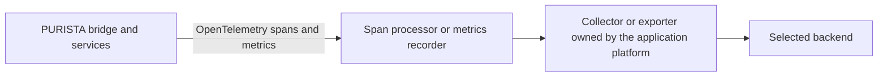

PURISTA creates standard OpenTelemetry traces and framework metrics; it accepts an optional span processor and metrics recorder when you construct the bridge or service. It does not create a vendor account, choose an exporter, or manage your backend. Keep that platform decision outside service definitions so the same service code can move between backends.

## Choose the operating model

Start with a collector or platform telemetry pipeline when production workloads need batching, retry isolation, policy enforcement, or a backend change without an application release. A direct exporter can be useful for a controlled local investigation, but it couples the process to a vendor endpoint and its credentials.

| Choose this when | Typical backends | Platform decision to make |
| --- | --- | --- |
| You operate an open tracing stack | [Jaeger](https://www.jaegertracing.io/docs/), [Zipkin](https://zipkin.io/pages/quickstart), [Grafana Tempo](https://grafana.com/docs/tempo/latest/), [SigNoz](https://signoz.io/docs/), [Teletrace](https://github.com/teletrace/teletrace), [Uptrace](https://uptrace.dev/get/) | Run an OpenTelemetry Collector or the backend's supported ingestion pipeline; own its availability, storage, and access policy. |
| Your cloud platform owns observability | [AWS Distro for OpenTelemetry](https://aws-otel.github.io/docs/getting-started/collector), [Azure Monitor OpenTelemetry](https://learn.microsoft.com/en-us/azure/azure-monitor/containers/opentelemetry-options), [Google Cloud Trace](https://cloud.google.com/trace/docs/setup) | Use the platform-supported collector/exporter and workload identity; let the platform team own roles, endpoint selection, and retention. |

The linked vendor guides are the source of truth for current packages, endpoint formats, authentication, and support status. Those details change independently of PURISTA and are deliberately not copied here.

## Build a portable pipeline

For a runnable local reference, use the Docker Compose stacks in
`examples/fullexample`. The maintained scripts start Grafana with
Tempo/Loki/Prometheus, Jaeger, SigNoz, Teletrace, Uptrace, or Zipkin alongside
the PURISTA example. Use synthetic data and stop the selected stack after the
verification run.

Configure the selected processor or recorder at application composition time, then pass it to the bridge and service instances as described in [Instrument with OpenTelemetry](/handbook/framework/secure-and-operate/observability/opentelemetry/). Do not put endpoint URLs, credentials, or backend-specific labels in commands, subscriptions, or service definitions.

## Transition from a legacy backend guide

1. Pick the operating model and review the vendor's current collector/exporter instructions.
2. In a non-production environment, configure identity and the backend pipeline outside the service code. Prefer workload identity or the platform's short-lived credential mechanism over embedded or long-lived secrets.
3. Send a controlled command and a queued job. Confirm that the service name, trace continuity, and expected low-cardinality metrics arrive.
4. Review collected attributes before production traffic: exclude payloads, authorization headers, credentials, and customer content; restrict access and set retention deliberately.
5. Define exporter failure behavior and a rollback path. Telemetry delivery must not create unbounded request-path retries or make business traffic depend on the backend.

## Carry these decisions into production

| Decision | Why it matters |
| --- | --- |
| Collector placement and availability | It separates backend outages and pipeline changes from service code. |
| Workload identity and least privilege | It avoids distributing backend credentials through application configuration. |
| Resource identity | Use a stable service name, environment, and deployment identity so traces can be grouped safely. |
| Sampling, retention, and access | They determine cost, incident evidence, and who can see operational data. |
| Attribute allowlist | It prevents sensitive or high-cardinality data from becoming telemetry. |

Next: [observability overview](/handbook/framework/secure-and-operate/observability/) and [Instrument with OpenTelemetry](/handbook/framework/secure-and-operate/observability/opentelemetry/).
