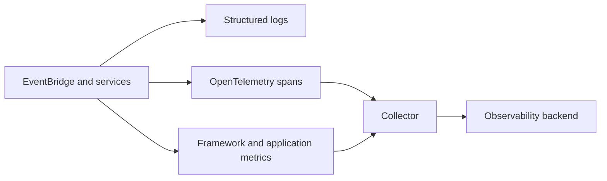

PURISTA instruments service, bridge, queue, and HTTP work through OpenTelemetry-friendly tracing and metrics surfaces. The application owns exporters, backends, sampling, retention, and sensitive-data policy.

| Signal | Use it to answer | Keep out |
| --- | --- | --- |
| Structured logs | What failed and which component acted? | Credentials, raw payloads, headers, customer content |
| Traces | Which command/event/queue path caused latency or failure? | Sensitive message bodies and unrestricted identifiers |
| Metrics | Is a queue growing, are retries rising, is latency degrading? | High-cardinality tenant/user/request labels |



Wire the same application-owned logger, span processor, and Meter policy into
each independently constructed component:

```ts title="src/index.ts"
const eventBridge = new DefaultEventBridge({ logger, spanProcessor, metrics: { meter } })
await eventBridge.start()

const orderService = await orderV1Service.getInstance(eventBridge, {
  logger,
  spanProcessor,
  metrics: { meter },
})
await orderService.start()
```

[`ServiceBuilder.getInstance(...)`](/handbook/api/classes/_purista_core.ServiceBuilder/#getinstance)
configures only that service instance; the EventBridge needs its own matching
telemetry options. Invoke one command and verify a structured log, a
`purista.command.invoke` trace, and `purista.command.executions` in the selected
backend before treating the pipeline as operational.

Start with [OpenTelemetry](/handbook/framework/secure-and-operate/observability/opentelemetry/),
then [define and record metrics](/handbook/framework/secure-and-operate/observability/define-and-record-metrics/)
and [trace commands, events, streams, and jobs](/handbook/framework/secure-and-operate/observability/trace-commands-events-streams-and-jobs/).
Use [connect an observability backend](/handbook/framework/secure-and-operate/observability/backend-guides/)
for the collector/export destination and the selected backend's official
deployment guidance for endpoint, identity, and retention configuration.

Use [structured logging](/handbook/framework/secure-and-operate/observability/logging/)
for the application logger, safe field design, and correlation with traces.

The critical boundary is cardinality and disclosure: telemetry must describe
component, operation, and outcome without copying business payloads, credentials,
prompts, or unrestricted tenant and principal identifiers.
