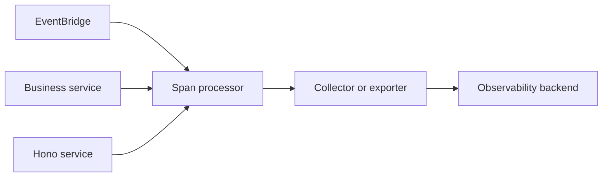

PURISTA creates a Node tracer provider for each EventBridge, service, and HTTP
client. You supply the `SpanProcessor`; PURISTA registers it with that
component's provider. Configure trace export and metrics at each process's
composition root—not in a command or service definition.



## Choose the setup that matches the deployment

| Deployment | What to configure | Guide |
| --- | --- | --- |
| One business service process | The EventBridge and one service instance. | [Configure OpenTelemetry for one service](/handbook/framework/secure-and-operate/observability/opentelemetry/one-service/) |
| Modular monolith | EventBridge, every business service, Hono, Meter, and shutdown list in the same process. | [Configure OpenTelemetry for a monolith](/handbook/framework/secure-and-operate/observability/opentelemetry/monolith/) |
| Distributed services/workers | A separate processor/Meter lifecycle in every process; collector and transport provide cross-process continuity. | [Configure OpenTelemetry for distributed services](/handbook/framework/secure-and-operate/observability/opentelemetry/distributed-services/) |

Tracing export is opt-in because exporter packages and collector ownership are
application concerns. Install exporter/SDK packages in the application that
imports them. A Meter is likewise optional: without one, PURISTA remains
functional. Without either an explicit Meter or a configured global
MeterProvider, OpenTelemetry's default no-op Meter exports no Framework or
custom metric instruments.

## Metric and privacy rules that apply to every setup

Framework metric recording is enabled by default for an EventBridge and
service. Pass `metrics: { meter }` to select the Meter that creates its
instruments; without it, PURISTA uses its global Meter path. Configure that
Meter's provider and exporter in the process that owns it. Set `enabled: false`
to suppress recording, `recordFrameworkMetrics: false` to keep only custom
metrics, or `recordCustomMetrics: false` to keep only Framework metrics.
Declare custom metrics before using `context.metrics` and use only
low-cardinality attributes such as component, operation, channel, or outcome.

Keep payloads, prompts/completions, headers, credentials, unrestricted IDs, and
tenant/user labels out of application-added logs, trace attributes, and metric
labels. Current Framework command, subscription, and queue paths propagate
principal/tenant identity into some logger and span fields. Before exporting to
a shared backend, configure collector/exporter redaction, restricted access,
and retention for those fields; the metric attribute filter is not a general
privacy boundary. Backend identity, TLS, sampling, retention, and access policy
are platform concerns; see [choose and transition an OpenTelemetry backend](/handbook/framework/secure-and-operate/observability/backend-guides/).

## Configure metric recording deliberately

[`PuristaMetricsRuntimeOptions`](/handbook/api/interfaces/_purista_core.PuristaMetricsRuntimeOptions/)
is accepted by EventBridge constructors and by
[`ServiceBuilder.getInstance(...)`](/handbook/api/classes/_purista_core.ServiceBuilder/#getinstance).
PURISTA creates a recorder unless `enabled: false`; without a configured global
OpenTelemetry provider or an explicit Meter, its instruments use OpenTelemetry's
no-op path and nothing is exported. Passing a Meter selects your application
provider; it is not the switch that makes a business service safe to run.

| `metrics` option | Default | Effect | Use it when |
| --- | --- | --- | --- |
| `enabled` | `true` | Creates a recorder. `false` replaces it with a no-op recorder. | Disable all Framework and custom metric recording for a controlled local/test path. |
| `meter` | Global meter named `purista` | Creates instruments on this Meter. | A process owns an explicit MeterProvider/exporter and needs a named application scope. |
| `defaultAttributes` | Component identity is added automatically | Merges scalar attributes and drops forbidden identifiers, unsafe names, and non-scalar values. It cannot infer whether an allowed string is high-cardinality. | Add reviewed, stable dimensions such as `deployment.environment`; never tenant, user, request, job, run, or trace identifiers. |
| `recordFrameworkMetrics` | `true` | Keeps or suppresses PURISTA lifecycle/delivery measurements. | A backend policy temporarily permits only application-defined metrics. |
| `recordCustomMetrics` | `true` | Keeps or suppresses metrics declared through `defineMetric(...)`. | A rollout needs Framework health only while application metric definitions are being reviewed. |

These options are process-composition settings. A service cannot export the
EventBridge's metrics, and an EventBridge cannot export the service's metrics;
pass the same policy to every independently constructed component.

`metricsRecorder` is an advanced alternative for a deliberate custom or
deterministic recorder. When supplied, it takes precedence over `metrics`, so
do not combine the two expecting `metrics.enabled: false` to disable the custom
recorder.

## Shared installation requirement

Tracing export is opt-in because the exporter package and collector are
application concerns. Install an OTLP exporter and trace SDK package in the
application that imports them:

```bash title="Install OTLP trace export dependencies"
npm install @opentelemetry/exporter-trace-otlp-http @opentelemetry/sdk-trace-node
```

Create a processor in the composition root, then pass it to every PURISTA
component constructed in that process. Keep an explicit shutdown action for
the processor and Meter provider so buffered telemetry can flush without making
business shutdown depend on a healthy backend.

```ts title="src/telemetry.ts"
import { OTLPTraceExporter } from '@opentelemetry/exporter-trace-otlp-http'
import { BatchSpanProcessor } from '@opentelemetry/sdk-trace-node'

const exporter = new OTLPTraceExporter({ url: process.env.OTEL_EXPORTER_OTLP_TRACES_ENDPOINT })
export const spanProcessor = new BatchSpanProcessor(exporter)
```

`BatchSpanProcessor` is normally the production choice because it batches
export. `SimpleSpanProcessor` exports each completed span immediately and suits
short-lived examples or controlled debugging—not ordinary high-throughput
traffic.

Next: choose the deployment setup above, then [configure structured logging](/handbook/framework/secure-and-operate/observability/logging/).
