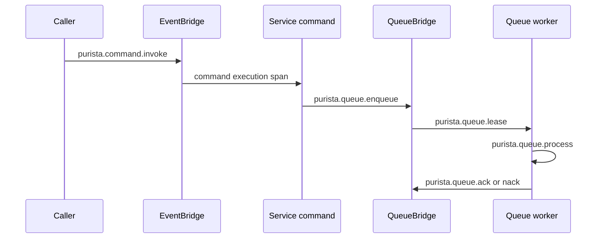

PURISTA creates spans around transport, service, store, stream, and queue
operations. Pass a `SpanProcessor` to every component in the process and
propagate OpenTelemetry context through the selected bridge to see one
distributed trace.

## Use the fixed span names

[`PuristaSpanName`](/handbook/api/enums/_purista_core.PuristaSpanName/) exports
the stable names used by Framework instrumentation.

| Boundary | Span names |
| --- | --- |
| EventBridge | `purista.emit.MessageToBridge`, `purista.command.invoke`, `purista.command.response`, `purista.handle.incomingMessage` |
| Message transport | `purista.command.sent`, `purista.command.received`, `purista.command.response.sent`, `purista.command.response.received`, `purista.subscription.eventReceived` |
| Queue lifecycle | `purista.queue.enqueue`, `purista.queue.lease`, `purista.queue.process`, `purista.queue.ack`, `purista.queue.nack`, `purista.queue.deadletter` |
| Stores | `purista.secretStore.*`, `purista.configStore.*`, `purista.stateStore.*` for get, set, and remove operations |

Command, subscription, stream, transform, and guard spans also use the declared
target or hook name. Search by the fixed transport/queue name first, then follow
the trace into target-specific child spans.

## Read the standard PURISTA attributes

[`PuristaSpanTag`](/handbook/api/enums/_purista_core.PuristaSpanTag/) defines
component and address attributes such as:

| Group | Attributes |
| --- | --- |
| Address | `purista.sender.name`, `.version`, `.target`; `purista.receiver.name`, `.version`, `.target` |
| Queue | `purista.queue.name`, `.jobId`, `.bridge`, `.attempt`, `.reason`, `.delayMs` |
| Store | `purista.store.type`, `purista.store.name` |
| Runtime | `purista.version` |
| Identity | `purista.principalId`, `purista.tenantId` |

Principal and tenant attributes can be sensitive and high-cardinality. Limit
backend access and retention, and redact them in the collector when operators
do not require identity-level correlation. Never add payloads, prompts,
credentials, headers, or customer content as span attributes.

## Verify one complete trace

1. Configure the same collector endpoint and propagation format for the caller,
   EventBridge, service, QueueBridge, and worker processes.
2. Invoke one command that enqueues one job with a synthetic business ID.
3. Find `purista.command.invoke`, then follow its linked/child spans through
   `purista.queue.enqueue`, `purista.queue.lease`, and `purista.queue.process`.
4. Trigger one controlled retry and confirm a `purista.queue.nack` span carries
   the bounded reason, delay, and attempt attributes.
5. Shut down the processors and confirm the final spans flush within the
   application's shutdown timeout.

A local in-process trace does not prove that a broker adapter propagates
context. Test the selected production EventBridge and QueueBridge in the real
topology before relying on cross-process traces in incident response.

Next: [connect an observability backend](/handbook/framework/secure-and-operate/observability/backend-guides/).
