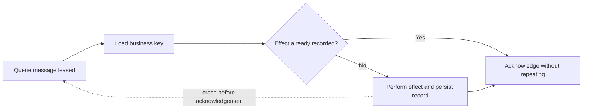

Do not call a message path reliable without naming its adapter and operating
mode. The default in-memory bridges are local only; NATS durable subscriptions
need JetStream; MQTT does not provide bridge-managed durable consumer retry/DLQ;
AMQP behavior depends on queue/broker configuration.

## Write the promise before choosing the adapter

For each important flow, write a short delivery contract that is observable in
production. “Reliable” is not a contract; these are:

| Question | Example answer for invoice email |
| --- | --- |
| May the handler run more than once? | Yes; sending must deduplicate by invoice/email type. |
| Is order required? | Per invoice only; unrelated invoices may run concurrently. |
| How long may it wait? | Accepted within 5 seconds, completed within 15 minutes. |
| What happens after repeated failure? | Move to DLQ, alert the billing operator, repair then replay. |
| What evidence proves completion? | Durable `email-delivery` record keyed by tenant, invoice, and template. |

Map the requirement to the actual bridge capabilities at startup. Queue bridge
capability validation prevents a queue definition from quietly relying on a
feature an adapter cannot provide; it does not turn at-least-once processing
into exactly-once side effects.

When the business effect crosses a database and broker boundary, add an explicit
reconciliation/outbox-like design rather than claiming one atomic transaction
where none exists. Document order, duplication, retention, acknowledgement,
and dead-letter behavior next to the flow's service contract, then prove it in
an adapter integration test.

Next: [chapter overview](/handbook/framework/secure-and-operate/reliability/).
