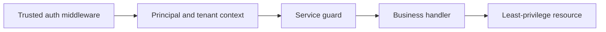

PURISTA propagates principal and tenant context through supported message paths, but it does not authenticate an end user for you. The HTTP server/middleware or calling application establishes trusted identity; service guards and resource policy enforce what that identity may do.

Start with one protected command. Have the transport authenticate the request and
set its trusted identity, let a guard decide whether that identity may perform
the operation, and give the handler only its required resource. Apply the same
guard/resource policy to work that can also arrive from a queue, subscription,
or internal invocation.

| Boundary | Responsible for | Must not decide |
| --- | --- | --- |
| HTTP middleware or calling application | Authenticate a credential and set a trusted principal/tenant | Which invoice, account, or record the caller may change |
| Command, stream, subscription, or worker guard | Reject an unauthenticated or unauthorized operation | How a gateway token is decoded |
| Handler and its resource | Load the record and enforce data-level scope | Trusting a caller-supplied tenant field |
| Adapter/workload identity | Limit broker, store, and cloud access | End-user authorization |

Never trust a tenant or principal value taken directly from a public JSON
payload. Map identity in authenticated middleware, validate it, and propagate
only the trusted context. Use distinct adapter identities, namespaces, and
credentials for tenant/environment boundaries where the backing system supports
them.

Before release, verify the path below for every sensitive operation.

1. A missing or invalid credential receives a controlled `401` response.
2. An authenticated but unauthorized principal receives `403`.
3. A tenant A principal cannot read or alter tenant B data, including delayed
   queue work and retries.
4. A workload identity cannot reach a neighboring broker subject, queue, or
   secret path.

Read [authentication and authorization](/handbook/framework/secure-and-operate/security/authentication-and-authorization/), [tenant isolation](/handbook/framework/secure-and-operate/security/tenant-isolation/), and [secrets and sensitive data](/handbook/framework/secure-and-operate/security/secrets-and-sensitive-data/).
