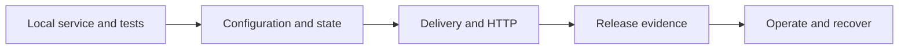

Take a working local service to production by replacing each local-only assumption deliberately. Start with a command and subscription that pass locally, then choose the stores, delivery, HTTP surface, tests, and operating controls that fit the workload.

The goal is not a particular topology. It is release evidence: the deployed application has explicit ownership for configuration, credentials, durable work, identity, recovery, and telemetry.

## Phase 1: Foundation

Create the project, service, command, and subscription with the [Start guide](/handbook/framework/start/). The generated local path uses the core in-memory defaults: no broker, database, cloud account, or optional adapter is required to get the first result.

**Exit criteria:** the generated tests, build, and application startup pass; a valid command returns its schema-valid result; and its subscription receives the expected event. Follow [Run and verify](/handbook/framework/start/run-and-verify/) when this is not yet true.

Do not promote the in-memory defaults as a production strategy. They prove your service contracts and local wiring, not persistence, distributed delivery, credential handling, or recovery.

## Phase 2: Integration-ready logic

Before connecting infrastructure, decide what each value is and who operates it.

| Need | Local default | Production decision | Exit criteria |
| --- | --- | --- | --- |
| Typed service settings | Core configuration path | Choose a configuration store and environment-specific values | Invalid or missing release configuration fails before business traffic. |
| Technical credentials; runtime-managed business secrets | Development-only local handling | Use workload identity/platform secret delivery for bootstrap; choose a secret store when runtime lifecycle or tenant/principal ownership requires it | A deployment receives credentials without committing or logging them. |
| Durable business state | In-memory state | Choose a state-store adapter and retention/backup policy | Restart and recovery behavior is tested against the selected store. |
| External SDK/database client | Application-created resource | Inject a scoped resource and set its timeout/lifecycle policy | A unit test replaces the dependency with a fake. |

Use [stores and application configuration](/handbook/framework/configure-applications/) for settings and secrets, and [persist application state](/handbook/framework/configure-applications/state-stores/) for state. Installing an adapter package only makes its code importable; the application still has to provision the external service, configure credentials, wire the adapter, and verify the connection.

## Phase 3: Runtime architecture

Keep service definitions focused on business contracts. Choose infrastructure in the application composition based on the failure boundary, not on a preference for a particular provider.

| If the workload needs | Choose | Verify before release |
| --- | --- | --- |
| One local process | Core defaults while developing | The production decision below; local defaults do not survive a process failure. |
| Events across processes | An EventBridge adapter | Delivery, duplicate handling, broker identity, and recovery expectations. |
| Long-running/retryable work | A durable QueueBridge plus worker | Idempotency, dead-letter/replay ownership, concurrency, and result retrieval. |
| An external HTTP API | Explicit HTTP-exposed commands and a server adapter | Authentication, request limits, error shape, and health route behavior. |
| Platform sidecars or Kubernetes | The applicable platform integration | Workload identity, probes, network policy, and component scopes. |

Use [Distributed infrastructure](/handbook/framework/connect-distributed-infrastructure/) to select and enable the exact optional adapter. For a public command surface, continue with [HTTP and REST](/handbook/framework/expose-and-consume-services/http-and-rest/). A production adapter is not a transparent replacement: its delivery and recovery guarantees must be confirmed on its focused guide.

## Phase 4: Production readiness

Use several small tests instead of expecting one end-to-end run to prove every guarantee.

1. Test command, subscription, stream, and worker behavior with deterministic fakes.
2. Run adapter integration tests against the real broker, store, or server with protected test credentials.
3. Run one production-shaped end-to-end flow: an authenticated request or accepted job, the expected business-visible outcome, and a safe trace/health signal.

Follow [Test applications](/handbook/framework/test-applications/) for the test boundary and [End-to-end testing](/handbook/framework/test-applications/end-to-end/) for the release-shaped flow. Test duplicate delivery, timeout, invalid input, unavailable infrastructure, and recovery only where that condition can actually occur.

## Pre-launch checklist

Before taking traffic, make the operating decisions visible to the team that owns the deployment:

- Use [Security](/handbook/framework/secure-and-operate/security/) to enforce authentication, authorization, tenant boundaries, secret handling, and infrastructure permissions.
- Use [Observability](/handbook/framework/secure-and-operate/observability/) to verify logs, metrics, and traces without exporting secrets or sensitive payloads.
- Use [Reliability](/handbook/framework/secure-and-operate/reliability/) to define retries, idempotency, shutdown, recovery, and replay ownership.
- Use [Deploy applications](/handbook/framework/deploy-applications/) to compile, package, run, and validate the selected topology.

**Production exit criteria:** the release has an owner for each external dependency; authenticated health and public-path checks pass; the selected delivery/store adapters have been tested under their intended failure conditions; and operators can find the trace, recovery action, and rollback decision without inspecting business code.

Next: choose the [configuration and secret stores](/handbook/framework/configure-applications/) for the target environment, or [connect distributed infrastructure](/handbook/framework/connect-distributed-infrastructure/) when the production boundary is already known.
