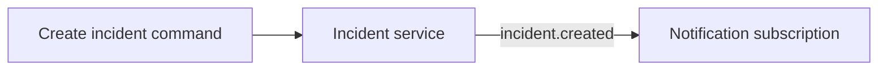

Build a small incident desk that accepts an incident, emits an event, and lets another service react. The default path uses only the generated project and the in-memory runtime, so no broker, database, or cloud account is required.

## What you will have

The generator first creates a small `ping` service and command so the untouched
project can run and test successfully. By the end of this path, the project also
contains a versioned incident service, a typed command, and a notification
subscription. Run its tests before adding a real EventBridge, stores, or HTTP
server.

## Follow this path

1. [Check requirements](/handbook/framework/start/requirements-and-installation/).
2. [Create the project](/handbook/framework/start/create-a-project/) and verify the untouched scaffold.
3. [Create the service](/handbook/framework/start/create-the-first-service/).
4. [Add a command](/handbook/framework/start/add-a-command/) that returns a result and can emit an event.
5. [Add a subscription](/handbook/framework/start/add-a-subscription/) that reacts without coupling the services.
6. [Run and verify](/handbook/framework/start/run-and-verify/) the generated tests and application.
7. [Understand the generated project](/handbook/framework/start/understand-the-generated-project/) before changing its composition or naming conventions.

## Choose a starting shape

| Need | Start with | Add later |
| --- | --- | --- |
| Local business API | Default EventBridge and a command | HTTP exposure, a production EventBridge |
| Background work | A queue and worker | Redis or NATS QueueBridge |
| Live progress | A stream | HTTP streaming transport |
| AI-assisted business action | [An AI-powered service](/handbook/framework/build-ai-powered-services/) | Model provider and Harness capabilities |

The in-memory defaults are useful for development and tests. They are not a production persistence or transport strategy; choose the relevant adapter before deploying a durable or distributed workload.

Next: [requirements and installation](/handbook/framework/start/requirements-and-installation/).
