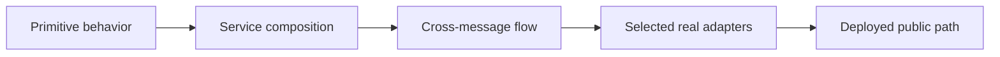

The command, subscription, stream, queue-worker, and AI chapters own the detailed tests for those implementations. This chapter starts where one primitive ends: it helps you assemble evidence across a service, asynchronous flow, infrastructure adapter, or deployed application.

Each boundary answers a different question. Passing a larger test does not make the smaller, more diagnostic test unnecessary; repeating every primitive case through the deployment only creates slow and brittle coverage.

## Start with the implementation owner

| What changed | Test it first here | Return to this chapter when |
| --- | --- | --- |
| Service definitions, resources, or lifecycle | [Test a service](/handbook/framework/build-services/services/test-a-service/) | Several definitions form one contract or deployment unit. |
| Command schemas, guards, transforms, handler, events, or HTTP metadata | [Test a command](/handbook/framework/build-services/commands/test-a-command/) | A caller/subscriber flow or public topology must be proven. |
| Event handling, fan-out, or acknowledgement | [Test a subscription](/handbook/framework/build-services/subscriptions/test-subscriptions/) | The flow crosses a real EventBridge. |
| Stream frames, cancellation, or final output | [Test a stream](/handbook/framework/build-services/streams/test-a-stream/) | The HTTP/server transport must carry the stream. |
| Lease, retry, idempotency, results, or dead letters | [Test queued work](/handbook/framework/build-services/queues-and-workers/test-queued-work/) | A production QueueBridge must prove its guarantees. |
| Attached-agent flow, authorization, sandbox, or policy wiring | [Test an AI-powered service deterministically](/handbook/framework/build-ai-powered-services/test-an-ai-powered-service-deterministically/) | Live model quality must be evaluated separately. |

## Choose the next test by its claim

| Claim | Smallest useful boundary | Chapter |
| --- | --- | --- |
| The assembled service has no duplicate or invalid definitions | Service aggregate | [Design service and contract coverage](/handbook/framework/test-applications/business-logic-and-service-contracts/) |
| A response event reaches a subscription or queue result drives the next action | Cross-message deterministic flow, then selected bridge | [Test message flows, queues, and retries](/handbook/framework/test-applications/message-flows-queues-and-retries/) |
| NATS reconnects, Redis leases expire, or a cloud identity is denied correctly | Protected real-adapter integration | [Test local infrastructure and production adapters](/handbook/framework/test-applications/local-infrastructure-and-production-adapters/) |
| The authenticated public route works in the deployed topology | Focused end-to-end flow | [End-to-end testing](/handbook/framework/test-applications/end-to-end/) |

Use synthetic data and unique run identifiers. Keep model output quality in Harness [evaluations](/handbook/harness/test-and-evaluate/evaluate-prompts-and-outputs/): deterministic adapters prove the implementation and flow, not whether a nondeterministic model answer is correct.
