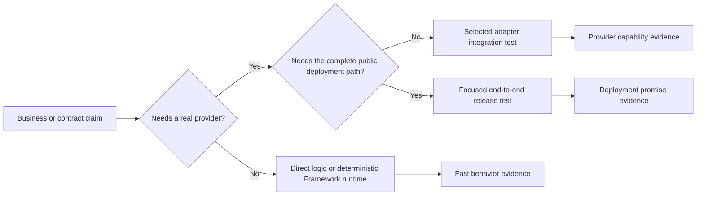

Use deterministic tests for Framework behavior, focused adapter integration
tests for infrastructure guarantees, and a small number of end-to-end tests
for the deployed path. Do not rely on an end-to-end test alone to diagnose a
command, subscription, queue, or schema failure.

The boundaries build on one another; they are not substitutes. A deterministic
queue-worker test can prove a handler's idempotency branch and Framework
settlement behavior. It cannot prove a Redis lease expiry or an IAM policy. A
successful end-to-end request can prove the public route but does not make
every error branch easy to diagnose.

## Select the deterministic runtime helper

All three helpers create a real service instance, but none calls
`service.start()`. Command and stream helpers materialize and register the one
definition they execute. The queue-worker helper directly runs the supplied
worker definition. Add the matching queue definition to the service builder
when its transforms, lifecycle, or result policy should participate.

| Helper | Required arguments and `run` input | Options and default infrastructure | Result, lifecycle, and boundary |
| --- | --- | --- | --- |
| [`createCommandTestHarness(serviceBuilder, commandBuilder, options?)`](/handbook/api/functions/_purista_core.createCommandTestHarness/) | Service builder, command builder; `run({ payload, parameter })` | Service instance configuration plus optional `eventBridge` and `queueBridge`. Without `eventBridge`, the helper owns an EventBridge mock. | Registers one command, calls `service.executeCommand`, and returns `{ message, result }`; `result` is defined only for a successful command response. `destroy()` destroys the service and only bridges it created. It does not prove HTTP projection or a supplied bridge. |
| [`createStreamTestHarness(serviceBuilder, streamBuilder, options?)`](/handbook/api/functions/_purista_core.createStreamTestHarness/) | Service builder, stream builder; `run({ payload, parameter })` | Service instance configuration plus optional `eventBridge`. Without it, the helper owns an EventBridge mock. | Registers one stream and returns `{ frames, chunks, final }`. Frame capture is available only with the owned mock; with a supplied EventBridge, test transport output separately. `destroy()` leaves a supplied bridge owned by the test. |
| [`createQueueWorkerTestHarness(serviceBuilder, workerBuilder, options?)`](/handbook/api/functions/_purista_core.createQueueWorkerTestHarness/) | Service builder, worker builder; `run(queueMessage)` | Service instance configuration plus optional `eventBridge` and `queueBridge`. Without either, the helper owns deterministic mocks. | With both owned mocks, injects one lease and returns `ackCalls`, `nackCalls`, `deadLetterCalls`, and `extendLeaseCalls`. A supplied QueueBridge owns leasing, so `run()` cannot inject the supplied message or collect mock calls. `destroy()` leaves supplied bridges owned by the test. |

The helpers reject if they cannot resolve the required bridge. Treat a supplied
real bridge as an adapter integration boundary, not a way to turn a unit test
into a complete deployment test.

## Keep the three levels distinct

| Level | Best entry point | What it proves | What it intentionally leaves to the next level |
| --- | --- | --- | --- |
| Direct logic | The primitive's typed context mock and direct builder function | Business branches and declared context calls with controllable inputs. | Registration, Framework orchestration, adapters, and process startup. |
| Deterministic Framework runtime | The command, stream, or queue-worker helper above | One primitive through the relevant deterministic Framework lifecycle. | `service.start()`, remote transport, credentials, and provider guarantees. |
| Selected real adapter | A protected integration environment | The exact provider capability, such as a broker round trip, lease recovery, or store authorization. | Broad release readiness and every business permutation. |

| Question | Start with | Then add | Evidence |
| --- | --- | --- |
| Does a handler validate and return the contract? | Its primitive's direct/helper test | Deterministic service-runtime test if transforms, guards, result events, or registration matter | Schema-valid result and expected side effects |
| Does a worker retry or complete safely? | Queue-worker harness | Selected QueueBridge integration test | Job outcome, idempotency, DLQ/recovery behavior |
| Does a broker/store adapter work with credentials? | Adapter's maintained test/example | Protected integration test environment | Real connection and denied neighboring resource |
| Does the release path serve the intended API? | Focused HTTP/command/worker guide | One end-to-end deployment flow | Authenticated request, health, trace, and recovery signal |

Use synthetic data. Never add production tokens, customer records, or raw model prompts/completions to fixtures.

## Pick the owner that matches the implementation

| You are changing | Canonical implementation test guide | What the cross-cutting chapter adds |
| --- | --- | --- |
| Service definitions, resources, startup, or lifecycle | [Test a service](/handbook/framework/build-services/services/test-a-service/) | How service tests fit alongside adapter and release checks. |
| Command validation, guards, results, events, or HTTP projection | [Test a command](/handbook/framework/build-services/commands/test-a-command/) | Contract and deployment-boundary selection. |
| Event routing, acknowledgement, redelivery, or fan-out | [Test a subscription](/handbook/framework/build-services/subscriptions/test-subscriptions/) | Real EventBridge capability verification. |
| Streaming frames, cancellation, or HTTP streaming | [Test a stream](/handbook/framework/build-services/streams/test-a-stream/) | Server and transport integration scope. |
| Queued work, lease controls, result events, or dead letters | [Test queued work](/handbook/framework/build-services/queues-and-workers/test-queued-work/) | Provider recovery and protected test-environment guidance. |
| Attached-agent Framework flow | [Test an AI-powered service deterministically](/handbook/framework/build-ai-powered-services/test-an-ai-powered-service-deterministically/) | Separation from live model evaluations. |

## Keep model quality separate from deterministic flow

For an AI-powered service, deterministic Framework and Harness adapters prove
your command, queue, tool binding, authorization, and output-handling flow.
They do not prove a live model's answer is factual, useful, or safe across
prompt variation. Measure that separately with synthetic, reviewed cases in
the Harness [evaluations](/handbook/harness/test-and-evaluate/evaluate-prompts-and-outputs/)
path.

Next, start with [business logic and service contracts](/handbook/framework/test-applications/business-logic-and-service-contracts/),
then add [message flows, queues, and retries](/handbook/framework/test-applications/message-flows-queues-and-retries/),
[local infrastructure and production adapters](/handbook/framework/test-applications/local-infrastructure-and-production-adapters/),
or an [end-to-end test](/handbook/framework/test-applications/end-to-end/) only when that boundary proves the needed claim.
