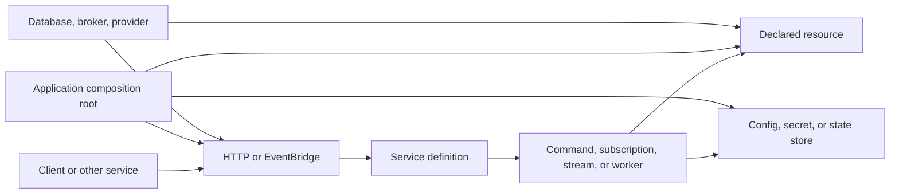

PURISTA separates business capability definitions from application runtime
composition. A versioned service declares what it can do. The application
selects the concrete transports, stores, resources, HTTP listener, credentials,
and deployment topology that make those definitions run.

## Assign each concern once

| Concern | Canonical owner | Why |
| --- | --- | --- |
| Business name, service version, schemas, commands, subscriptions, streams, queues, and mounted Harness targets | Versioned service definition | These are the callable and observable business contract. |
| Database repository, provider SDK, mail client, or another external integration interface | Service resource declaration | Handlers receive a typed capability without constructing infrastructure. |
| Concrete resource, EventBridge, QueueBridge, stores, model providers, logger, metrics, and credentials | Application composition root | Deployment-specific choices stay replaceable and testable. |
| HTTP route projection and authentication middleware | HTTP service/application composition | HTTP is an adapter over declared Framework targets; business authorization remains in service guards. |
| Database records and domain facts | Database or domain-owned resource | `StateStore` is for application/session-like state, not a substitute for the domain database. |
| Process listener, readiness, signal handling, and shutdown order | Application entry point | One owner can stop intake, services, resources, and transports in dependency order. |

This boundary is enforced through builders. A handler can use only resources,
stores, outbound calls, events, queues, streams, or Harness targets declared by
its service definition. The composition root must then provide the concrete
runtime dependencies required by those declarations.

## Follow one request

1. A transport creates a Framework message with a receiver address and trusted caller identity.
2. The EventBridge routes it to a started service instance.
3. The service validates schemas, runs transforms and business guards, and calls the handler.
4. The handler uses declared resources or invokes another address through the EventBridge.
5. PURISTA validates the result and returns it, streams frames, enqueues work, or publishes the configured fact.

The topology can change from one process to several without changing the
service contract. Network and delivery guarantees do change, so the
composition and deployment chapters own those choices.

Continue with [services and boundaries](/handbook/framework/understand-the-framework/services-and-boundaries/)
for versioning and extraction decisions. Use
[runtime composition and lifecycle](/handbook/framework/understand-the-framework/runtime-composition-and-lifecycle/)
for exact startup and shutdown ownership.

Next: [services and boundaries](/handbook/framework/understand-the-framework/services-and-boundaries/).
