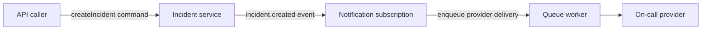

Choose the primitive from the caller's contract, not from the code you already have.

| Need | Use | Caller receives | Main consequence |
| --- | --- | --- | --- |
| A business result now | Command | Validated response | Keep the handler bounded by a timeout. |
| Inform independent consumers | Success/custom event and subscription | No direct subscriber result | Consumers must handle duplicate or failed delivery. |
| Incremental output | Stream | Ordered frames until completion | Define cancellation and terminal failure behavior. |
| Work later or with retry | Queue and worker | Job acceptance/result reference | Side effects must be idempotent. |
| Model-assisted business action | AI-powered service | Command, stream, or queued outcome | Provider and Harness runtime are explicitly enabled. |

An event is a fact: `incidentCreated`. A command is an intent: `createIncident`. Do not use an event to request a specific service to perform work; use a command or queue when the requester needs that ownership and outcome.

## Follow one incident through the right boundaries

An API caller creates an incident and needs its identifier immediately, so use
a command. The incident service then emits an `incident.created` fact; a
notification service can react independently. If notifying an on-call provider
may be slow or must retry, the notification capability enqueues its own job.

This separates the caller's bounded command response from notification delivery
and gives each capability a focused failure policy. The notification worker
still needs an idempotency record: a broker retry can happen after the provider
has accepted the message but before acknowledgement.

Start with a [command](/handbook/framework/build-services/commands/) when the
caller needs a response, then follow the focused guides for
[subscriptions](/handbook/framework/build-services/subscriptions/),
[queues and workers](/handbook/framework/build-services/queues-and-workers/),
or [streams](/handbook/framework/build-services/streams/).

Next: [runtime composition and lifecycle](/handbook/framework/understand-the-framework/runtime-composition-and-lifecycle/).
