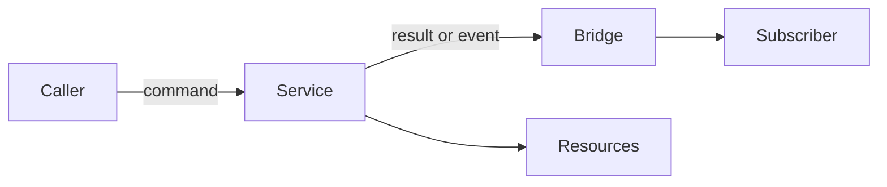

PURISTA organizes backend behavior around versioned services and typed message
contracts. Start here to choose a boundary, an execution primitive, or a
deployment shape before implementing a particular builder method.

The service owns business behavior. The application composition root owns bridges, stores, HTTP servers, credentials, and deployment wiring. This distinction keeps the same service definition usable in a modular monolith or a distributed deployment.

## Read by question

| Question | Page |
| --- | --- |
| Which layer owns business definitions, adapters, and external systems? | [Architecture and ownership at a glance](/handbook/framework/understand-the-framework/architecture-and-ownership/) |
| What is the unit of business ownership? | [Services and boundaries](/handbook/framework/understand-the-framework/services-and-boundaries/) |
| What is validated and transported? | [Messages, schemas, and contracts](/handbook/framework/understand-the-framework/messages-schemas-and-contracts/) |
| When should I use a command, event, stream, queue, or agent? | [Commands, events, and execution flow](/handbook/framework/understand-the-framework/commands-events-and-execution-flow/) |
| Where do adapters and services start? | [Runtime composition and lifecycle](/handbook/framework/understand-the-framework/runtime-composition-and-lifecycle/) |
| Can the same service run locally and remotely? | [Distribution and deployment models](/handbook/framework/understand-the-framework/distribution-and-deployment-models/) |
| What delivery behavior can I rely on? | [Reliability and delivery guarantees](/handbook/framework/understand-the-framework/reliability-and-delivery-guarantees/) |
| How should I classify an expected rejection or inspect failures? | [Handle errors across service primitives](/handbook/framework/build-services/handle-service-errors/) and [observability](/handbook/framework/secure-and-operate/observability/) |

Next: [architecture and ownership at a glance](/handbook/framework/understand-the-framework/architecture-and-ownership/).
