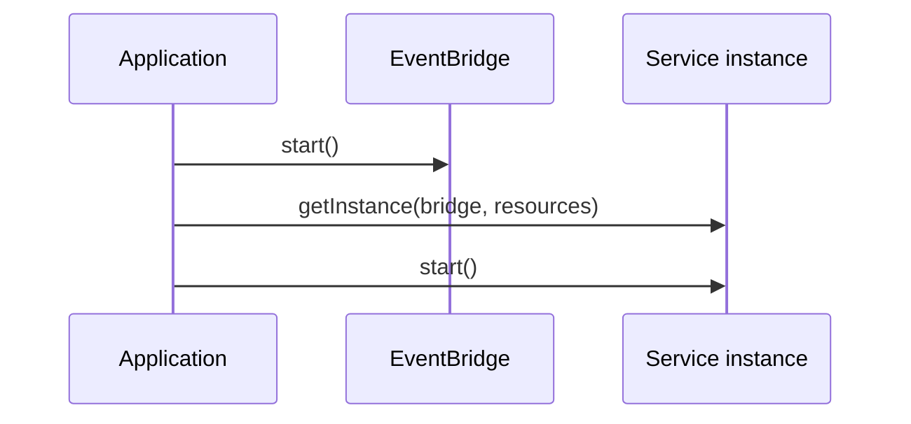

The composition root is usually `src/index.ts`. It is the one place that joins concrete infrastructure to service definitions.



The order matters: `getInstance(...)` composes a service, while `start()`
validates it against the selected runtime and registers its receivers. A service
does not begin receiving messages merely because an object exists.

| Lifecycle step | Owner | What happens | Failure boundary |
| --- | --- | --- | --- |
| `eventBridge.start()` | Application | Connects/initializes the chosen transport and makes health checks meaningful | A service refuses to start when its EventBridge is unhealthy. |
| `serviceBuilder.getInstance(eventBridge, options)` | Application composition | Creates the service with resources, stores, logger, metrics, and optional QueueBridge; validates required resources/configuration shape during composition where applicable | Missing required resources or invalid composition options fail before traffic begins. It does not register receivers. |
| `service.start()` | Service runtime | Validates the service config, checks bridge health, registers commands/subscriptions/streams, starts configured queue workers, and announces service readiness | Unsupported bridge/queue capabilities, invalid config, unavailable bridge, or registration failure prevent this service from becoming ready. |
| `service.destroy()` | Application shutdown | Cancels active streams, stops queue workers, closes its started QueueBridge, and performs service cleanup | The platform must still allow enough grace time for the selected adapter to recover unfinished work. |

One HTTP Hono process is a separate service composition. In a monolith it reads
in-memory definitions before it starts; in a separate deployment it must start
and subscribe before business services announce HTTP endpoints. Follow the
[HTTP runtime architecture](/handbook/framework/expose-and-consume-services/http-and-rest/runtime-architecture/)
instead of treating Hono as a route middleware added to each service.

A service with queues starts its QueueBridge during `service.start()` and calls
`destroy()` on that bridge during service shutdown. Give a shared QueueBridge a
clear composition owner, or use one coordinated service/application lifecycle;
otherwise stopping one service can close infrastructure still needed by another.

## Build the smallest running application

Start the selected bridge before starting services, then construct every service
with its concrete resources and service configuration. This is also the right
place for stores, server setup, telemetry, and shutdown registration.

```ts title="src/index.ts"
import { DefaultEventBridge } from '@purista/core'
import { createIncidentRepository } from './resource/createIncidentRepository.js'
import { incidentV1Service } from './service/incident/v1/incidentV1Service.js'

const eventBridge = new DefaultEventBridge()
await eventBridge.start()

const incidentService = await incidentV1Service.getInstance(eventBridge, {
  resources: { incidentRepository: createIncidentRepository() },
})
await incidentService.start()
```

`DefaultEventBridge` is included in `@purista/core` and is appropriate for a
local/in-process application. A durable broker is a separately installed and
wired adapter; choose it only when the deployment needs its delivery behavior.
The [event delivery](/handbook/framework/connect-distributed-infrastructure/event-delivery/)
chapter provides that decision and setup path.

## Ownership

| Application owns | Service owns |
| --- | --- |
| Adapter choice, credentials, network, logger, HTTP server, deployment configuration | Business handlers, schemas, message names, local service configuration |
| Concrete resources passed to `getInstance(...)` | The interface it expects from those resources |

For tests, replace the application-owned bridge or resource with the provided mocks or a deterministic fake. Do not test a handler by starting an external broker unless the test is specifically an adapter integration test.

## Make readiness observable

Mark a process ready only after all of its required adapters are healthy and
all services that own traffic have completed `start()`. A TCP listener, a
constructed service instance, or a generated HTTP route alone is not readiness.
For a distributed Hono deployment, route registration is also part of readiness:
start Hono first, then verify each announced operation before sending external
traffic. During shutdown, reject HTTP intake first and use the documented
[graceful shutdown order](/handbook/framework/secure-and-operate/reliability/graceful-shutdown/);
do not rely on a process kill to acknowledge or complete queued work.

Next: [distribution and deployment models](/handbook/framework/understand-the-framework/distribution-and-deployment-models/).
