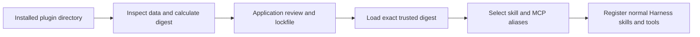

Install the first-party loader when plugin packages are part of your delivery:

```sh title="Install Agent Plugin support"
npm install @purista/harness-agent-plugins
```

`@purista/harness-agent-plugins` has a peer dependency on `@purista/harness`.
Selecting an MCP component also needs the optional
`@modelcontextprotocol/client` peer used by Harness MCP tools. Inspection and
skill-only binding do not need the MCP client.

It is deliberately a data loader, not an executable plugin system. A plugin may
declare immediate child skills and modern MCP servers; it cannot add agents,
workflows, providers, credentials, sandbox authority, or runtime code.

By the end of this path, a reviewed local research plugin contributes one
explicitly named skill and, if selected, one MCP tool to a normal Harness
definition. Store the reviewed digest in deployment configuration or a reviewed
lockfile before this code runs—do not inspect a package and trust that same
unreviewed digest in production.



## 1. Inspect an untrusted package

`inspectAgentPlugin(...)` reads package data and returns inventory plus
diagnostics. It does not import JavaScript, start MCP, fetch a schema, connect
to a URL, or expand command placeholders.

| Source or option | Default | Meaning |
| --- | --- | --- |
| `root` | required | Already-installed local plugin directory containing `plugin.json` |
| `trust` | `untrusted` | Application review state; manifest content cannot set it |
| `expectedDigest` | none | Optional reviewed lowercase SHA-256 used to report a mismatch during inspection |
| `dataDirectory` | none | Caller-owned persistent data directory used later only for approved stdio staging |
| `maxFileBytes` | 2 MiB | Maximum JSON manifest or `SKILL.md` size read during inspection |
| `maxPackageBytes` | 100 MiB | Maximum aggregate bytes hashed for the package digest |

The returned inspection contains `valid`, validated manifest metadata, the
effective trust, digest, content-free skill and MCP inventories, and
content-free diagnostics. `valid: true` means discovery succeeded; it does not
mean the application has trusted or authorized the package.

API reference: [`inspectAgentPlugin(...)`](/handbook/api/functions/_purista_harness-agent-plugins.inspectAgentPlugin/),
[`AgentPluginSource`](/handbook/api/interfaces/_purista_harness-agent-plugins.AgentPluginSource/), and
[`AgentPluginInspection`](/handbook/api/interfaces/_purista_harness-agent-plugins.AgentPluginInspection/).

## 2. Load only the reviewed digest

```ts title="src/loadReviewedResearchPlugin.ts"
import { inspectAgentPlugin, loadAgentPlugins } from '@purista/harness-agent-plugins'

export async function loadReviewedResearchPlugin(root: string, expectedDigest: string) {
	const inspection = await inspectAgentPlugin({ root })
	if (!inspection.valid || inspection.digest !== expectedDigest) {
		throw new Error('Plugin is invalid or differs from the reviewed digest.')
	}

	const [plugin] = await loadAgentPlugins({
		plugins: [{ root, trust: 'trusted', expectedDigest }],
	})
	if (!plugin) throw new Error('The reviewed plugin was not loadable.')

	const bindings = plugin.bindings({
		skills: { research_playbook: 'playbook' },
		tools: {
			search_knowledge: {
				server: 'knowledge',
				tool: 'search',
				description: 'Search approved product knowledge.',
				headers: { 'x-application': 'support' },
			},
		},
	})
	if (bindings.diagnostics.some(diagnostic => diagnostic.level === 'error')) {
		throw new Error('The selected plugin bindings are invalid.')
	}

	return bindings
}
```

`loadAgentPlugins(...)` processes each source independently and returns only
trusted, valid entries whose current digest equals `expectedDigest`. An
invalid, untrusted, changed, or malformed source is omitted; inspect first when
the application needs diagnostics for a reviewer.

| Load option | Default | Meaning |
| --- | --- | --- |
| `plugins` | required | Approved local roots; every entry requires `expectedDigest` |
| `trustedRoots` | none | Application-owned roots whose contained plugin directories are trusted |
| `supportedTransports` | `stdio` and `streamable-http` | Narrows the MCP transports that may be bound |
| `validationMode` | `strict` | Skill frontmatter validation used for projected skills |
| `maxFileBytes`, `maxPackageBytes` | 2 MiB / 100 MiB | Same bounded inspection and digest limits |

Do not set `trust: 'trusted'` merely because inspection succeeded. Compare the
digest with an independently reviewed deployment value, as the example does.

## 3. Select explicit local aliases

`plugin.bindings(...)` does not bind every discovered component. The
application maps each selected plugin skill name or MCP server/tool pair to a
local Harness ID.

| Binding input | Meaning |
| --- | --- |
| `skills: { local_alias: plugin_skill_name }` | Projects one discovered immediate child skill as a trusted Harness `SkillDefinition` |
| `tools: { local_alias: { server, tool, description, headers? } }` | Projects one upstream MCP tool through the selected server |

The result contains normal `skills` and `tools` registries, diagnostics for
invalid selections, and provenance with plugin name/version, digest, component,
and transport. Treat any error diagnostic as a failed composition. Warnings
such as an unsupported disabled transport mean that component was not bound.

Plugin-declared HTTP headers are never sent. Only application-owned static
headers from the binding are projected, and sensitive authentication headers
are prohibited at the plugin layer.

API reference: [`LoadedAgentPlugin`](/handbook/api/interfaces/_purista_harness-agent-plugins.LoadedAgentPlugin/),
[`AgentPluginToolBinding`](/handbook/api/interfaces/_purista_harness-agent-plugins.AgentPluginToolBinding/), and
[`AgentPluginBindings`](/handbook/api/interfaces/_purista_harness-agent-plugins.AgentPluginBindings/).

## 4. Register the projected definitions

Pass the projected registries through the normal Harness builders, then grant
the agent only the aliases it needs:

```ts title="src/createResearchHarness.ts"
const harness = defineHarness({ name: 'research' })
	.sandbox(sandbox)
	.models(models)
	.skills(bindings.skills)
	.tools(bindings.tools)
	.agent('researcher', {
		model: 'assistant',
		input: z.string(),
		output: z.string(),
		instructions: 'Research the question using approved sources.',
		skills: ['research_playbook'],
		builtinTools: ['read'],
		tools: ['search_knowledge'],
	})
	.build()
```

The `read` built-in lets the default agent loop load the selected skill's
mounted `SKILL.md`; it does not grant shell execution. If the plugin has no
selected MCP tool, omit `.tools(bindings.tools)` and the agent's `tools` field.
Use the normal [skill](/handbook/harness/add-capabilities/skills/) and
[MCP](/handbook/harness/add-capabilities/mcp/) guides for runtime requirements,
permissions, and tests.

API reference: [`defineHarness(...)`](/handbook/api/functions/_purista_harness.defineHarness/),
[`HarnessBuilder.sandbox(...)`](/handbook/api/interfaces/_purista_harness.HarnessBuilder/#sandbox),
[`HarnessBuilder.models(...)`](/handbook/api/interfaces/_purista_harness.HarnessBuilder/#models),
[`HarnessBuilder.skills(...)`](/handbook/api/interfaces/_purista_harness.HarnessBuilder/#skills),
[`HarnessBuilder.tools(...)`](/handbook/api/interfaces/_purista_harness.HarnessBuilder/#tools),
[`HarnessBuilder.agent(...)`](/handbook/api/interfaces/_purista_harness.HarnessBuilder/#agent), and
[`HarnessBuilder.build()`](/handbook/api/interfaces/_purista_harness.HarnessBuilder/#build).

When you select an MCP tool, a plugin package never supplies an authorization
credential: replace the illustrative static header with application-owned,
non-secret routing metadata and configure credentials outside the plugin.

## Establish trust outside the plugin

The application supplies source identity, inspects load results, records a
reviewed SHA-256 digest, and binds each accepted skill or MCP tool explicitly.
There is no digest-free trusted-loading mode. Re-review and re-digest every
upgrade; reject malformed manifests and unexpected entries.

For remote MCP, bind non-secret static headers and credentials in application
configuration. Plugin-declared headers are validated but never sent. Remote
plugins require modern stateless Streamable HTTP; legacy stateful MCP and
HTTP+SSE are rejected.

Stdio plugins also require a spawn-capable sandbox with an immutable package
mount. The local host-directory sandbox cannot provide that guarantee, so it is
not a production isolation boundary. Use an isolating adapter, test a changed
digest and failed staging, and record the selected plugin version in your
deployment evidence.

## 5. Test the review and staging boundary

Cover invalid manifest, unsupported schema, path escape, untrusted source,
digest mismatch, unknown skill/server, disabled transport, and duplicate local
alias. For stdio, also test missing or overlapping `dataDirectory`, changed
bytes between review and staging, immutable mount capability, data sync, and
cleanup. For remote MCP, test the selected transport, redirect rejection,
application authentication, and upstream tool schema with a controlled server.

These tests prove package review, projection, and runtime wiring. They do not
prove that skill instructions are safe or that an MCP server is authorized for
production data; those require application review and the real deployment
boundary.

Run the maintained data-only fixture without a model or MCP connection:

```bash title="Verify Agent Plugin inspection and binding"
cd examples/agent-plugins
npm install
npm run typecheck
npm run build
npm run start -- ./fixtures/knowledge-plugin
```

The output contains only diagnostics and content-free provenance. Read the
[complete example](https://github.com/puristajs/harness/tree/main/examples/agent-plugins)
before adapting it to an installed package.

Next: [orchestrate multi-step work](/handbook/harness/orchestrate-work/).
