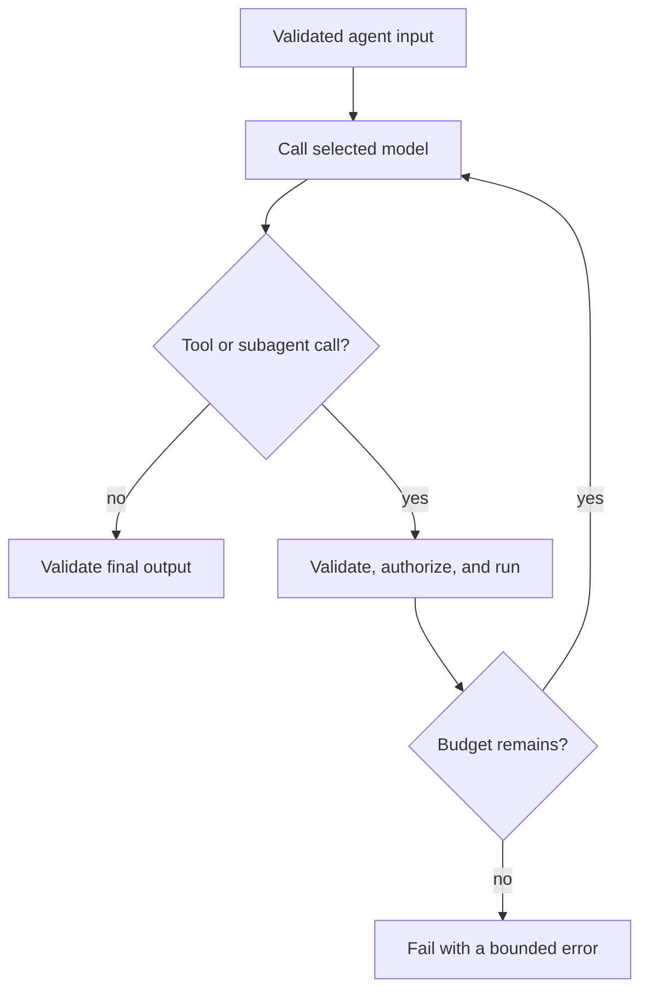

The standard agent loop asks the selected model for a result. When the model
requests an allowed tool, Harness validates and governs the call, runs it, adds
the result to the turn, and asks the model again. The loop ends with a
schema-valid result or fails when it reaches a declared limit.



## Declare explicit limits

```ts title="src/harness/researchCase.ts"
import { defineAgent } from '@purista/harness'

export const researchCase = defineAgent('researchCase', {
	model: 'assistant',
	input: researchInput,
	output: researchOutput,
	prompt: input => ({ role: 'user', content: JSON.stringify(input) }),
	instructions: 'Research the case using only the approved tools.',
	tools: [searchCases, readCase],
	subagents: { specialist: specialistAgent },
	loop: {
		maxSteps: 4,
		maxToolCalls: 6,
		maxSubagentCalls: 2,
		maxParallelSubagents: 2,
		maxDepth: 3,
	},
})
```

| Limit | What it bounds |
| --- | --- |
| `maxSteps` | Model turns in this agent run |
| `maxToolCalls` | Tool occurrences proposed across all turns |
| `maxSubagentCalls` | Delegations started by this agent |
| `maxParallelSubagents` | Delegations running at the same time |
| `maxDepth` | Nested subagent depth reachable from this agent |

Use the smallest values that cover the expected work. Higher limits can
increase latency, provider cost, and the number of attempted side effects.
They do not replace timeouts, tool permissions, business authorization,
governance, or sandbox isolation.

## Keep custom orchestration in workflows

Use a workflow when application code must
choose a fixed sequence, branch deterministically, call model operations
directly, coordinate several agents, or persist a human wait.

Test each limit with a strict fake provider. Prove that the next model, tool, or
subagent call does not start after the corresponding budget is exhausted. Also
test cancellation and the normalized error returned at the application
boundary.

Next: [define structured inputs and outputs](/handbook/harness/build-agents/inputs-and-structured-outputs/) or
[build a workflow](/handbook/harness/orchestrate-work/workflows/).
