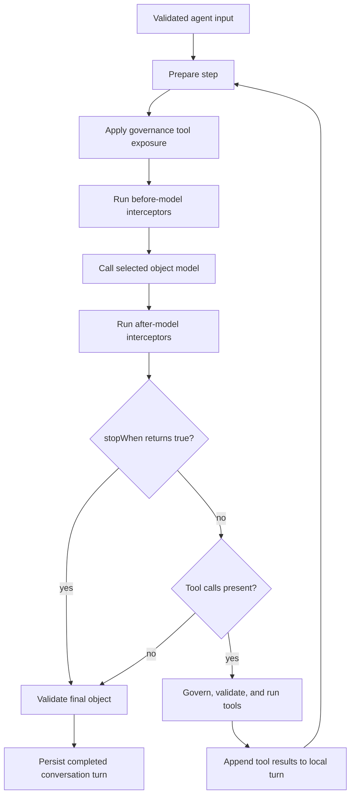

The default agent loop asks the selected model for a structured result. When the
model requests tools, Harness validates and runs the allowed calls, adds their
results to the local turn, and asks the model again. The loop finishes when the
model returns no tool calls, `stopWhen` ends it, or the step budget is reached.



Most agents need only the defaults. Add loop controls when the use case has a
specific, testable reason such as limiting cost, enabling an expensive tool
after retrieval, or stopping before a proposed action is executed.

## 1. Set a hard model-step budget

```ts title="src/harness/createResearchAgent.ts"
research_case: agent({
	model: 'assistant',
	input: researchInput,
	output: researchOutput,
	instructions: 'Research the case using the approved read-only tools.',
	tools: ['search_cases', 'read_case'],
	maxSteps: 4,
})
```

[`maxSteps`](/handbook/api/types/_purista_harness.AgentDefinition/#signature)
is the maximum number of model calls for this agent invocation. It must be a
positive integer. When omitted, Harness uses `defaults.agentMaxIterations`,
which defaults to `16`. Reaching the limit raises non-retriable
`AgentLoopBudgetError`; it does not return the latest unvalidated candidate.

Choose a value that covers the expected tool round trips plus one final model
response. Raising the value can increase cost and the number of possible side
effects. It is not a substitute for tool permissions, timeouts, or workflow
orchestration.

## 2. Prepare one model step

`prepareStep` runs before each model call. This example exposes the broad search
tool first and the detailed reader only after the first round.

```ts title="src/harness/createResearchAgent.ts"
research_case: agent({
	model: 'assistant',
	input: researchInput,
	output: researchOutput,
	instructions: 'Research the case using the approved read-only tools.',
	tools: ['search_cases', 'read_case'],
	maxSteps: 4,
	prepareStep: ({ step }) => ({
		activeTools: step === 0 ? ['search_cases'] : ['search_cases', 'read_case'],
	}),
})
```

[`prepareStep`](/handbook/api/types/_purista_harness.AgentDefinition/#signature)
may return nothing or a step-local override. It cannot add a tool that the
agent did not declare. Governance exposure runs after this filter and may
remove more tools; a preparation callback cannot restore a governance-hidden
tool.

| Callback input | Meaning |
| --- | --- |
| `step` | Zero-based model-call index. The first call is `0`. |
| `model` | Alias selected for the step before this callback's override. |
| `messages` | Frozen model-facing conversation messages before the system instruction is added. |
| `tools` | Frozen tools permitted by the agent definition before per-step filtering and governance exposure. |
| `input`, `sessionId`, `runId` | Validated run identity and input. |
| `history`, `memory`, `metadata`, `metrics` | Same bounded run context described on the instructions/context page. |

| Returned field | Runtime effect | Constraint |
| --- | --- | --- |
| `model` | Uses another registered alias for this model call. | Select an alias that supports structured object output and every modality needed by this step. |
| `instructions` | Replaces the system instructions for this call only. | Keep security and authority in enforceable controls. |
| `activeTools` | Keeps only the named model-facing tools for this call. | Unknown or undeclared names fail the run. Governance can still hide a retained tool. |
| `messages` | Replaces the call's message list for this step. | Must remain valid model messages and preserve protected transcript/tool-result structure. Use a context-projection policy for routine context-length recovery. |
| `call` | Overrides provider-neutral generation settings for this call. | Values still pass through the selected provider adapter and its supported range. |

`call` accepts these [`ModelCallOptions`](/handbook/api/interfaces/_purista_harness.ModelCallOptions/):

| Option | Use |
| --- | --- |
| `temperature` | Change randomness for this call when the selected provider supports it. |
| `maxTokens` | Bound provider output tokens for this call. |
| `topP` | Apply nucleus sampling when supported. Avoid changing both `topP` and `temperature` without evaluation evidence. |
| `stopSequences` | Stop generation at provider-supported sequences. |
| `parallelToolCalls` | Allow or disallow multiple tool proposals in one model turn. Harness still applies its own parallel tool limit. |
| `retry` | Override the alias retry setting for this call. It does not make tool effects idempotent. |
| `providerOptions` | Pass explicit adapter/provider-specific options. This couples the step to that provider; isolate and test the choice. |

The callback may be asynchronous, but its context does not expose a cancellation
signal. Keep it pure, local, and fast; move cancellable I/O into a tool or
workflow. A thrown callback, invalid message transform, or invalid active tool
fails closed before the provider call. Test each returned branch.

## 3. Stop before another tool round

`stopWhen` runs after the model response and after model-response interceptors,
but before requested tools execute.

```ts title="src/harness/createResearchAgent.ts"
research_case: agent({
	model: 'assistant',
	input: researchInput,
	output: researchOutput,
	instructions: 'Research the case using the approved read-only tools.',
	tools: ['search_cases', 'read_case'],
	maxSteps: 4,
	stopWhen: ({ step, toolCalls }) => step >= 2 && toolCalls.some(call => call.name === 'read_case'),
})
```

[`stopWhen`](/handbook/api/types/_purista_harness.AgentDefinition/#signature)
receives the preparation context plus the normalized `response` and its
`toolCalls`. Returning `true` skips those tool calls and treats the response's
object as the final candidate. Output interceptors and the agent output schema
still run; if the response object is incomplete, the invocation fails
validation.

Use this hook only when “stop now and validate this object” is correct. To deny
an unsafe tool while allowing the agent to continue, use permissions or
governance. To coordinate a fixed sequence of stages, use a workflow.

## 4. Test the loop decisions

Use a scripted fake provider and fake tool handlers. Verify:

- the first and later `activeTools` sets;
- an undeclared tool override fails before another model call;
- governance still removes a tool retained by `prepareStep`;
- `stopWhen: true` prevents the proposed tool handler from running;
- the stopped response must still pass the output schema;
- the configured step limit produces `AGENT_LOOP_BUDGET_EXCEEDED`;
- cancellation prevents another step from starting.

These are deterministic control-flow tests. Whether a live model chooses the
best tool or produces a good answer belongs in
[evaluations](/handbook/harness/test-and-evaluate/evaluate-prompts-and-outputs/).

Next: [define input and output contracts](/handbook/harness/build-agents/inputs-and-structured-outputs/).
