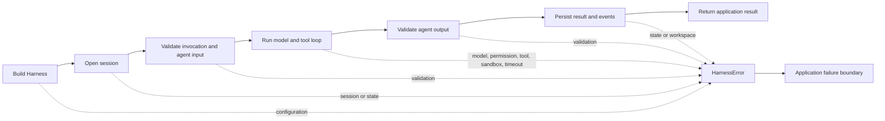

An agent can fail before the model is called, while a provider or tool is
running, or after the model returns. Your application must decide what the
caller may see and what operators need for diagnosis. Do not return a caught
error, its `message`, or its `meta` directly from an HTTP endpoint or queue
consumer.

By the end of this page, an application boundary will:

1. recognize Harness errors without assuming every error is safe to disclose;
2. return a small, stable response to the caller;
3. preserve the original error for logs and telemetry;
4. retry only when the operation and its side effects are safe to repeat.

## Follow a failure through the runtime



The failure stage changes the safe response. Invalid agent input belongs to the
caller and can become a bad-request response. Invalid agent output is an
internal contract failure; the caller must not receive the rejected value or
validator details.

## Keep the three error views separate

| View | Intended reader | What it contains | What to do with it |
| --- | --- | --- | --- |
| Thrown error | Application code in the current process | The original error identity; a `HarnessError` can also carry `cause` and `meta`. | Catch it at the application boundary. Pass the original object to trusted logging and telemetry. |
| Serialized error | Harness run events, persistence, and internal diagnostics | Stable `code`, `category`, `retriable`, `message`, and sanitized `meta`; no stack or `cause`. | Treat it as operational data. Sanitized does not mean approved for an untrusted caller. |
| Public response | HTTP, queue, UI, or another trust boundary | An application-owned status, stable public code, and intentionally generic message. | Build it from an allowlist. Never spread an error object or serialized envelope into it. |

[`isHarnessError(...)`](/handbook/api/functions/_purista_harness.isHarnessError/)
narrows an unknown value to [`HarnessError`](/handbook/api/classes/_purista_harness.HarnessError/).
[`serializeError(...)`](/handbook/api/functions/_purista_harness.serializeError/)
creates the internal envelope used by runtime events. It is not an HTTP error
mapper because an unknown `Error` keeps its original message.

## 1. Define the public error contract

Keep the contract smaller than the internal catalog. The caller needs to know
whether to correct its request, retry later, or contact support—not which model,
provider, schema path, tool argument, or database operation failed.

```ts title="src/http/publicAgentFailure.ts"
import { isHarnessError } from '@purista/harness'

export interface PublicAgentFailure {
	status: number
	body: {
		error: {
			code: string
			message: string
			retryable: boolean
		}
	}
}

const internalFailure = (): PublicAgentFailure => ({
	status: 500,
	body: {
		error: {
			code: 'AGENT_REQUEST_FAILED',
			message: 'The request could not be completed.',
			retryable: false,
		},
	},
})

export function toPublicAgentFailure(error: unknown): PublicAgentFailure {
	if (!isHarnessError(error)) return internalFailure()

	if (error.code === 'VALIDATION_ERROR') {
		const where = error.meta?.where

		// Only caller-owned boundaries are safe to classify as bad input.
		if (where === 'agent_input' || where === 'invoke_options') {
			return {
				status: 400,
				body: {
					error: {
						code: 'INVALID_AGENT_REQUEST',
						message: 'Check the request fields and try again.',
						retryable: false,
					},
				},
			}
		}
	}

	if (error.code === 'PERMISSION_DENIED' || error.code === 'POLICY_DENIED') {
		return {
			status: 403,
			body: {
				error: {
					code: 'AGENT_ACTION_NOT_ALLOWED',
					message: 'The requested action is not allowed.',
					retryable: false,
				},
			},
		}
	}

	if (error.code === 'OPERATION_TIMEOUT') {
		return {
			status: 504,
			body: {
				error: {
					code: 'AGENT_TIMEOUT',
					message: 'The operation did not finish in time.',
					retryable: true,
				},
			},
		}
	}

	if (error.code === 'MODEL_ERROR' && error.retriable) {
		return {
			status: 503,
			body: {
				error: {
					code: 'AGENT_TEMPORARILY_UNAVAILABLE',
					message: 'The agent is temporarily unavailable.',
					retryable: true,
				},
			},
		}
	}

	return internalFailure()
}
```

This is an example policy, not a universal HTTP mapping. A public API may choose
different status codes, but it should keep the allowlist and disclosure
boundary. Add public cases only after deciding that callers may distinguish
them. For example, exposing `AGENT_NOT_FOUND` can reveal an internal registry;
many applications should keep it as the generic `500` response.

## 2. Catch failures where the application owns the transport

Harness does not own your HTTP or queue protocol. Call the typed session API,
map a failure once, and log the original exception separately.

```ts title="src/http/handleClassifyCase.ts"
import { classifyCaseHarness } from '../harness/classifyCase.js'
import { toPublicAgentFailure } from './publicAgentFailure.js'

export async function handleClassifyCase(request: Request): Promise<Response> {
	try {
		// The transport value is untrusted; Harness validates it against the agent schema.
		const input = (await request.json()) as { summary: string }
		const session = await classifyCaseHarness.getSession('http-classifier')
		const idempotencyKey = request.headers.get('idempotency-key') ?? undefined

		const result = await session.agents.classify_case.run(input, {
			...(idempotencyKey ? { idempotencyKey } : {}),
			timeoutMs: 15_000,
		})

		return Response.json(result)
	} catch (error) {
		// Send `error` to trusted logging/telemetry before returning the safe view.
		const failure = toPublicAgentFailure(error)
		return Response.json(failure.body, { status: failure.status })
	}
}
```

The `idempotency-key` header is application policy. Harness accepts
`idempotencyKey` values matching `^[A-Za-z0-9_.:-]{1,120}$`. Repeating a
successful direct agent invocation with the same session, agent, input, and key
returns the recorded output without another model call or transcript turn. A
changed input with the same key is rejected.

Validate or generate the key before passing it to Harness. For a queue with
at-least-once delivery, use the transport's stable delivery ID. Do not derive a
key from prompt text or create a new random key on every redelivery.

## 3. Decide whether the failure is recoverable

`error.retriable` means the cause can be transient. It does not prove that the
whole business operation is safe to repeat.

| Failure | Default action | Retry only when |
| --- | --- | --- |
| Invalid input or invoke options | Correct the request. | Do not retry unchanged input. |
| Invalid model or agent output | Record an internal contract failure; improve schema, provider mapping, or instructions. | A bounded retry is explicitly designed and produces no duplicate side effect. |
| Permission, policy, or Guardrail block | Respect the decision. | Do not retry unchanged authority or content. A new request must pass the boundary again. |
| Provider network, rate-limit, or availability failure | Use the model alias retry policy for short provider retries. | The remaining time budget permits it and any earlier effect is idempotent or absent. |
| Tool or sandbox failure | Inspect the wrapped cause and operation. | The tool operation is idempotent, or reconciliation proves that it did not complete. |
| Session busy | Delay this competing mutation. | The original run is still authoritative and the caller uses the same idempotency identity. |
| Timeout or cancellation | Stop scheduling new work and reconcile external state. | The caller still wants the work and every uncertain effect has an idempotency or compensation path. |
| State or workspace failure | Preserve the run and diagnose the adapter. | The adapter reports a transient failure and replay follows its consistency contract. |

Provider retries are configured on the
[model alias](/handbook/harness/configure-the-runtime/configuration-and-model-settings/#choose-a-retry-policy-for-the-caller).
Use durable workflow steps for multi-stage recovery; direct HTTP retries alone
do not make payments, emails, or database writes exactly once.

## Understand denied tool calls

In the default model/tool loop, a valid permission or governance denial is a
safe tool result. The model can continue and explain that it could not perform
the action. The following failures terminate the run instead:

- malformed or throwing policy/approval callbacks;
- Guardrail decision-evaluation failures;
- cancellation or timeout of the decision boundary;
- invalid decision evidence.

This distinction keeps an expected refusal usable while failing closed when
the control itself cannot make a trustworthy decision. See
[Govern agent actions](/handbook/harness/secure-and-govern/) and
[Protect content with Guardrails](/handbook/harness/secure-and-govern/guardrails/)
for the two boundaries.

## 4. Test the unhappy path deterministically

Test your mapping with concrete error instances. This proves application flow
and disclosure behavior without depending on a model's wording.

```ts title="src/http/publicAgentFailure.test.ts"
import { describe, expect, it } from 'vitest'
import { ModelError, ValidationError } from '@purista/harness'
import { toPublicAgentFailure } from './publicAgentFailure.js'

describe('toPublicAgentFailure', () => {
	it('returns a correctable response for invalid caller input', () => {
		const error = new ValidationError('Agent input is invalid.', {
			where: 'agent_input',
			issues: { count: 1, truncated: false },
		})

		expect(toPublicAgentFailure(error)).toEqual({
			status: 400,
			body: {
				error: {
					code: 'INVALID_AGENT_REQUEST',
					message: 'Check the request fields and try again.',
					retryable: false,
				},
			},
		})
	})

	it('does not expose output validation details', () => {
		const error = new ValidationError('Secret output value was invalid.', {
			where: 'agent_output',
			issues: { count: 1, truncated: false },
		})

		expect(JSON.stringify(toPublicAgentFailure(error))).not.toContain('Secret')
		expect(toPublicAgentFailure(error).status).toBe(500)
	})

	it('marks a transient model outage as retryable without leaking provider data', () => {
		const error = new ModelError('Provider request failed.', {
			provider: 'provider-a',
			model: 'private-deployment-name',
			method: 'generateText',
			status: 503,
			reason: 'provider_unavailable',
		})

		const failure = toPublicAgentFailure(error)
		expect(failure.status).toBe(503)
		expect(failure.body.error.retryable).toBe(true)
		expect(JSON.stringify(failure)).not.toContain('private-deployment-name')
	})

	it('hides unknown exception messages', () => {
		const failure = toPublicAgentFailure(new Error('database password appeared in an unexpected driver error'))

		expect(failure.status).toBe(500)
		expect(JSON.stringify(failure)).not.toContain('password')
	})
})
```

Also test that a failed input or policy boundary prevents the model or protected
tool from running. Use a fake provider and deterministic adapters for those
tests. This verifies your implementation and control flow; model correctness
belongs in [evaluations](/handbook/harness/test-and-evaluate/evaluate-prompts-and-outputs/).

Use the [error catalog](/handbook/harness/reference/error-catalog/) when adding
another application mapping, and [observe failures](/handbook/harness/configure-the-runtime/observability/)
to correlate the safe public response with trusted run evidence.
