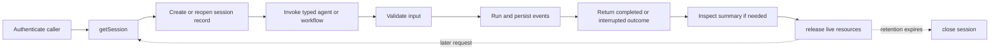

A session is the application-facing boundary for agents and workflows. It gives
related runs one stable identity, conversation history, memory scope, and
sandbox ownership record. A session is not a queue: it accepts one active run
at a time.

Use a new session ID for an independent conversation or task context. Reopen
the same ID when a later request should continue with the same persisted
session state.



## 1. Choose the session ID and verified identity

The application creates the session ID. Use a stable, opaque value that does
not contain a prompt, email address, access token, or other sensitive content.
Do not let an unauthenticated caller select another user's session ID.

```ts title="src/transport/runSupportClassifier.ts"
import { classifyCaseHarness } from '../harness/classifyCase.js'

export interface VerifiedCaller {
	tenantId: string
	principalId: string
}

export async function runSupportClassifier(conversationId: string, caller: VerifiedCaller, summary: string) {
	const session = await classifyCaseHarness.getSession(`support:${conversationId}`, {
		identity: {
			tenantId: caller.tenantId,
			principalId: caller.principalId,
		},
	})

	try {
		return await session.agents.classify_case.run({ summary })
	} finally {
		await session.release()
	}
}
```

[`harness.getSession(id, options)`](/handbook/api/interfaces/_purista_harness.Harness/#getsession)
creates the persisted session record when the ID is new or reopens the existing
record. It does not call an agent. Sandbox compute is attached lazily when a
run or session capability needs it.

| Argument or option | What it means | How to use it |
| --- | --- | --- |
| `id` | Application-owned logical session key. | Keep it stable for one conversation and unique across unrelated conversations. Store the mapping in the application, not in a prompt. |
| `identity.tenantId` | Optional verified tenant dimension. | Supply it from the application authentication boundary. Business authorization must already allow this caller to use the requested session. The value becomes part of the immutable session binding. |
| `identity.principalId` | Optional verified principal dimension. | Supply it when memory, sandbox, or policy needs a principal scope. Omit the field rather than setting it to `undefined`. |
| `sandboxOwner` | Advanced attachment to an existing immutable sandbox owner. | Use only with an application-owned `authorizeOwner` callback configured on `.sandbox(...)`. It is not a shortcut for sharing by session ID. |

Identity is immutable for the lifetime of a persisted session record. Every
later `getSession(...)` call must provide the same identity, including the same
omitted dimensions. A mismatch fails before memory or sandbox access. Harness
enforces this binding, but the application still owns authentication and the
decision that this caller may use the tenant, principal, and session ID.

For shared or borrowed sandbox owners, follow
[Isolate agent execution](/handbook/harness/secure-and-govern/sandbox-and-mcp/)
before using `sandboxOwner`.

## 2. Invoke the typed agent

Each registered agent appears under `session.agents` with the input and output
types inferred from its schemas.

```ts title="src/transport/classifySupportCase.ts"
const outcome = await session.agents.classify_case.run(
	{
		summary: 'The customer cannot sign in after a password reset.',
	},
	{
		timeoutMs: 15_000,
		idempotencyKey: 'delivery:ticket-7342',
		metadata: {
			channel: 'support_api',
			riskTier: 'standard',
		},
	},
)

if (outcome.status === 'completed') {
	console.log(outcome.output.priority)
} else {
	console.log(`Run ${outcome.runId} paused for ${outcome.interrupt.type}`)
}
```

[`run(input, options)`](/handbook/api/interfaces/_purista_harness.AgentInvoker/#run)
waits until the run completes, reaches a durable resumable interrupt, or
throws. A completed outcome contains the schema-valid value under `output`; an
interrupted outcome contains the typed reason under `interrupt`. The same
shared invocation options are accepted by agent/workflow `run(...)` and
`stream(...)`, except that `durable` is workflow-only.

| Invocation option | Default | Use it for | Important constraint |
| --- | --- | --- | --- |
| `signal` | No caller signal | Propagate request, job, or shutdown cancellation. | Cancellation is cooperative; reconcile an external side effect that may already have started. |
| `timeoutMs` | Harness `defaults.runTimeoutMs` (`600_000` unless changed) | Bound this run more tightly. | `0` disables the run timeout. Negative values are rejected. Provider, tool, and decision sub-budgets still apply. |
| `historyWindow` | Model alias or Harness default | Limit non-system history sent to the model for this call. | It does not delete stored history. Use retention policy for storage limits. |
| `idempotencyKey` | New run identity | Deduplicate at-least-once delivery of a direct invocation. | Must match `^[A-Za-z0-9_.:-]{1,120}$`. Reuse only for the same session, target, and input. |
| `contextProjection` | Model alias or Harness default | Override retry-only tool-result projection for this invocation. | Configure it only when recovering from context-length pressure; it is not a general redaction policy. |
| `traceparent` | New trace | Continue a validated W3C distributed trace. | Invalid trace context is ignored and logged; accept it only at the trusted transport boundary. |
| `tracestate` | None | Continue vendor trace state with `traceparent`. | Maximum 512 characters; newline-bearing values are invalid. |
| `metadata` | Empty object | Supply trusted scalar routing/policy/telemetry facts to handlers. | Metadata is not authenticated identity. Keep values JSON-compatible, bounded, and free of secrets. |
| `durable` | Ephemeral run | Start or resume durable workflow execution. | Supplying it to an agent invocation throws `ValidationError`; use the durable workflow guide. |

For provider retries and model timeouts, use
[model settings](/handbook/harness/configure-the-runtime/configuration-and-model-settings/).
For durable workflow options, use
[Run durable workflows](/handbook/harness/orchestrate-work/durable-workflows/).

## 3. Handle concurrent use deliberately

Only one agent or workflow run can mutate a session at a time. A competing run,
history replacement, release, or close operation can raise
`SessionBusyError`. Do not use repeated concurrent calls against one session as
a fan-out mechanism.

| Requirement | Use |
| --- | --- |
| Continue one conversation in order | Reuse one session and serialize delivery in the application or queue consumer. |
| Process unrelated requests concurrently | Give each request or conversation its own session ID. |
| Run parallel branches inside one business process | Use a workflow and its bounded fan-out helpers. |
| Buffer bursts or retry after process failure | Put work on an application/PURISTA queue; a session itself is not a broker. |

If a broker can redeliver a message, pass its stable delivery ID as
`idempotencyKey`. A successful replay returns the recorded output without a new
model call or transcript turn. A different input bound to the same key is
rejected rather than silently returning an unrelated result.

## 4. Inspect the completed run

When an application needs accounting or operator evidence, read the final run
ID from a streamed `run.started`/`run.finished` event and ask the session for a
summary:

```ts title="src/operations/readAgentRun.ts"
const summary = await session.getRunSummary(runId)

if (summary) {
	console.log({
		status: summary.status,
		modelCalls: summary.modelCalls,
		toolCalls: summary.toolCalls,
		totalTokens: summary.tokenTotals.totalTokens,
	})
}
```

[`session.getRunSummary(runId)`](/handbook/api/interfaces/_purista_harness.Session/#getrunsummary)
returns `undefined` when the storage has no run. A summary contains status and
timestamps, aggregate provider-reported tokens, model/tool/agent call counts,
and an internal serialized error when the run failed. It does not replace the
application's authorization check for who may inspect a run, and its error is
not a public HTTP response. See
[Handle agent failures safely](/handbook/harness/build-agents/errors-and-failure-behavior/).

## 5. End the attachment or session intentionally

Use cleanup in a `finally` block after the transport is finished with the
session facade.

| Session method | What it removes | What remains | Use it when |
| --- | --- | --- | --- |
| [`release()`](/handbook/api/interfaces/_purista_harness.Session/#release) | Live, process-local sandbox/MCP attachment and child tasks owned by this facade. | Persisted session record, history, runs, memory, and durable state. | A request or worker is done but the logical session may reopen later. This is the normal per-request cleanup. |
| [`disposeSandbox()`](/handbook/api/interfaces/_purista_harness.Session/#disposesandbox) | Owned sandbox and matching workspace resources; borrowed owners are detached, not deleted. | Session record, history, run receipts, and separately managed memory. | The application's sandbox retention policy expires. A later live invocation of the disposed owned session fails closed. |
| [`destroy()`](/handbook/api/interfaces/_purista_harness.Session/#destroy) | Live resources and persisted session data owned by `HarnessStorage`; owned sandbox resources are disposed. | Data in external systems that have their own deletion contract may remain. | The logical session is intentionally destroyed. Treat broader privacy deletion as an application workflow. |
| [`harness.shutdown()`](/handbook/api/interfaces/_purista_harness.Harness/#shutdown) | All process-local sessions and Harness-owned adapter resources. | Persisted backend data. | The process is shutting down after it has stopped accepting work. Inspect returned cleanup errors. |

Do not call `release()`, `disposeSandbox()`, or `destroy()` while the session is
running. Stop accepting new work, cancel or await the active run, and then
clean up. A released facade is no longer usable; call `getSession(...)` again
to reopen the logical session.

Next: [stream run progress and propagate cancellation](/handbook/harness/build-agents/streaming-cancellation-and-timeouts/).
