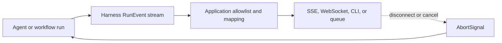

Use `run(...)` when the caller only needs the final typed result. Use
`stream(...)` when the application needs progress, live text, workflow wait
events, or the run ID before completion. Harness produces typed events; the
application decides which events may cross an HTTP, WebSocket, queue, or CLI
boundary.



Do not serialize every `RunEvent` directly to a browser. Tool input/output,
model messages, partial objects, and internal error envelopes can contain data
that the public transport must not expose.

## 1. Consume the run lifecycle

Every normal streamed invocation begins with `run.started` and ends with
`run.finished`. The stream then completes. If the run failed, Harness emits the
terminal event with its internal serialized error and the async iterator throws
the original failure after queued events have been delivered.

```ts title="src/transport/observeSupportClassification.ts"
import { classifyCaseHarness } from '../harness/classifyCase.js'

const session = await classifyCaseHarness.getSession('support-thread-01')

try {
	for await (const event of session.agents.classify_case.stream({
		summary: 'The customer cannot sign in after a password reset.',
	})) {
		switch (event.type) {
			case 'run.started':
				console.log('Run started:', event.runId)
				break
			case 'run.finished':
				if (event.output) console.log('Result:', event.output)
				break
			case 'stream.overflow':
				console.warn('Progress events were dropped:', event.dropped)
				break
		}
	}
} catch (error) {
	// Map the original failure at the application boundary.
	console.error(error)
} finally {
	await session.release()
}
```

[`session.agents.<id>.stream(input, options)`](/handbook/api/interfaces/_purista_harness.AgentInvoker/#stream)
accepts the same typed input and invocation options as `run(...)`. It returns
an `AsyncIterable<RunEvent>` rather than the final output directly. Workflow
invokers expose the corresponding `stream(...)` method.

## 2. Know which events can contain application data

| Event family | What it reports | Transport guidance |
| --- | --- | --- |
| `run.started`, `run.finished` | Run identity and terminal result/error. | Safe only after mapping. Final output may be public by contract; the serialized error is internal. |
| `agent.started`, `agent.finished` | Agent lifecycle and optional output/error. | Prefer an application status enum. Do not expose internal agent IDs or errors unless they are part of the public API. |
| `model.completed`, embedding/rerank completion | Operation, finish reason, and provider-reported usage. | Useful for internal telemetry. Do not use token counts as authorization or billing truth without application reconciliation. |
| `model.delta` | Live text chunks from an opted-in `textStream(...)` call. | Content-bearing. Pass only through the same output/Guardrail boundary as the final response. |
| `model.object.partial`, `model.object` | Partial or complete structured model content. | Partial values can be invalid and unreviewed. Keep them internal unless the application designs a safe partial-output contract. |
| `model.message` | Conversation message. | Content-bearing; normally keep private. |
| `tool.started`, `tool.finished` | Tool arguments, output, or internal error. | Keep private unless an application mapper emits a separate, content-free status. |
| policy, approval, and external-wait events | Content-free decision/wait lifecycle evidence. | Still apply authorization and expose only fields the caller needs. |
| fan-out and child-task events | Coordination status and internal IDs. | Map to public progress states; do not expose internal topology by default. |
| `stream.overflow` | Count of dropped unread progress events. | Treat the client view as incomplete; obtain authoritative final state separately. |

The complete event union is available as
[`RunEvent`](/handbook/api/types/_purista_harness.RunEvent/). New event variants
can be added in future releases. Use an explicit allowlist at public boundaries
instead of treating unknown events as safe.

## 3. Expose a small SSE contract

The following endpoint exposes only lifecycle status and the final declared
output. It never forwards raw Harness errors or internal progress events.

```ts title="src/http/streamSupportClassification.ts"
import { classifyCaseHarness } from '../harness/classifyCase.js'
import { toPublicAgentFailure } from './publicAgentFailure.js'

const encoder = new TextEncoder()

function sse(event: string, value: unknown): Uint8Array {
	return encoder.encode(`event: ${event}\ndata: ${JSON.stringify(value)}\n\n`)
}

export async function streamSupportClassification(request: Request): Promise<Response> {
	const runController = new AbortController()
	const abortRun = () => runController.abort()
	let consumerCancelled = false
	request.signal.addEventListener('abort', abortRun, { once: true })

	const body = new ReadableStream<Uint8Array>({
		async start(controller) {
			try {
				const input = (await request.json()) as { summary: string }
				const session = await classifyCaseHarness.getSession('http-classifier')

				try {
					for await (const event of session.agents.classify_case.stream(input, {
						signal: runController.signal,
						timeoutMs: 30_000,
					})) {
						if (event.type === 'run.started') {
							controller.enqueue(sse('status', { state: 'running' }))
						}

						if (event.type === 'run.finished' && event.output !== undefined) {
							controller.enqueue(sse('result', event.output))
						}

						if (event.type === 'stream.overflow') {
							controller.enqueue(sse('status', { state: 'progress_incomplete' }))
						}
					}
				} finally {
					await session.release()
				}
			} catch (error) {
				if (!consumerCancelled) {
					const failure = toPublicAgentFailure(error)
					controller.enqueue(sse('error', failure.body.error))
				}
			} finally {
				request.signal.removeEventListener('abort', abortRun)
				if (!consumerCancelled) controller.close()
			}
		},
		cancel() {
			consumerCancelled = true
			abortRun()
		},
	})

	return new Response(body, {
		headers: {
			'cache-control': 'no-cache',
			'content-type': 'text/event-stream',
		},
	})
}
```

The helper `toPublicAgentFailure(...)` is defined in
[Handle agent failures safely](/handbook/harness/build-agents/errors-and-failure-behavior/). A production
endpoint should also authenticate and authorize before opening the session,
derive the session ID from application state, validate the request content
type and size, and apply connection/rate limits.

Sending an SSE `error` event does not change the already-started HTTP status.
If the application must use HTTP status codes for pre-run validation, validate
the request and open the session before creating the streaming response.

## 4. Propagate cancellation explicitly

Stopping iteration is not cancellation. `break`, `iterator.return()`, or a
disconnected consumer detaches that consumer, but the underlying run continues
unless its `AbortSignal` is aborted.

Pass one application-owned signal into the invocation:

- abort it when the HTTP/SSE/WebSocket client disconnects;
- abort it when a queue job is cancelled or loses its lease;
- abort it during graceful shutdown after the drain period;
- forward `ctx.signal` from workflow, tool, policy, Guardrail, memory, and
  application dependency handlers.

Harness checks the signal between stages and passes it to supported adapters.
Cancellation is cooperative. A provider SDK, subprocess, database, or remote
API may already have accepted work. Do not claim rollback; reconcile
application side effects using idempotency keys and receipts.

## 5. Choose timeout budgets in the correct order

`timeoutMs` sets the run budget. More specific Harness defaults bound nested
operations.

| Budget | Default | Applies to |
| --- | --- | --- |
| `defaults.runTimeoutMs` or invocation `timeoutMs` | `600_000 ms` | Whole agent/workflow invocation. Per-call `0` disables only this run timeout. |
| `defaults.modelTimeoutMs` | `300_000 ms` | One provider model operation. |
| `defaults.toolTimeoutMs` | `120_000 ms` | One tool execution. |
| `defaults.decisionTimeoutMs` | `10_000 ms` | Policy, immediate approval, audit, or Guardrail decision callback. |
| `defaults.skillTimeoutMs` | `60_000 ms` | Skill discovery/read operation. |

Set the external transport deadline longer than the useful Harness work plus
response overhead, while keeping each nested operation shorter than the
remaining run budget. A timeout becomes `OperationTimeoutError`; map it at the
application boundary and reconcile uncertain effects before retrying.

## 6. Handle slow consumers and replays

The in-process stream buffer holds at most 1,024 unread events. When a consumer
falls behind, Harness drops droppable progress events and emits
`stream.overflow` with the count. Only `run.finished` is protected from
eviction; even `agent.finished` may be dropped under pressure.

On overflow:

1. keep consuming until the terminal event when possible;
2. mark the live progress view incomplete;
3. use `session.getRunSummary(runId)` or application state as the authoritative
   final view;
4. fix transport backpressure or reduce event volume instead of increasing an
   unbounded application buffer.

When `idempotencyKey` replays an already successful direct agent call,
`stream(...)` emits a fresh relay-only `run.started` and `run.finished` pair
for the existing run. It does not repeat model/tool calls or persist another
transcript turn.

## Understand model-content streaming

The default object-based agent loop emits `model.completed` accounting for each
provider call, including intermediate tool-call responses. It emits the final
`model.object` only after the candidate passes output Guardrails and schema
validation.

A workflow or custom handler can call `textStream(...)` or `objectStream(...)`.
Their chunks remain private unless that call opts into `emitRunEvents: true`.
Those direct model calls own their content-release boundary: agent output rails
do not automatically cover them, and opaque provider reasoning is never a safe
public stream.

Next: [handle agent failures safely](/handbook/harness/build-agents/errors-and-failure-behavior/), then
[test the agent deterministically](/handbook/harness/build-agents/test-a-basic-agent/).
