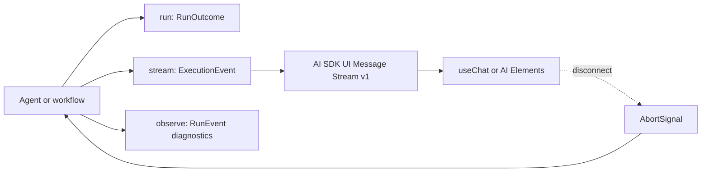

Use `run(...)` when the caller needs one typed outcome. Use `stream(...)` when
the caller needs text updates, structured snapshots, file/media progress, tool
status, or an approval interruption before the final outcome. Harness keeps the
portable consumer contract separate from detailed operator diagnostics.



## 1. Choose the consumer contract

| Invocation | Result | Intended consumer |
| --- | --- | --- |
| [`run(input, options?)`](/handbook/api/interfaces/_purista_harness.AgentInvoker/#run) | `Promise<RunOutcome<Output>>` | A command, worker, workflow, test, or server handler that needs completion or a durable interrupt. |
| [`stream(input, options?)`](/handbook/api/interfaces/_purista_harness.AgentInvoker/#stream) | `AsyncIterable<ExecutionEvent<Output>>` | A service/browser transport that needs a provider-neutral, versioned execution stream. |
| [`observe(input, options?)`](/handbook/api/interfaces/_purista_harness.AgentInvoker/#observe) | `AsyncIterable<RunEvent>` | Trusted logs, local debugging, telemetry, or an operator console. Never forward it wholesale to a browser. |

Workflow invokers expose the corresponding
[`run(...)`](/handbook/api/interfaces/_purista_harness.WorkflowInvoker/#run),
[`stream(...)`](/handbook/api/interfaces/_purista_harness.WorkflowInvoker/#stream),
and [`observe(...)`](/handbook/api/interfaces/_purista_harness.WorkflowInvoker/#observe)
methods with the workflow's inferred input and output types. A completed
`run(...)` returns `{ status: 'completed', runId, output }`. Approval and
external waits return `{ status: 'interrupted', runId, interrupt }`; they are
resumable outcomes, not server errors.

## 2. Declare which output updates are portable

Set `updates` on the agent or workflow definition. The default is `none`.

```ts title="src/harness/supportHarness.ts"
const supportHarness = defineHarness({ name: 'support' })
  .models({ primary: modelAlias })
  .agent('answer_support', {
    input: supportInputSchema,
    output: supportOutputSchema,
    updates: 'text-delta',
    handler: async context => {
      const stream = context.models.primary.textStream(
        { messages: [{ role: 'user', content: context.input.question }] },
        context.signal,
        { emitRunEvents: true },
      )

      let answer = ''
      for await (const part of stream) {
        if (part.kind === 'delta') answer += part.text
      }
      return { answer }
    },
  })
  .build()
```

The usual composition calls remain explicit:
[`defineHarness(...)`](/handbook/api/functions/_purista_harness.defineHarness/)
starts the typed builder,
[`.models(...)`](/handbook/api/interfaces/_purista_harness.HarnessBuilder/#models)
registers the alias used by the handler, and
[`.agent(...)`](/handbook/api/interfaces/_purista_harness.HarnessBuilder/#agent)
declares the portable update mode on the schema-validated agent, while
[`.build()`](/handbook/api/interfaces/_purista_harness.HarnessBuilder/#build)
validates the complete runtime before a session opens.

[`OutputUpdateMode`](/handbook/api/types/_purista_harness.OutputUpdateMode/) is:

| Value | Portable content event | Use it when |
| --- | --- | --- |
| `none` | No partial output; lifecycle, tools, approvals, files/progress, and the final outcome still stream. | Only the final schema-valid output should be public. |
| `text-delta` | `output.text.delta` | The declared public result has live text. |
| `object-snapshot` | `output.object.snapshot` | A UI can render replaceable partial structured state. A snapshot is not a JSON Patch. |

`updates` is an allowlist, not a producer. A custom handler must call a model
stream with `{ emitRunEvents: true }`. The final return value still passes the
agent/workflow output schema. Partial values do not prove the final schema and
must not trigger irreversible business actions.

## 3. Understand portable execution events

[`ExecutionEvent`](/handbook/api/types/_purista_harness.ExecutionEvent/) contains
only the public execution families supported by the adapter boundary:

| Event | Meaning |
| --- | --- |
| `run.started` | Stable run identity and start time. |
| `output.text.delta` | One allowed text update. |
| `output.object.snapshot` | One allowed structured snapshot. |
| `output.file` | A declared artifact reference. The referenced URL still needs application authorization. |
| `output.progress` | Provider-neutral video progress (`queued` or `running`, with optional progress). |
| `tool.input.available`, `tool.started`, `tool.finished` | Standard tool-call state for a client UI. Tool values still need the same data-release review as the tool contract. |
| `approval.requested`, `approval.responded` | Tool approval lifecycle. The durable resume descriptor arrives with the terminal interrupt. |
| `run.finished` | Exactly one completed or interrupted `RunOutcome`. |

Provider payloads, internal model messages, child-task topology, token details,
and internal diagnostics remain on `observe(...)`. Application authentication,
business authorization, Guardrails, and artifact access control still apply to
portable content.

## 4. Use AI SDK UI Message Stream v1 for a browser

Do not invent a Harness-specific browser protocol or client library. Install
the first-party server adapter and the AI SDK protocol implementation:

```bash title="Install the standard browser stream adapter"
npm install @purista/harness-ai-sdk-ui ai
```

The example below is a framework-neutral Fetch handler. Derive `sessionId` and
the allowed agent input from authenticated application state; do not trust a
browser-supplied tenant or principal ID.

```ts title="src/http/postSupportChat.ts"
import {
  createHarnessUIMessageStreamResponse,
  parseHarnessToolApprovalResume,
} from '@purista/harness-ai-sdk-ui/v1'
import type { UIMessage } from 'ai'
import { supportHarness } from '../harness/supportHarness.js'

type ChatBody = {
  input: { question: string }
  messages: UIMessage[]
}

export async function postSupportChat(request: Request, sessionId: string): Promise<Response> {
  const body = await request.json() as ChatBody
  const session = await supportHarness.getSession(sessionId)
  const runController = new AbortController()
  const abortRun = () => runController.abort('client disconnected')
  request.signal.addEventListener('abort', abortRun, { once: true })

  const resume = parseHarnessToolApprovalResume(body.messages)
  const lastAssistant = body.messages.findLast(message => message.role === 'assistant')
  const execution = session.agents.answer_support.stream(body.input, {
    signal: runController.signal,
    ...(resume ? { resume } : {}),
  })

  async function* withLifecycle() {
    try {
      yield* execution
    } finally {
      runController.abort('stream closed')
      request.signal.removeEventListener('abort', abortRun)
      await session.release()
    }
  }

  return createHarnessUIMessageStreamResponse(withLifecycle(), {
    ...(lastAssistant ? { messageId: lastAssistant.id } : {}),
  })
}
```

[`createHarnessUIMessageStreamResponse(...)`](/handbook/api/functions/_purista_harness-ai-sdk-ui_v1.createHarnessUIMessageStreamResponse/)
returns the standard `text/event-stream` response with
`x-vercel-ai-ui-message-stream: v1`. Text, files, tools, and approvals use AI
SDK message parts. Harness lifecycle and structured output use typed
`data-status` and `data-output` parts, which a compatible client may render or
ignore.

If another framework owns SSE framing, use
[`createHarnessUIMessageSseEvents(...)`](/handbook/api/functions/_purista_harness-ai-sdk-ui_v1.createHarnessUIMessageSseEvents/)
and apply
[`AI_SDK_UI_MESSAGE_STREAM_V1_HEADERS`](/handbook/api/variables/_purista_harness-ai-sdk-ui_v1.AI_SDK_UI_MESSAGE_STREAM_V1_HEADERS/).
PURISTA Framework streams use that form so the EventBridge remains the
address-first execution boundary.

## 5. Treat approval as a normal stream outcome

The adapter maps a tool-approval interrupt to standard
`tool-approval-request` parts. A UI built with AI SDK or AI Elements can call
its normal approval API. On the next authenticated request,
[`parseHarnessToolApprovalResume(messages)`](/handbook/api/functions/_purista_harness-ai-sdk-ui_v1.parseHarnessToolApprovalResume/)
returns the typed resume only after every request in the batch has a valid,
non-conflicting decision.

Pass that resume to the same session and target, as the example does. Keep the
pending review in application storage and authorize the reviewer against its
tenant, run, revision, expiry, and action digest. An interrupted stream is not
an HTTP `500`.

## 6. Propagate cancellation explicitly

Stopping iteration stops delivery to that consumer; it cannot undo a provider
call or external side effect that has already started. Pass one
application-owned `AbortSignal` into the invocation and abort it when:

- the HTTP/SSE/WebSocket client disconnects;
- a queue job is cancelled or loses its lease;
- the server's drain deadline expires; or
- an application user with authority cancels the run.

The lifecycle wrapper above also aborts when the response stream closes and
releases the session exactly once. Provider, tool, sandbox, memory, and
application adapters must honor the supplied signal for cancellation to reach
their work. Reconcile uncertain side effects with idempotency keys and durable
receipts; never describe cancellation as rollback.

## 7. Set time budgets in dependency order

`timeoutMs` sets the whole invocation budget. Nested defaults are shorter:

| Budget | Default | Applies to |
| --- | --- | --- |
| `defaults.runTimeoutMs` or invocation `timeoutMs` | `600_000 ms` | Whole agent/workflow invocation. Per-call `0` disables only this run timeout. |
| `defaults.modelTimeoutMs` | `300_000 ms` | One provider model operation. |
| `defaults.toolTimeoutMs` | `120_000 ms` | One tool execution. |
| `defaults.decisionTimeoutMs` | `10_000 ms` | Policy, audit, approval, or Guardrail decision callback. |
| `defaults.skillTimeoutMs` | `60_000 ms` | Skill discovery/read operation. |

Keep each nested operation shorter than the remaining run budget, and keep the
external transport deadline long enough to return the final protocol event. A
timeout raises `OperationTimeoutError`; it is not a resumable approval outcome.

## 8. Use diagnostics without exposing them

Call `observe(...)` when an operator or test needs detailed `RunEvent` values
such as model calls, token usage, workflow fan-out, child tasks, internal tool
values, or overflow. The diagnostic relay has a bounded unread-event buffer;
slow consumers can receive `stream.overflow`, and internal serialized errors
can be present.

Do not forward `RunEvent` as public SSE. Convert only reviewed, low-cardinality
operator evidence into logs/metrics, and use the portable `stream(...)` plus
the AI SDK adapter for browser behavior.

Next: [handle agent failures safely](/handbook/harness/build-agents/errors-and-failure-behavior/), then
[test the agent deterministically](/handbook/harness/build-agents/test-a-basic-agent/).
