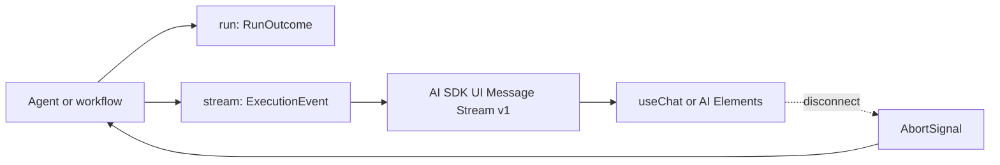

Use `run(...)` when the caller needs one typed outcome. Use `stream(...)` when
the caller needs text updates, structured snapshots, file/media progress, tool
status, or an approval interruption before the final outcome. Harness keeps the
portable consumer contract separate from application logs and telemetry.


## 1. Choose the consumer contract

| Invocation | Result | Intended consumer |
| --- | --- | --- |
| [`HarnessTargetInvoker.run(input, options?)`](/handbook/api/interfaces/_purista_harness.HarnessTargetInvoker/#run) | `Promise<RunOutcome<Output>>` | A command, worker, workflow, test, or server handler that needs completion or a durable interrupt. |
| [`HarnessTargetInvoker.stream(input, options?)`](/handbook/api/interfaces/_purista_harness.HarnessTargetInvoker/#stream) | `HarnessTargetStream<Output>` | A service/browser transport that needs a provider-neutral, versioned execution stream. Call [`HarnessTargetStream.cancel(reason?)`](/handbook/api/interfaces/_purista_harness.HarnessTargetStream/#cancel) when the client disconnects. |

Agent and workflow invokers expose the same `run(...)` and `stream(...)`
methods with their inferred input and output types. A completed
`run(...)` returns `{ status: 'completed', runId, output }`. Approval and
external waits return `{ status: 'interrupted', runId, interrupt }`; they are
resumable outcomes, not server errors.

## 2. Choose text or structured updates

The agent output schema determines its portable update family. A string output
produces text deltas. A structured output produces replaceable object snapshots.
Workflows expose lifecycle and terminal events without partial output updates.

```ts title="Streaming Cancellation And Timeouts example 2"
import { defineAgent, defineHarness } from '@purista/harness'
import { z } from 'zod'

const answerSupport = defineAgent('answerSupport', {
	model: 'answering',
  input: z.object({ question: z.string().min(1) }),
  output: z.string(),
  prompt: input => ({ role: 'user', content: input.question }),
  instructions: 'Answer the support question briefly and factually.',
})
export const definition = defineHarness({ name: 'support' }).addAgent(answerSupport)
const supportHarness = await definition.getInstance({ models: { answering: modelAlias } })
```
The composition uses [`defineHarness(...)`](/handbook/api/functions/_purista_harness.defineHarness/),
[`defineAgent(...)`](/handbook/api/functions/_purista_harness.defineAgent/),
and [`HarnessInstanceConfig`](/handbook/api/types/_purista_harness.HarnessInstanceConfig/)
to bind the model alias before a session opens.

[`HarnessOutputUpdateKind`](/handbook/api/types/_purista_harness.HarnessOutputUpdateKind/) is:

| Value | Portable content event | Use it when |
| --- | --- | --- |
| `none` | No partial output; lifecycle, tools, approvals, files/progress, and the final outcome still stream. | Workflow targets. |
| `text-delta` | `output.text.delta` | The agent's declared output is text. |
| `object-snapshot` | `output.object.snapshot` | The agent's declared output is structured. A snapshot is not a JSON Patch. |

The final value still passes the declared output schema. Partial values do not
prove the final schema and must not trigger irreversible business actions.

## 3. Understand portable execution events

[`ExecutionEvent`](/handbook/api/types/_purista_harness.ExecutionEvent/) contains
only the public execution families supported by the adapter boundary:

| Event | Meaning |
| --- | --- |
| `run.started` | Stable run identity and start time. |
| `output.text.delta` | One allowed text update. |
| `output.object.snapshot` | One allowed structured snapshot. |
| `output.file` | A declared artifact reference. The referenced URL still needs application authorization. |
| `output.progress` | Provider-neutral video progress (`queued` or `running`, with optional progress). |
| `tool.input.available`, `tool.started`, `tool.finished` | Standard tool-call state for a client UI. Tool values still need the same data-release review as the tool contract. |
| `approval.requested`, `approval.responded` | Tool approval lifecycle. The durable resume descriptor arrives with the terminal interrupt. |
| `run.finished` | Exactly one completed or interrupted `RunOutcome`. |

Provider payloads, internal model messages, child-task topology, token details,
and internal diagnostics remain in application-owned logs and telemetry. Application authentication,
business authorization, Guardrails, and artifact access control still apply to
portable content.

## 4. Use AI SDK UI Message Stream v1 for a browser

Do not invent a Harness-specific browser protocol or client library. Install
the first-party server adapter and the AI SDK protocol implementation:

```bash title="Streaming Cancellation And Timeouts example 3"
npm install @purista/harness-ai-sdk-ui ai
```
The example below is a framework-neutral Fetch handler. Derive `sessionId` and
the allowed agent input from authenticated application state; do not trust a
browser-supplied tenant or principal ID.

```ts title="Streaming Cancellation And Timeouts example 4"
import {
  createHarnessUIMessageStreamResponse,
  parseHarnessUIMessageRequest,
} from '@purista/harness-ai-sdk-ui/v1'
import { answerSupport } from '../harness/answerSupport.js'
import { supportHarness } from '../runtime/supportHarness.js'

export async function postSupportChat(request: Request, sessionId: string): Promise<Response> {
  const parsed = await parseHarnessUIMessageRequest(await request.json(), { sessionId })

  const question = parsed.lastUserMessage.parts
    .filter(part => part.type === 'text')
    .map(part => part.text)
    .join('\n')
  const session = await supportHarness.getSession(sessionId)
  const target = session.agents[answerSupport.contract.id]
  const events = parsed.resume === undefined
    ? target.stream({ question })
    : target.resume(parsed.resume).stream()

  return createHarnessUIMessageStreamResponse(events, {
    request: parsed,
    onSettled: () => session.release(),
  })
}
```
[`createHarnessUIMessageStreamResponse(...)`](/handbook/api/functions/_purista_harness-ai-sdk-ui_v1.createHarnessUIMessageStreamResponse/)
returns the standard `text/event-stream` response with
`x-vercel-ai-ui-message-stream: v1`. Text, files, tools, and approvals use AI
SDK message parts. Harness lifecycle and structured output use typed
`data-status` and `data-output` parts, which a compatible client may render or
ignore.

If another framework owns SSE framing, use
[`pipeHarnessUIMessageStream(...)`](/handbook/api/functions/_purista_harness-ai-sdk-ui_v1.pipeHarnessUIMessageStream/)
with its stream writer. The helper owns projection, completion, closing, and
cancellation. A lower-level host can instead consume
[`createHarnessUIMessageSseEvents(...)`](/handbook/api/functions/_purista_harness-ai-sdk-ui_v1.createHarnessUIMessageSseEvents/)
and apply
[`AI_SDK_UI_MESSAGE_STREAM_V1_HEADERS`](/handbook/api/variables/_purista_harness-ai-sdk-ui_v1.AI_SDK_UI_MESSAGE_STREAM_V1_HEADERS/).
PURISTA Framework streams use the pipe form so the EventBridge remains the
address-first execution boundary.

## 5. Treat approval as a normal stream outcome

The adapter maps a tool-approval interrupt to standard
`tool-approval-request` parts. A UI built with AI SDK or AI Elements can call
its normal approval API. On the next authenticated request,
[`parseHarnessToolApprovalResume(messages)`](/handbook/api/functions/_purista_harness-ai-sdk-ui_v1.parseHarnessToolApprovalResume/)
returns the typed resume only after every request in the batch has a valid,
non-conflicting decision.

Pass that resume to `target.resume(descriptor).run()` or `.stream()` on the same
session and target, as the example does. A fresh run accepts input; a resumed
run accepts only continuation options. Keep the
pending review in application storage and authorize the reviewer against its
tenant, run, revision, expiry, and action digest. An interrupted stream is not
an HTTP `500`.

## 6. Propagate cancellation explicitly

Stopping iteration stops delivery to that consumer; it cannot undo a provider
call or external side effect that has already started. Pass one
application-owned `AbortSignal` into the invocation and abort it when:

- the HTTP/SSE/WebSocket client disconnects;
- a queue job is cancelled or loses its lease;
- the server's drain deadline expires; or
- an application user with authority cancels the run.

The lifecycle wrapper above also aborts when the response stream closes and
releases the session exactly once. Provider, tool, sandbox, memory, and
application adapters must honor the supplied signal for cancellation to reach
their work. Reconcile uncertain side effects with idempotency keys and durable
receipts; never describe cancellation as rollback.

## 7. Set time budgets in dependency order

`timeoutMs` sets the whole invocation budget. Nested defaults are shorter:

| Budget | Default | Applies to |
| --- | --- | --- |
| `defaults.runTimeoutMs` or invocation `timeoutMs` | `600_000 ms` | Whole agent/workflow invocation. Per-call `0` disables only this run timeout. |
| `defaults.modelTimeoutMs` | `300_000 ms` | One provider model operation. |
| `defaults.toolTimeoutMs` | `120_000 ms` | One tool execution. |
| `defaults.decisionTimeoutMs` | `10_000 ms` | Policy, audit, approval, or Guardrail decision callback. |
| `defaults.skillTimeoutMs` | `60_000 ms` | Skill discovery/read operation. |

Keep each nested operation shorter than the remaining run budget, and keep the
external transport deadline long enough to return the final protocol event. A
timeout raises `OperationTimeoutError`; it is not a resumable approval outcome.

## 8. Keep diagnostics out of the public stream

Use application-owned logs, metrics, and traces for model calls, token usage,
workflow fan-out, child tasks, and internal failures. Keep attributes bounded
and content-free unless an explicit, reviewed policy permits capture.

Do not forward diagnostic records as public SSE. Use the portable `stream(...)` plus
the AI SDK adapter for browser behavior.

Next: [handle agent failures safely](/handbook/harness/build-agents/errors-and-failure-behavior/), then
[test the agent deterministically](/handbook/harness/build-agents/test-a-basic-agent/).
