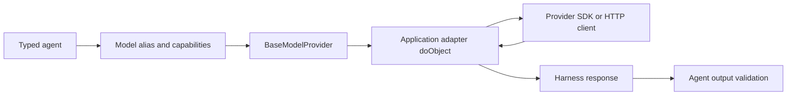

Build a custom provider only when none of the first-party adapters can reach the
model endpoint or gateway your application must use. The adapter translates
between one provider API and the Harness request, response, streaming, usage,
finish-reason, cancellation, and error contracts.

Prefer [`BaseModelProvider`](/handbook/api/classes/_purista_harness.BaseModelProvider/)
over implementing every cross-cutting behavior yourself. It owns bounded
timeouts, provider-neutral retries, cancellation, error normalization, safe
logging, and standard telemetry. Your subclass maps provider-specific data in
the protected `do*` methods.

## See the adapter boundary



The agent knows only the model alias. The composition root selects the
provider and concrete model identifier. Provider credentials and endpoint
configuration stay in application startup code, never in the agent definition.

## 1. Define the smallest client contract

Start with the operation the application needs. The invoice example needs only
structured output, so its client exposes one JSON operation:

```ts title="src/internalModelProvider.ts"
import type { JsonValue, ObjectRequest } from '@purista/harness'

export interface InternalJsonRequest {
	model: string
	messages: ObjectRequest['messages']
	schema: JsonValue
	signal: AbortSignal
}

export interface InternalJsonResult {
	value: JsonValue
	inputTokens: number
	outputTokens: number
	stopReason: 'complete' | 'limit'
}

export interface InternalJsonClient {
	generateJson(request: InternalJsonRequest): Promise<InternalJsonResult>
	close?(): Promise<void>
}
```

In production, implement this interface around the reviewed SDK or HTTP client.
Forward the `AbortSignal` so cancellation reaches the actual request. Do not
place API keys, endpoints, raw prompts, or responses in errors or logs.

## 2. Extend `BaseModelProvider`

Map the client result into the exact Harness response. Normalize usage and
finish reasons even when the provider uses different names:

```ts title="src/internalModelProvider.ts"
import {
	BaseModelProvider,
	type JsonValue,
	type ObjectRequest,
	type ObjectResponse,
	type TokenUsage,
} from '@purista/harness'

export class InternalModelProvider extends BaseModelProvider {
	public constructor(private readonly client: InternalJsonClient) {
		super({ id: 'internal-gateway', genAiSystem: 'internal-gateway' })
	}

	protected override async doObject<T extends JsonValue = JsonValue>(
		request: ObjectRequest<T>,
	): Promise<ObjectResponse<T>> {
		const result = await this.client.generateJson({
			model: request.model,
			messages: request.messages,
			schema: request.schema,
			signal: request.signal,
		})
		const finishReason = result.stopReason === 'complete' ? 'stop' : 'length'
		const usage: TokenUsage = {
			inputTokens: result.inputTokens,
			outputTokens: result.outputTokens,
			totalTokens: result.inputTokens + result.outputTokens,
		}

		return {
			object: result.value as T,
			usage,
			finishReason,
			outcome: { finishReason, providerFinishReason: result.stopReason },
		}
	}

	public async close(): Promise<void> {
		await this.client.close?.()
	}
}
```

`id` identifies the adapter in safe diagnostics. `genAiSystem` supplies the
provider-neutral OpenTelemetry system name. Both must be stable and
content-free.

Implement only the operations the provider actually supports:

| Harness capability | Protected method | Required result |
| --- | --- | --- |
| `text` | `doText(...)` | One `TextResponse` |
| `text_stream` | `doTextStream(...)` | Ordered `TextStreamChunk` values ending with one finish chunk |
| `object` | `doObject(...)` | One `ObjectResponse` |
| `object_stream` | `doObjectStream(...)` | Structured chunks ending with one final object |
| `embeddings` | `doEmbed(...)` | Vectors with stable input indexes and usage |
| `rerank` | `doRerank(...)` | Ranked results referencing submitted document IDs and indexes |

Do not implement a method by silently falling back to another operation. Omit
unsupported methods and do not declare their capabilities on the model alias.

## 3. Register the provider and agent

Create the concrete client at the composition root, then register the adapter
before the agent:

```ts title="src/createInvoiceHarness.ts"
import { defineHarness } from '@purista/harness'
import { z } from 'zod'
import { InternalModelProvider, type InternalJsonClient } from './internalModelProvider.js'

const invoiceInput = z.object({ invoiceId: z.string().min(1) })
const invoiceOutput = z.object({ message: z.string().min(1) })

export function createInvoiceHarness(client: InternalJsonClient) {
	return defineHarness({ name: 'internal-provider-example' })
		.models({
			assistant: {
				provider: new InternalModelProvider(client),
				model: 'internal-json-v1',
				capabilities: ['object'],
			},
		})
		.agent('invoice_status', {
			model: 'assistant',
			input: invoiceInput,
			output: invoiceOutput,
			instructions: 'Return a concise invoice status matching the output schema.',
		})
		.build()
}
```

[`defineHarness(...)`](/handbook/api/functions/_purista_harness.defineHarness/)
creates the composition root.
[`HarnessBuilder.models(...)`](/handbook/api/interfaces/_purista_harness.HarnessBuilder/#models)
registers the concrete adapter and model at runtime composition.
[`HarnessBuilder.agent(...)`](/handbook/api/interfaces/_purista_harness.HarnessBuilder/#agent)
then lets the agent select the stable `assistant` alias. Only `object` is
declared because that is the only operation this adapter implements.
[`HarnessBuilder.build()`](/handbook/api/interfaces/_purista_harness.HarnessBuilder/#build)
validates the complete registry before it returns the runnable Harness.

## 4. Run the complete example

The maintained example uses an in-process client so it is runnable without a
provider account:

```bash title="Run the custom provider example"
cd examples/custom-model-provider
npm install
npm run typecheck
npm test
npm run build
npm start
```

Expected output:

```text title="Terminal output"
Invoice INV-42 is ready for payment.
```

Read the [complete maintained source](https://github.com/puristajs/harness/tree/main/examples/custom-model-provider)
to see client injection, session cleanup, and the full agent invocation.

## 5. Verify the provider contract

Use the shared offline contract suite for every operation capability the
adapter claims:

```ts title="src/internalModelProvider.test.ts"
import { modelProviderContract } from '@purista/harness/testing'
import { InternalModelProvider } from './internalModelProvider.js'

modelProviderContract(
	() =>
		new InternalModelProvider({
			async generateJson(request) {
				request.signal.throwIfAborted()
				return {
					value: { ok: true },
					inputTokens: 1,
					outputTokens: 1,
					stopReason: 'complete',
				}
			},
		}),
	{ capabilities: ['object'] },
)
```

[`modelProviderContract(...)`](/handbook/api/functions/_purista_harness_testing.modelProviderContract/)
checks stable provider identities, the declared method, normalized output, and
cancellation. Add adapter-specific tests for message mapping, schemas, tool
calls, multimodal parts, streaming order, provider status mapping, rate limits,
context limits, retries, malformed responses, and shutdown as applicable.

Use a fake client for the contract and application tests. Keep a live-provider
smoke test separate, credential-gated, bounded, and excluded from ordinary unit
test runs.

## Production checklist

- Disable hidden SDK retries when possible so Harness retry policy remains the
  visible owner.
- Forward `request.signal` and provider deadlines to every SDK or HTTP call.
- Map every provider stop/status value to a Harness finish reason and preserve
  the original content-free value in `outcome.providerFinishReason`.
- Normalize token usage, including cache and reasoning details when available.
- Implement `close()` when the adapter owns sockets, processes, or clients.
- Keep raw provider requests/responses out of logs and telemetry under
  `contentCaptureMode: 'NO_CONTENT'`.
- Publish provider SDKs only in the adapter package; do not add them to
  `@purista/harness`.

Continue with [test adapter contracts](/handbook/harness/test-and-evaluate/test-adapters/)
or return to [choose a model provider](../provider-selection/).
