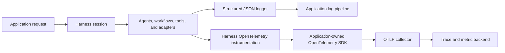

Observability answers three different questions:

- **Logs:** what did the application decide or do at a specific moment?
- **Traces:** which model, agent, tool, memory, or workflow operation made one
  request slow or fail?
- **Metrics:** is latency, usage, failure rate, or policy denial changing over
  many requests?

The Harness produces this operational evidence, but it does not choose or run
your collector and backend. The application starts OpenTelemetry before it
creates the Harness and flushes it after the Harness has stopped.

## Know what is available

| Capability | Available from `@purista/harness` | Additional setup |
| --- | --- | --- |
| JSON logs | Yes. `JsonLogger` is the default logger. | Send process output to the application's log pipeline. |
| Harness spans and metrics | Yes. The Harness uses its OpenTelemetry shim automatically. | Start an OpenTelemetry SDK with exporters before creating the Harness. |
| Application metrics | Yes. Workflow and tool contexts expose scoped metric helpers. | Configure a metric reader/exporter in the OpenTelemetry SDK. |
| Trace and log correlation | Yes. `JsonLogger` adds active trace and span IDs. | A working OpenTelemetry context manager must be active. `NodeSDK` configures one. |
| OTLP export | No. Exporters are deployment choices. | Install the OpenTelemetry SDK and OTLP exporter packages. |
| Dashboard, storage, and alerts | No. | Configure Jaeger, Grafana, Datadog, or another backend outside the Harness. |

## Follow the first useful path

1. [Configure structured logging](./structured-logging/) and add
   stable, low-cardinality identifiers at application decision points.
2. [Export OpenTelemetry traces and metrics](./opentelemetry/)
   before tuning retries, timeouts, or model selection from production data.
3. Keep `contentCaptureMode: 'NO_CONTENT'` until a reviewed data policy requires
   more capture.
4. Verify one request in logs, traces, and metrics before deploying alerts.

The maintained
[`observability-quickstart`](https://github.com/puristajs/ai-harness/tree/main/examples/observability-quickstart)
runs a support workflow, emits a correlated log and application metrics, and
tests the exported evidence without an external service.
