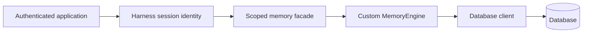

Build a custom memory engine when an existing database or platform must store
agent facts and none of the first-party memory packages matches its contract.
The engine is a database boundary: Harness creates scopes and canonical
records; the engine performs backend I/O.

Do not use a memory engine for conversation transcripts, run checkpoints,
external waits, or durable files. Those belong to `HarnessStorage` and
`DurableWorkspace`.



## 1. Define the backend operations

Keep the backend client unaware of agents and sessions. It receives the exact
`scopeKey` generated by Harness and the canonical `MemoryRecord`:

```ts title="src/ticketMemoryEngine.ts"
import type { MemoryRecord } from '@purista/harness'

export interface TicketMemoryClient {
	get(scopeKey: string, key: string): Promise<MemoryRecord | undefined>
	put(scopeKey: string, record: MemoryRecord): Promise<void>
	delete(scopeKey: string, key: string): Promise<void>
	list(scopeKey: string): Promise<readonly MemoryRecord[]>
	close?(): Promise<void>
}
```

Production clients should push prefix filtering, pagination, expiry, and search
into the database. The maintained example keeps them in the adapter so it can
run offline.

## 2. Implement the required engine methods

```ts title="src/ticketMemoryEngine.ts"
import type {
	MemoryEngine,
	MemoryEngineContext,
	MemoryListOptions,
	MemoryListResult,
	MemoryRecord,
	MemoryScope,
} from '@purista/harness'

export class TicketMemoryEngine
	implements MemoryEngine<readonly ['memory.kv', 'memory.list', 'memory.delete', 'memory.ttl']>
{
	readonly info = {
		id: 'ticket_memory',
		packageName: '@example/harness-memory-ticket',
		version: '1',
	} as const

	readonly capabilities = ['memory.kv', 'memory.list', 'memory.delete', 'memory.ttl'] as const

	constructor(private readonly client: TicketMemoryClient) {}

	async get(scope: MemoryScope, key: string, context: MemoryEngineContext) {
		context.signal.throwIfAborted()
		const record = await this.client.get(scope.scopeKey, key)
		return record && !isExpired(record) ? record : undefined
	}

	async put(scope: MemoryScope, record: MemoryRecord, context: MemoryEngineContext) {
		context.signal.throwIfAborted()
		await this.client.put(scope.scopeKey, record)
	}

	async delete(scope: MemoryScope, key: string, context: MemoryEngineContext) {
		context.signal.throwIfAborted()
		await this.client.delete(scope.scopeKey, key)
	}

	async list(scope: MemoryScope, options: MemoryListOptions, context: MemoryEngineContext): Promise<MemoryListResult> {
		context.signal.throwIfAborted()
		const records = (await this.client.list(scope.scopeKey))
			.filter(record => !isExpired(record))
			.filter(record => !options.prefix || record.key.startsWith(options.prefix))
			.sort((left, right) => left.key.localeCompare(right.key))
		const start = options.cursor ? Math.max(0, records.findIndex(record => record.key === options.cursor) + 1) : 0
		const limit = options.limit ?? 100
		const page = records.slice(start, start + limit)
		const cursor = start + limit < records.length ? page.at(-1)?.key : undefined
		return { records: page, ...(cursor ? { cursor } : {}) }
	}

	async close() {
		await this.client.close?.()
	}
}

function isExpired(record: MemoryRecord): boolean {
	return record.expiresAt !== undefined && Date.parse(record.expiresAt) <= Date.now()
}
```

The example keeps pagination in memory to remain dependency-free. A production
client should apply the same stable ordering, prefix, limit, cursor, and expiry
semantics in the database. Do not reconstruct `scopeKey` from tenant or session
values; preserving the provided key is what maintains scope isolation.

## 3. Declare only verified capabilities

| Capability | Advertise it only when the backend guarantees |
| --- | --- |
| `memory.kv` | Canonical records round-trip by scope and key |
| `memory.list` | Stable, bounded, cursor-paginated listing |
| `memory.delete` | Exact scoped deletion |
| `memory.ttl` | Expired records never become visible |
| `memory.text_search` | Backend text search with stable filtering and ordering |
| `memory.vector_search` | Compatible vector descriptor and dimensions are enforced |
| `memory.hybrid_search` | Text and vector results are combined with documented scoring |
| `memory.persistent` | Records survive process and backend restart |
| `memory.multi_instance` | Concurrent application instances observe the documented consistency model |

The offline example intentionally does not advertise persistence or
multi-instance behavior. TypeScript capability tuples must remain literal with
`as const`, allowing `.memory(...)` and `.requires(...)` to reject incompatible
compositions.

## 4. Register and use the engine

```ts title="src/createTicketMemoryHarness.ts"
import { defineHarness, inMemorySandbox } from '@purista/harness'
import { TicketMemoryEngine, type TicketMemoryClient } from './ticketMemoryEngine.js'

export function createTicketMemoryHarness(client: TicketMemoryClient) {
	return defineHarness({ name: 'custom-memory-example' })
		.sandbox(inMemorySandbox())
		.memory(new TicketMemoryEngine(client))
		.build()
}
```

[`HarnessBuilder.memory(...)`](/handbook/api/interfaces/_purista_harness.HarnessBuilder/#memory)
registers the engine before agents and workflows. This memory-only example has
no model dependency. Register actual model aliases when an agent or
model-backed memory configuration needs them.

The composition uses
[`defineHarness(...)`](/handbook/api/functions/_purista_harness.defineHarness/),
[`HarnessBuilder.sandbox(...)`](/handbook/api/interfaces/_purista_harness.HarnessBuilder/#sandbox),
and [`HarnessBuilder.build()`](/handbook/api/interfaces/_purista_harness.HarnessBuilder/#build).

Application code uses the scoped facade rather than the database client:

```ts title="src/readTicketStatus.ts"
const session = await harness.getSession('ticket-42', {
	identity: { tenantId: 'acme', principalId: 'operator-7' },
})

try {
	await session.memory.write('status', 'open', { ttlMs: 3_600_000 })
	console.log(await session.memory.read<string>('status'))
} finally {
	await session.release()
	await harness.shutdown()
}
```

Authenticate and authorize the identity before `getSession(...)`. The engine
receives a derived namespace; that namespace prevents accidental mixing but is
not authorization by itself.

## 5. Run and test the adapter

```bash title="Run the custom memory example"
cd examples/custom-memory-engine
npm install
npm run typecheck
npm test
npm run build
npm start
```

Expected output is `open`.

Every adapter should run the shared contract:

```ts title="src/ticketMemoryEngine.test.ts"
import { memoryEngineContract } from '@purista/harness/testing'
import { InMemoryTicketMemoryClient, TicketMemoryEngine } from './ticketMemoryEngine.js'

memoryEngineContract(() => new TicketMemoryEngine(new InMemoryTicketMemoryClient()))
```

[`memoryEngineContract(...)`](/handbook/api/functions/_purista_harness_testing.memoryEngineContract/)
proves canonical record round-trips, scope isolation, deletion, TTL visibility,
pagination, and cancellation. Add real-backend tests for migrations,
concurrency, restart persistence, outages, cursor compatibility, search
semantics, and atomic index updates for every capability advertised.

Never log keys, values, queries, vectors, tenant/principal identifiers,
credentials, or database responses. Use content-free operation, duration,
capability, and stable error classifications instead.

Read the [complete maintained example](https://github.com/puristajs/harness/tree/main/examples/custom-memory-engine)
or compare the first-party [memory backend guides](../).
