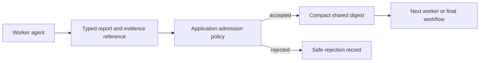

Shared context is an application pattern, not a generic Harness API. The
reference implementation keeps a compact, admitted finding beside the detailed
evidence it references; workers receive the compact digest and unfold evidence
only when needed.

Use this shape for a parallel checkout-incident investigation. Workers inspect
logs, metrics, and a proposed mitigation; only findings that pass the
application's admission policy become context for the next worker or final
answer.

The application owns the shared-context store and its policy. The Harness owns
the typed worker invocation, cancellation, and workflow checkpoint around it.
The maintained [checkout shared-context example](https://github.com/puristajs/harness/tree/main/examples/delm-shared-context)
is executable with a scripted deterministic provider and proves that a detailed
evidence value remains outside the compact digest.

Use this sequence:

1. Give each worker a bounded task and evidence scope.
2. Store a structured finding with provenance and an evidence reference.
3. Apply deterministic admission rules before it reaches shared context.
4. Build the final answer from admitted findings only.

Expected evidence: an admitted `FACT` or `PATCH_SUMMARY` appears in the shared
digest with its evidence reference; an unverified mitigation is rejected and
does not reach the final answer.

Do not turn every worker output into prompt text. Record tenant/run scope,
source, version, retention deadline, and a digest. A model's assertion is not
verified evidence; require tests, trusted sources, deterministic checks, or
human approval according to the domain.

The reference queue and store are in-memory and scoped to one workflow run.
Choose the persistence boundary deliberately:

| Scope | Appropriate implementation | Required controls |
| --- | --- | --- |
| One workflow run in one process | In-memory queue and finding store | Bounded entry/evidence size and deterministic admission tests. |
| Restart or several workers | Application-owned transactional store and queue | Read/write authorization, duplicate publication handling, leases, retention cleanup, and replay. |

Test rejected findings, duplicate publication, missing evidence, expired
claims, and final output that excludes unadmitted data.
