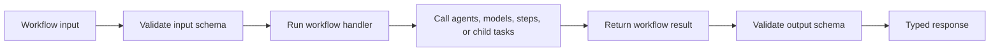

Declare agents before workflows so `ctx.agents` is typed from registered agent
keys. Keep one workflow centered on a business outcome such as reviewing an
incident, not on a generic model conversation. The example is deterministic so
you can prove data flow and policy before substituting a model-backed agent.



The workflow handler is ordinary application code. Harness provides typed
access to registered agents and runtime services, propagates cancellation, and
validates the boundary before and after the handler. It does not infer a
business process from a prompt.

```ts title="src/harness/incidentReview.ts"
import { defineHarness, inMemorySandbox } from '@purista/harness'
import { z } from 'zod'

export const incidentReviewHarness = defineHarness({ name: 'incident-review' })
	.sandbox(inMemorySandbox())
	.agent('facts', {
		input: z.object({ report: z.string() }),
		output: z.object({ confirmed: z.boolean() }),
		handler: async () => ({ confirmed: true }),
	})
	.agent('risk', {
		input: z.object({ confirmed: z.boolean() }),
		output: z.object({ level: z.enum(['low', 'medium', 'high']) }),
		handler: async ({ input }) => ({ level: input.confirmed ? 'medium' : 'low' }),
	})
	.workflow('review_incident', {
		input: z.object({ report: z.string() }),
		output: z.object({ level: z.enum(['low', 'medium', 'high']) }),
		delegation: { agents: ['facts', 'risk'] },
		handler: async ctx => ctx.agents.risk(await ctx.agents.facts({ report: ctx.input.report })),
	})
	.build()
```

```ts title="src/runIncidentReview.ts"
import { incidentReviewHarness } from './harness/incidentReview.js'

const session = await incidentReviewHarness.getSession('incident:42')
try {
	const outcome = await session.workflows.review_incident.run({
		report: 'Checkout errors increased after a deploy.',
	})
	if (outcome.status === 'interrupted') {
		throw new Error(`Incident review paused for ${outcome.interrupt.type}`)
	}
	console.log(outcome.output)
} finally {
	await incidentReviewHarness.shutdown()
}
```

```text title="Expected deterministic workflow result"
{ level: 'medium' }
```

## Define the workflow contract

Use `.workflow(id, definition)` so its schemas and previously declared agents
remain connected to the handler type. The ID becomes the typed key under
`session.workflows`.

Both workflow registration forms are repeatable and accumulate definitions:

| Method | Use it for | Result |
| --- | --- | --- |
| [`.workflow(id, definition)`](/handbook/api/interfaces/_purista_harness.HarnessBuilder/#workflow) | The normal case: one inline workflow with schema-derived handler types. | Adds one typed workflow without replacing earlier registrations. |
| [`.workflows(definitions)`](/handbook/api/interfaces/_purista_harness.HarnessBuilder/#workflows) | A non-empty, already typed record of related workflows. | Adds every record key without replacing earlier workflows. |

Declare every delegated agent first so `ctx.agents` contains its typed ID.
Reusing a workflow ID is a configuration error. The plural method accepts a
definition record directly and does not use an identity-helper callback.

| Field | Required | Runtime behavior |
| --- | --- | --- |
| `input` | no | Validates the caller value before the handler. Omission uses a string schema. |
| `output` | no | Validates the handler result before returning it. Omission uses a string schema. |
| `delegation` | no | Enables and bounds workflow-local agent calls. Delegation is otherwise disabled unless enabled in Harness defaults. |
| `sandbox` | no | Chooses `inherit`, `private`, or an authorized sharing group for this workflow. Omission inherits the caller's partition. |
| `handler` | yes | Implements the workflow and receives the schema-derived `WorkflowContext`. Its result must match `output`. |

An invalid input never starts the handler. An invalid output fails after the
handler and is an internal contract failure; do not expose the rejected value.
A handler error keeps its original in-process identity so application code can
classify it at the transport or worker boundary.

## Use the handler context

| Context member | What it provides | Typical use |
| --- | --- | --- |
| `input` | Validated, typed workflow input | Read the business request |
| `agents.<id>(input, options?)` | Typed call to a registered agent | Wait for a child result inside the current workflow |
| `models.<alias>` | Provider-neutral model operations | Make an explicit model call from custom orchestration |
| `memory` | Run-scoped memory facade | Read or write shared application context |
| `step(id, fn, options?)` | Replayable checkpoint during a durable invocation; pass-through otherwise | Protect a stable unit of retryable work |
| `fanOut(items, worker, options?)` | Ordered, cancellation-aware parallel mapping | Process independent items with a concurrency bound |
| `childTasks.start(...)` | Workflow-owned asynchronous agent task | Return a task ID before the agent finishes |
| `externalWait.wait(request)` | Durable checkpoint and suspension | Wait for an application-owned human or external decision |
| `log`, `metrics` | Scoped logging and metrics | Record content-safe application diagnostics |
| `signal` | Cancellation for the active workflow run | Forward to every cancellable dependency |
| `runId`, `sessionId` | Correlation identifiers | Idempotency and diagnostics, not authorization |
| `metadata` | Read-only invocation metadata supplied by application code | Read trusted routing values only when the application created them |

`ctx.output` is not populated while the handler is running. Return the final
value from the handler instead of using it as mutable workflow state.

Child-agent delegation is disabled by default. A workflow-local `delegation`
block is the clearest opt-in: it restricts agents and can bound total calls,
parallel calls, depth, and model aliases. Policy violations fail with
`DelegationPolicyError`; do not replace that boundary with a prompt.

The presence of a workflow-local `delegation` object enables delegation unless
`enabled: false` is set. If the workflow omits the object, the Harness-wide
`defaults.delegation.enabled` value applies.

| Call or field | Runtime effect | When to set it |
| --- | --- | --- |
| [`defineHarness({ name })`](/handbook/api/functions/_purista_harness.defineHarness/) | Creates this named composition root; a missing name uses `agent-harness`. | The name helps distinguish local runtime diagnostics. It neither enables delegation nor selects a model. |
| [`.sandbox(inMemorySandbox())`](/handbook/api/interfaces/_purista_harness.HarnessBuilder/#sandbox) | Registers the fixed files-and-bounded-search contract returned by [`inMemorySandbox()`](/handbook/api/functions/_purista_harness.inMemorySandbox/) before workflow or agent sandbox policies are checked. | The factory takes no options and exposes `sandbox.fs` plus `sandbox.text_search`; it has no executor, process spawning, or durable filesystem. Passing it avoids automatic adapter detection for this handler-only workflow. Choose an adapter with the exact required capabilities before adding sandbox-backed tools; this is not a tenant-isolation boundary. |
| [`.agent(...)`](/handbook/api/interfaces/_purista_harness.HarnessBuilder/#agent) | Registers `facts` and `risk` before a workflow refers to them. | These deterministic agents use custom handlers, so they declare no model or model-loop instructions. Always define delegated agents before workflows so `ctx.agents` is typed from actual IDs. |
| [`.workflow(...)`](/handbook/api/interfaces/_purista_harness.HarnessBuilder/#workflow) | Registers `review_incident` as `session.workflows.review_incident`. | Its inline schemas infer `ctx.input` and the returned output; earlier agents infer `ctx.agents`. |
| [`delegation.enabled`](/handbook/api/interfaces/_purista_harness.WorkflowDelegationPolicy/#enabled) | Enables or disables calls through `ctx.agents` and `ctx.childTasks`. | Omit it inside a workflow-local policy to enable delegation; set `false` to prohibit it explicitly. |
| [`delegation.agents`](/handbook/api/interfaces/_purista_harness.WorkflowDelegationPolicy/#agents) | Limits child calls to the named agents. | Use an allowlist for production workflows; omitting it permits every registered agent. |
| [`delegation.maxChildAgentCalls`](/handbook/api/interfaces/_purista_harness.WorkflowDelegationPolicy/#maxchildagentcalls) | Caps total child calls in one run; the default is `32`. | Set `0` to disable child calls while retaining an explicit policy. It overrides the Harness default. |
| [`delegation.maxParallelChildAgentCalls`](/handbook/api/interfaces/_purista_harness.WorkflowDelegationPolicy/#maxparallelchildagentcalls) | Caps simultaneously active child calls; the default is `8`. | Use a positive integer and lower it to protect shared provider and tool quotas. |
| [`delegation.maxDepth`](/handbook/api/interfaces/_purista_harness.WorkflowDelegationPolicy/#maxdepth) | Caps local delegation depth; the default is `1`. | `1` permits the normal workflow-to-agent call; `0` disables child-agent delegation. |
| [`delegation.modelAliases`](/handbook/api/interfaces/_purista_harness.WorkflowDelegationPolicy/#modelaliases) | Restricts aliases usable by child agents. | Use it to prevent an expensive or higher-risk model alias in a workflow. |
| [`delegation.agentModelAliases`](/handbook/api/interfaces/_purista_harness.WorkflowDelegationPolicy/#agentmodelaliases) | Replaces the shared model allowlist for each named agent. | Use only when one child needs a narrower or different approved alias set. |
| [`.build()`](/handbook/api/interfaces/_purista_harness.HarnessBuilder/#build) | Validates the complete model, agent, and workflow registry graph before returning the Harness. | Run it after the workflow registry. Unknown aliases or disallowed delegation fail before a workflow request is served. |

Use
[`ctx.fanOut(items, fn, { concurrency })`](/handbook/api/interfaces/_purista_harness.WorkflowContext/#fanout)
for independent work and return a
schema-validated result. Handle partial failures deliberately—often with
`Promise.allSettled` and a result that identifies unavailable sources. Map
workflow `ExecutionEvent` values through a standard transport adapter. Use the
AI SDK UI Message Stream v1 adapter for browser chat rather than defining a
custom consumer protocol.

`fanOut.concurrency` must be a positive integer. Its effective value cannot
exceed the workflow's `maxParallelChildAgentCalls` budget, and cancellation
prevents new workers from starting.

Next: [child tasks and data flow](/handbook/harness/orchestrate-work/child-tasks-and-data-flow/).
