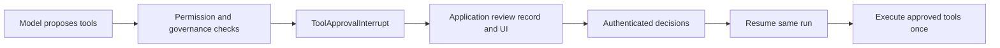

When a permission or governance rule requires approval, Harness stops before
any tool in that batch runs. `run(...)` returns an interrupted `RunOutcome`;
`stream(...)` emits corresponding portable approval events. This is a normal,
resumable state, not an error.



## Require approval

A native governance rule can demand approval for a business condition:

```ts title="Require review for a large transfer"
rule({
  id: 'large-transfer-review',
  tools: ['transfer_funds'],
  effect: 'require_approval',
  when: ({ input }) => input.amount > 1_000,
  reasonCode: 'large_transfer',
})
```

Built-in tool permissions can also use `mode: 'require_approval'`. Harness
combines all demands for one tool batch into a deterministic interrupt.

## Handle the interruption

```ts title="Persist the pending review"
const first = await session.agents.banker.run(input)
if (first.status === 'interrupted' && first.interrupt.type === 'tool-approval') {
  await reviewRepository.create({
    runId: first.runId,
    interruptId: first.interrupt.id,
    revision: first.interrupt.revision,
    requests: first.interrupt.requests,
    tenantId,
    expiresAt,
  })
}
```

Each `ToolApprovalRequest` contains the tool id, call id, model-proposed input,
and content-free policy evidence. It does not contain trusted caller identity.
The application owns reviewer authentication, tenant and role authorization,
expiry, action-digest checks, audit records, and user delivery.

## Resume the same run

After authorization, supply a `ToolApprovalResume` with the original run,
interrupt, revision, and one stable event id:

```ts title="Resume with an approved decision"
const outcome = await session.agents.banker.run(input, {
  resume: {
    type: 'tool-approval',
    runId: pending.runId,
    interruptId: pending.interruptId,
    revision: pending.revision,
    eventId: decision.id,
    decisions: pending.requests.map(request => ({
      approvalId: request.approvalId,
      approved: true,
      reason: 'Approved by an authorized reviewer',
    })),
  },
})
```

Harness verifies the resume binding and continues from its checkpoint without
asking the model to repeat the approved tool request. Replaying the same
decision is idempotent. Rejection uses `approved: false`; the agent receives
the denied tool result and may finish safely.

The business command behind a tool must still reauthorize the action against
trusted application state and enforce the supplied tool idempotency key.

## Browser clients

`@purista/harness-ai-sdk-ui/v1` maps the interrupt to the standard AI SDK UI
tool-approval request. AI SDK and AI Elements can render it. After the user
responds, `parseHarnessToolApprovalResume(messages)` reconstructs the typed
resume envelope for the next server request. Do not return a 500 response or
invent a custom client protocol for approval.

## Test the flow

With `FakeModelProvider`, assert that no tool executes before approval, the
interrupt is stable, authorized approval executes the tool once, rejection
does not execute it, stale revision and changed action are rejected, duplicate
resume is idempotent, and cancellation/expiry remain safe.

API reference:
[`ToolApprovalInterrupt`](/handbook/api/interfaces/_purista_harness.ToolApprovalInterrupt/),
[`ToolApprovalRequest`](/handbook/api/interfaces/_purista_harness.ToolApprovalRequest/),
[`ToolApprovalDecision`](/handbook/api/interfaces/_purista_harness.ToolApprovalDecision/),
and [`ToolApprovalResume`](/handbook/api/interfaces/_purista_harness.ToolApprovalResume/).
