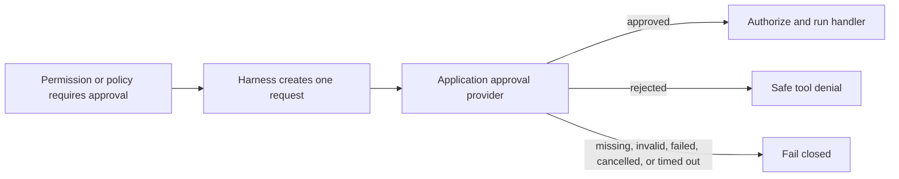

Immediate approval pauses one prepared tool call long enough to obtain a fast
decision. Use it for an automated risk service or a reviewer that reliably
responds inside the active run's decision timeout. The handler starts only
after an `approved` result.

Do not use this callback for a person who may answer minutes or days later. Use
[durable human review](/handbook/harness/orchestrate-work/human-review/) when a
workflow must persist, stop consuming a worker, and resume after restart.

## Understand one approval occurrence



Harness combines every matching approval demand for the same tool occurrence
into one request. The provider returns one terminal result. It does not create
a durable review record and cannot submit a decision later.

## 1. Create an approval demand

Use a governance rule for a typed business condition:

```ts title="src/policy/transferPolicy.ts"
rule({
	id: 'large-transfer-review',
	tools: ['transfer_funds'],
	effect: 'require_approval',
	when: ({ input }) => input.amount > 1_000,
	reasonCode: 'large_transfer',
})
```

A built-in `write`, `edit`, or `bash` permission can also use
`mode: 'require_approval'`. Both sources use the same configured approval
provider. The provider is not called when no permission or policy demands it.

## 2. Set the decision time budget

Approval is part of the active agent run. Bound it with
`defaults.decisionTimeoutMs` at Harness composition:

```ts title="src/createTransferHarness.ts"
defineHarness({ name: 'payments' }).defaults({ decisionTimeoutMs: 5_000 })
// Register models, tools, agents, and governance next.
```

See [`defineHarness(...)`](/handbook/api/functions/_purista_harness.defineHarness/)
and [`HarnessBuilder.defaults(...)`](/handbook/api/interfaces/_purista_harness.HarnessBuilder/#defaults)
for the construction and default-options contracts.

The default is `10_000` milliseconds when this field is omitted. The same
budget bounds policy predicates, external evaluators, approval providers, and
audit sinks. A timeout fails closed and the handler does not run.

Choose a value that fits inside the surrounding HTTP, queue, or worker deadline.
Use [durable human review](/handbook/harness/orchestrate-work/human-review/) when
a decision cannot reliably complete within this bounded callback.

## 3. Implement the application provider

The application owns the reviewer transport, credentials, authorization, and
availability. The Harness contract is intentionally small:

```ts title="src/policy/createTransferApproval.ts"
import type {
	DecisionExecutionContext,
	GovernanceApprovalProvider,
	GovernanceApprovalRequest,
	GovernanceApprovalResult,
} from '@purista/harness'

export interface ImmediateTransferReviewer {
	decide(request: GovernanceApprovalRequest, execution: DecisionExecutionContext): Promise<GovernanceApprovalResult>
}

export function createTransferApproval(reviewer: ImmediateTransferReviewer): GovernanceApprovalProvider {
	return {
		request: (request, execution) => reviewer.decide(request, execution),
	}
}
```

For an HTTP reviewer service, validate its response before returning it to
Harness and forward the cancellation signal:

```ts title="src/policy/createHttpTransferReviewer.ts"
import { z } from 'zod'
import type { ImmediateTransferReviewer } from './createTransferApproval.js'

const approvalResult = z.strictObject({
	decision: z.enum(['approved', 'rejected']),
	reasonCode: z
		.string()
		.regex(/^[a-z][a-z0-9_]{0,63}$/)
		.optional(),
})

export function createHttpTransferReviewer(endpoint: URL, token: string): ImmediateTransferReviewer {
	return {
		async decide(request, execution) {
			const response = await fetch(endpoint, {
				method: 'POST',
				headers: {
					authorization: `Bearer ${token}`,
					'content-type': 'application/json',
				},
				body: JSON.stringify(request),
				signal: execution.signal,
			})

			if (!response.ok) throw new Error('Approval service unavailable.')
			return approvalResult.parse(await response.json())
		},
	}
}
```

Create `endpoint` and `token` from trusted deployment configuration. The
reviewer service must authenticate the requester, authorize the reviewer, and
protect the submitted subject. Do not derive its endpoint or credential from a
prompt, skill, tool input, or model response.

The reviewer returns `approved` or `rejected` and may add a stable,
content-free `reasonCode`:

```ts title="src/policy/approvalResults.ts"
const approved = { decision: 'approved', reasonCode: 'review_approved' } as const
const rejected = { decision: 'rejected', reasonCode: 'review_rejected' } as const
```

| Input | Meaning | Required handling |
| --- | --- | --- |
| `request.approvalId` | Deterministic identity of this approval occurrence | Use as the idempotency and correlation key |
| `request.subject` | Tool ID, parsed input, call/run/session IDs, agent/workflow, and step | Treat as sensitive; disclose only to an authenticated, authorized reviewer |
| `request.demands` | Content-free evidence for every permission/policy that requested approval | Use for routing and explanation without copying tool input |
| `execution.signal` | Cancellation from the active run | Forward to the HTTP client or SDK |
| `execution.deadline` | Absolute deadline for the decision | Bound connection, request, and retry time below it |

The subject contains model-proposed tool input. It is not caller identity or
authorization. Reauthorize the business action in the handler against trusted
application state after approval.

## 4. Wire the provider

Create the concrete reviewer in the composition root and pass the adapter to
the same governance configuration as the policy:

```ts title="src/createApprovedTransferHarness.ts"
return createTransferAgentBuilder(provider)
  .governance(({ native, rule }) => ({
    defaultEffect: 'allow',
    approval: createTransferApproval(transferReviewer),
    policies: [
      native({
        id: 'transfer-controls',
        rules: [
          rule({
            id: 'large-transfer-review',
            tools: ['transfer_funds'],
            effect: 'require_approval',
            when: ({ input }) => input.amount > 1_000,
            reasonCode: 'large_transfer',
          }),
        ],
      }),
    ],
  }))
  .build()
```

## 5. Verify every terminal result

| Situation | Result |
| --- | --- |
| Provider returns `approved` | Handler may run unless a stronger deny decision also matched |
| Provider returns `rejected` | Expected tool denial; handler does not run |
| Approval is required but no provider exists | Evaluation fails closed; handler does not run |
| Provider throws, times out, is cancelled, or returns invalid data | Evaluation fails closed; handler does not run |
| Governance is in `shadow` mode | Policy approval is observed but not requested or enforced; static permission approval still applies |

Use a scripted model and deterministic reviewer fake. Assert approval runs the
handler exactly once, while rejection, missing provider, timeout, cancellation,
callback failure, and invalid result do not run it. Also assert the
`approval.requested` and `approval.finished` events without copying the request
subject into logs or snapshots.

Continue with [record governance audit evidence](../record-audit-evidence/).
The maintained [bank governance example](https://github.com/puristajs/harness/tree/main/examples/bank-governance)
contains the complete local policy, provider, invocation, and tests.

API reference: [`GovernanceApprovalProvider`](/handbook/api/types/_purista_harness.GovernanceApprovalProvider/),
[`GovernanceApprovalRequest`](/handbook/api/types/_purista_harness.GovernanceApprovalRequest/), and
[`GovernanceApprovalResult`](/handbook/api/types/_purista_harness.GovernanceApprovalResult/).
