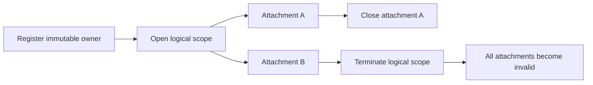

Build a custom sandbox when an agent must use a container, microVM, remote
workspace service, or application-owned execution platform that no first-party
adapter supports. A sandbox adapter maps stable Harness scope and lifecycle
operations to that platform. The platform—not the TypeScript interface—provides
process, filesystem, network, resource, and tenant isolation.

Start with `sandbox.fs`. Add `sandbox.text_search`, `sandbox.exec`, `sandbox.spawn`, persistence,
snapshots, or workspace binding only after the backend implements and tests the
corresponding guarantee.

## Understand the lifecycle



Closing a `SandboxSession` detaches one client. It must not delete shared
logical state. `terminate(...)` destroys the addressed logical scope and
invalidates every attachment. `attach` and `restore` must report
`SandboxStateLostError` when state is missing; they must never replace it with
an empty sandbox.

## 1. Implement a filesystem-only adapter

The maintained example wraps the built-in in-memory implementation so it can
teach the public lifecycle without claiming production isolation:

```ts title="src/trackedFilesystemSandbox.ts"
import {
	inMemorySandbox,
	type Sandbox,
	type SandboxOpenOptions,
	type SandboxOpenResult,
	type SandboxOwnerRegistrationOptions,
	type SandboxTerminateOptions,
} from '@purista/harness'

export class TrackedFilesystemSandbox implements Sandbox<readonly ['sandbox.fs']> {
	private readonly delegate = inMemorySandbox()

	readonly capabilities = ['sandbox.fs'] as const
	readonly telemetryAdapterId = 'tracked_filesystem'
	readonly administration = this.delegate.administration

	async registerOwner(options: SandboxOwnerRegistrationOptions) {
		await this.delegate.registerOwner(options)
	}

	async open(options: SandboxOpenOptions): Promise<SandboxOpenResult<readonly ['sandbox.fs']>> {
		return await this.delegate.open(options)
	}

	async terminate(options: SandboxTerminateOptions) {
		await this.delegate.terminate(options)
	}
}
```

A production adapter replaces the delegate with its provider client while
preserving these semantics.

| Adapter member | Required behavior |
| --- | --- |
| `capabilities` | Literal tuple containing only implemented guarantees |
| `telemetryAdapterId` | Stable, low-cardinality adapter identity; never a provider resource ID |
| `registerOwner(...)` | Create or attach immutable owner metadata before partition allocation |
| `administration` | Bounded, application-authorized inventory and exact cleanup operations |
| `open({ scope, mode, identity, signal })` | Create, attach, or restore exactly the requested scope and return a truthful disposition |
| `terminate({ scope, reason, signal })` | Idempotently remove only the requested logical scope and invalidate attachments |

Keep container IDs, VM IDs, volume handles, generations, leases, fencing
tokens, credentials, and topology inside the adapter.

## 2. Implement the session operations

Every opened session provides filesystem and attachment operations:

| Member | Contract |
| --- | --- |
| `read`, `readText` | Read an absolute POSIX path or return a safe sandbox error |
| `write` | Write bytes or text without escaping the logical filesystem |
| `remove` | Remove one path; recursive removal is explicit |
| `list` | Return stable entries with optional recursive and glob filtering |
| `stat`, `exists` | Report the active logical filesystem state |
| `mount` | Stage the supplied file map at an absolute target path |
| `executor` | Exactly `available` or `unavailable` |
| `close` | Detach this handle and reject its later operations |

An exec-capable session additionally implements `exec(...)`. A spawn-capable
session implements `spawn(...)`; stdio MCP requires this long-lived process
contract. Agent Plugin stdio additionally requires an isolating implementation
of `mountReadOnly(...)`. Do not advertise these operations by casting a
filesystem-only session.

## 3. Add bounded text search when agents need `grep`

Text search is independent from command execution. Built-in `grep` requires
`sandbox.text_search`; it does not require `sandbox.exec`, and Harness does not
emulate missing support by downloading files or invoking a shell.

Add the capability only when every opened session implements
[`searchText(...)`](/handbook/api/interfaces/_purista_harness.TextSearchCapableSandboxSession/#searchtext):

```ts title="The search boundary inside a custom session"
import {
	SANDBOX_TEXT_SEARCH_LIMITS,
	validateSandboxTextSearchRequest,
	type SandboxTextSearchRequest,
	type SandboxTextSearchResult,
} from '@purista/harness'

type PodSearchClient = {
	searchInsidePod(input: SandboxTextSearchRequest & {
		limits: typeof SANDBOX_TEXT_SEARCH_LIMITS
	}): Promise<SandboxTextSearchResult>
}

async function searchText(
	client: PodSearchClient,
	request: SandboxTextSearchRequest,
): Promise<SandboxTextSearchResult> {
	validateSandboxTextSearchRequest(request)
	request.signal?.throwIfAborted()

	return await client.searchInsidePod({
		...request,
		limits: SANDBOX_TEXT_SEARCH_LIMITS,
	})
}
```

Then advertise the literal tuple:

```ts title="Advertise bounded search without command execution"
readonly capabilities = [
	'sandbox.fs',
	'sandbox.text_search',
	'sandbox.persistent_fs',
] as const
```

The provider call must execute where the files live—for example inside the pod
or next to its volume. Enforce the fixed pattern, file, byte, line, and result
limits. Return stable matches and `complete: false` with precise
`limitReasons` whenever work or output was capped. Never treat an incomplete
result as proof that no more matches exist.

`safe_regex_v1` is a case-sensitive, ASCII-pattern portable non-backtracking
subset. Literal insensitive matching folds ASCII letters only. Call
`validateSandboxTextSearchRequest(...)` at the adapter trust boundary, then
implement it with a non-backtracking engine or fixed provider primitive. Pass
patterns and paths as typed API fields or process arguments after `--`; never
interpolate them into a shell command. Logs and telemetry must omit pattern,
path, and match content.

## 4. Register the adapter before tools

```ts title="src/createReportHarness.ts"
const sandbox = new TrackedFilesystemSandbox()

const harness = defineHarness({ name: 'custom-sandbox-example' })
	.sandbox(sandbox)
	.models({
		assistant: {
			provider,
			model: 'scripted-report-model',
			capabilities: ['object', 'tool_use'],
		},
	})
	.tool('create_report', {
			description: 'Create and verify one report in the active sandbox.',
			input: z.object({ content: z.string().min(1) }),
			output: z.object({ saved: z.boolean() }),
			handler: async (context, input) => {
				await context.sandbox.write('/workspace/report.txt', input.content)
				const saved = await context.sandbox.readText('/workspace/report.txt')
				return { saved: saved === input.content }
			},
	})
	.agent('reporter', {
		model: 'assistant',
		input: z.string().min(1),
		output: z.string().min(1),
		tools: ['create_report'],
		instructions: 'Use create_report, then return a concise status.',
	})
	.build()
```

Registering [`.sandbox(...)`](/handbook/api/interfaces/_purista_harness.HarnessBuilder/#sandbox)
before [`.tool(...)`](/handbook/api/interfaces/_purista_harness.HarnessBuilder/#tool)
gives the handler a capability-inferred `context.sandbox`. This example cannot
call `exec` or `spawn` because its adapter declares only `sandbox.fs`.

The composition also uses
[`defineHarness(...)`](/handbook/api/functions/_purista_harness.defineHarness/),
[`.models(...)`](/handbook/api/interfaces/_purista_harness.HarnessBuilder/#models),
[`.agent(...)`](/handbook/api/interfaces/_purista_harness.HarnessBuilder/#agent),
and [`.build()`](/handbook/api/interfaces/_purista_harness.HarnessBuilder/#build).

## 5. Run the complete example

```bash title="Run the custom sandbox example"
npm run typecheck --workspace @purista/custom-sandbox-adapter-example
npm run test --workspace @purista/custom-sandbox-adapter-example
npm run build --workspace @purista/custom-sandbox-adapter-example
npm run start --workspace @purista/custom-sandbox-adapter-example
```

Expected output:

```text title="Terminal output"
report ready (created: 1, terminated: 1)
```

The runnable flow creates one logical scope, lets a typed tool write and read a
file, closes the Harness session destructively, and verifies one termination.
Read the [complete maintained source](https://github.com/puristajs/harness/tree/main/examples/custom-sandbox-adapter).

## 6. Add capabilities deliberately

| Capability | Backend guarantee required |
| --- | --- |
| `sandbox.fs` | Scoped absolute-path filesystem and attachment lifecycle |
| `sandbox.text_search` | Bounded data-local literal and `safe_regex_v1` search with truthful completeness |
| `sandbox.exec` | Bounded one-shot execution, timeout, cancellation, output limits, and cleanup |
| `sandbox.spawn` | Long-lived processes, streaming stdio, kill, exit, and close cleanup |
| `sandbox.persistent_fs` | Files survive the documented detach/restart boundary |
| `sandbox.snapshot` | Adapter can create an immutable restorable snapshot identity |
| `sandbox.resume` | Exact, idempotent snapshot-to-target resume without replacement |
| `sandbox.hibernate` | Snapshot plus release of active compute |
| `sandbox.workspace_binding` | Active run scope binds to the configured durable workspace |

Use `.requires([...])` for guarantees the application cannot operate without.
An agent that enables built-in `grep` adds `sandbox.text_search` implicitly, so
a missing implementation fails during `.build()` before model or sandbox I/O.
Snapshot capability is not durable workflow recovery: committed
`DurableWorkspace` files remain the recovery contract, while retained compute
is an optional optimization.

Run both `sandboxContract(...)` and `sandboxTextSearchContract(...)` when search
is advertised, then continue with [test sandbox isolation](../test-sandbox-isolation/).
