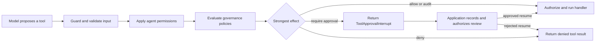

Governance adds an application-controlled decision before an agent tool handler
runs. A policy can allow or deny the prepared call, require durable approval,
record audit evidence, or keep a tool out of the model's tool list.

Start here when a rule must apply consistently across agents or tools. For
example, a payment application can allow an ordinary transfer, require approval
for a larger amount, and reject any amount above a hard limit.

Governance is included in `@purista/harness`. It is disabled until
`.governance(...)` is configured. Native TypeScript policies require no extra
package or external service.

## Learn the six terms used in this chapter

The following names describe one decision; they are not separate services:

| Term | Plain-language meaning | Transfer example |
| --- | --- | --- |
| Tool occurrence | One prepared call proposed by the model | Call `transfer_funds` once with an amount and two accounts |
| Governance configuration | The controls attached to one Harness | All transfer controls registered through `.governance(...)` |
| Policy | A named, versionable owner for related decisions | `bank-transfer-policy` |
| Rule | One condition inside a native TypeScript policy | Amounts above `10_000` are denied |
| Evaluator | Application code that asks an external policy system for a decision | Map the transfer to an organization-owned policy API |
| Effect | What a matching rule or evaluator requests | `allow`, `audit`, `require_approval`, or `deny` |

An **unmatched call** is a prepared tool occurrence for which no rule or
external evaluator returned a decision. `defaultEffect` determines whether
that call is allowed or denied.

## Keep the responsibilities separate

Governance is one control in a larger security boundary:

| Question | Owner |
| --- | --- |
| Who is the caller, and may they operate on this account? | Application authentication and authorization |
| May this agent propose `transfer_funds` at all? | The agent's `tools` allowlist |
| May this prepared transfer run under the current policy? | Harness governance |
| Is the prompt, tool value, or result safe content? | [Guardrails](/handbook/harness/secure-and-govern/guardrails/) |
| Where can the tool read, write, or execute? | [Sandbox isolation](/handbook/harness/secure-and-govern/sandbox-and-mcp/) |

A policy narrows what an agent may do. It does not make model-provided account
IDs, tenant IDs, roles, or balances trustworthy. The tool handler must still
authorize the business operation against application-owned identity and state.

## Follow one tool call

The model first proposes a tool and JSON arguments. Harness prepares and
validates that input before governance receives its typed value. The handler is
called only after every enforced decision admits the occurrence.



Governance receives the parsed, potentially Guardrail-transformed tool input.
A denied permission or policy, an approval interruption, or a configured audit
failure prevents the handler from starting. Governance cannot roll back another
side effect that already ran.

## Register governance after the tools and agents

The builder needs to know the tool registry before it can type-check a rule's
selector and input. Define models, tools, and agents first; add governance just
before `.build()`:

```ts title="src/createPaymentsHarness.ts"
const harness = builder
	.governance(({ native, rule }) => ({
		defaultEffect: 'allow',
		policies: [
			native({
				id: 'bank-transfer-policy',
				rules: [
					rule({
						id: 'hard-transfer-limit',
						tools: ['transfer_funds'],
						effect: 'deny',
						when: ({ input }) => input.amount > 10_000,
						reasonCode: 'hard_limit',
					}),
				],
			}),
		],
	}))
	.build()
```

This example is an exception list: unmatched calls are allowed, and the one
matching condition is denied. The next guide builds the model, tool, agent,
policy, invocation, and deterministic verification around this rule.

## Choose the smallest control

| Requirement | Use |
| --- | --- |
| The agent must never see a tool | Omit it from `tools` or `builtinTools` |
| `bash`, `write`, or `edit` needs a local command/path rule | [Built-in tool permissions](/handbook/harness/secure-and-govern/tool-permissions/) |
| Parsed business input needs an in-process rule | Native governance policy |
| A prepared call needs a human decision | `require_approval`, persist its interrupt, and resume the same run |
| A workflow pauses for a business event beyond tool approval | [Durable human review](/handbook/harness/orchestrate-work/human-review/) |
| A central policy platform owns the decision | Application-owned policy evaluator |
| Content needs inspection or transformation | [Guardrails](/handbook/harness/secure-and-govern/guardrails/) |

Use native policies first when the rule belongs to one application and can be
released with its TypeScript code. An external engine is useful only when
policy ownership or deployment is genuinely separate.

## Understand the four execution effects

| Effect | What happens when the rule matches |
| --- | --- |
| `allow` | The call may continue unless a stronger matching effect stops it |
| `audit` | The call may continue and the configured audit sink receives evidence |
| `require_approval` | Harness returns a durable interruption before execution; the application later resumes it with authenticated decisions |
| `deny` | Harness returns a safe tool denial and does not run the handler |

If several rules match, `deny` wins over `require_approval`, which wins over
`audit`, which wins over `allow`. When execution policies exist and none
returns a decision, the default is `deny`. Set `defaultEffect: 'allow'` only
for an intentional exception-list policy.

Exposure policies use a separate pair of effects: `expose` and `hide`. They
change which tools the model sees before a model step, but never replace the
execution decision or handler authorization.

## Know every top-level option

Use only the fields required by the control you are adding:

| Option | Default | Use it for |
| --- | --- | --- |
| `enabled` | `true` once governance is configured | Temporarily disable policy and exposure evaluation with `false`. Built-in permissions remain active. |
| `mode` | `enforce` | Select `shadow` to evaluate and observe policy/exposure decisions without enforcing them. Built-in permissions remain enforced. |
| `defaultEffect` | `deny` | Decide an unmatched execution occurrence when at least one execution policy exists. It has no effect on an exposure-only configuration. |
| `policies` | none | Register native policies and application-owned external evaluators. |
| `exposure` | none | Filter the model-facing tool list before each model step. |
| `audit` | none | Persist content-free evidence for evaluated execution-policy decisions. A configured write failure fails closed. |

`.governance(...)` may be called once. At least one execution policy or exposure
rule must be present. A `require_approval` rule needs no callback provider: the
run returns a `ToolApprovalInterrupt` when that rule matches.

## Build up the policy in small steps

1. [Build the first native policy](/handbook/harness/secure-and-govern/governance-policies/build-the-first-policy/)
   and prove that a denied transfer cannot reach its handler.
2. [Choose effects, defaults, and matching rules](/handbook/harness/secure-and-govern/governance-policies/choose-effects-defaults-and-precedence/)
   before adding approval or several policies.
3. [Hide tools and roll out policies safely](/handbook/harness/secure-and-govern/governance-policies/hide-tools-and-roll-out-safely/)
   with exposure rules and shadow mode.
4. [Request and resume tool approval](/handbook/harness/secure-and-govern/approval-and-audit/)
   with an application-owned review record and authenticated decision.
5. [Record governance audit evidence](/handbook/harness/secure-and-govern/record-audit-evidence/) in an
   application-owned store.
6. [Connect Open Policy Agent](/handbook/harness/secure-and-govern/governance-policies/connect-external-policy-engine/)
   when OPA owns the external decision; retain focused application evaluators
   for Cedar and custom engines.
7. [Test governance policies](/handbook/harness/secure-and-govern/governance-policies/test-governance-policies/)
   across allowed, denied, unmatched, approval, timeout, cancellation, failure,
   and shadow paths.

## Know what PURISTA provides

| Capability | Availability | Enablement |
| --- | --- | --- |
| Native TypeScript rules | Included, disabled by default | Add `.governance(...)` |
| Exposure rules, shadow mode, approval interruptions, and audit contracts | Included, opt-in | Configure the corresponding governance rule or field |
| OPA adapter | Separate `@purista/harness-policy-opa` package | Create the fixed Data API client, explicitly map typed input, validate the result, and operate OPA |
| Cedar adapter | Not shipped | Implement the Harness evaluator contract and Cedar client in the application |
| Generic HTTP policy client | Not shipped | Own the HTTP client, authentication, mapping, and operations in the application |

The `.governance(({ adapter }) => ...)` helper alone is only a typed
registration helper for a `GovernancePolicyEvaluator`. It preserves the tool
IDs and schema-derived input types available at that point in the builder.
`opaPolicy(helpers, ...)` uses that inference anchor and supplies the OPA Data
API transport; it still does not load bundles or own identity and business
mapping. No helper translates Cedar decisions.

## Run the maintained example

The bank example uses a scripted local model and synthetic balances. It needs
no provider credentials:

```bash title="Run the governance example"
cd examples/bank-governance
npm install
npm run typecheck
npm test
npm run build
npm start
```

The tests prove ordinary, approval, hard-limit, and insufficient-funds paths,
including unchanged balances when the handler is blocked. Read the complete
[bank governance example](https://github.com/puristajs/harness/tree/main/examples/bank-governance)
while following the first-policy guide.

API reference: [`HarnessBuilder.governance(...)`](/handbook/api/interfaces/_purista_harness.HarnessBuilder/#governance),
[`GovernanceConfig`](/handbook/api/interfaces/_purista_harness.GovernanceConfig/), and
[`GovernanceContext`](/handbook/api/types/_purista_harness.GovernanceContext/).
