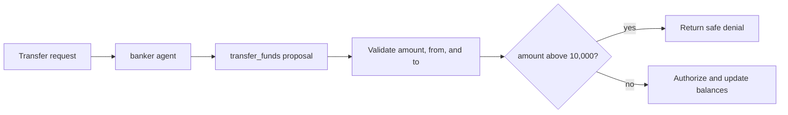

By the end of this guide, a transfer agent can propose `transfer_funds`, while
a native policy prevents amounts above `10_000` from reaching the tool handler.
The example is deterministic and needs no model-provider credential.

Native policy support is included in `@purista/harness`; no optional dependency
is required. Start from an application that already registers a model, a typed
tool, and an agent allowed to use that tool.

## See the finished boundary



The policy controls the proposed amount. The handler still owns account
authorization, the latest balance, transaction semantics, and the final state
change.

## 1. Define the tool contract and trusted state

The tool schema defines the value that both the handler and the policy receive.
Account balances stay in application-owned state; the model cannot supply a
trusted balance.

```ts title="src/policy/transferSchemas.ts"
const transferInput = z.object({
	from: z.string(),
	to: z.string(),
	amount: z.number().positive(),
})

const transferOutput = z.object({
	ok: z.boolean(),
	fromBalance: z.number(),
	toBalance: z.number(),
})

const balances = {
	checking: 5_000,
	savings: 2_500,
	brokerage: 0,
}
```

Invalid tool arguments fail schema validation before governance or the handler
runs. Governance therefore does not need to repeat shape validation.

## 2. Register the model, tool, and agent

Governance comes after these declarations so its helpers know the valid tool
IDs and the exact input type of each tool.

```ts title="src/createTransferAgentBuilder.ts"
const builder = defineHarness({ name: 'payments' })
	.sandbox(inMemorySandbox())
	.models({
		banker_model: {
			provider,
			model: 'scripted-bank-model',
			capabilities: ['object', 'tool_use'],
		},
	})
	.tool('transfer_funds', {
			description: 'Move money between two authorized bank accounts.',
			input: transferInput,
			output: transferOutput,
			handler: async (_context, input) => {
				const currentFrom = balances[input.from] ?? 0
				const currentTo = balances[input.to] ?? 0

				// Recheck trusted state immediately before the side effect.
				if (currentFrom < input.amount) {
					throw new Error('Transfer rejected by the account service.')
				}

				balances[input.from] = currentFrom - input.amount
				balances[input.to] = currentTo + input.amount
				return {
					ok: true,
					fromBalance: balances[input.from] ?? 0,
					toBalance: balances[input.to] ?? 0,
				}
			},
	})
	.agent('banker', {
		model: 'banker_model',
		input: z.string(),
		output: z.string(),
		instructions: 'Use transfer_funds for the requested transfer, then summarize the result.',
		tools: ['transfer_funds'],
	})
```

| Declaration | What it establishes |
| --- | --- |
| `.models(...)` | A model alias with the structured-output and tool-use capabilities required by this agent |
| `.tool('transfer_funds', definition)` | The validated `transfer_funds` contract and the only code allowed to mutate balances |
| `tools: ['transfer_funds']` | The agent may propose this custom tool; governance cannot add a tool that is absent here |

API details for this builder section:
[`defineHarness(...)`](/handbook/api/functions/_purista_harness.defineHarness/),
[`HarnessBuilder.sandbox(...)`](/handbook/api/interfaces/_purista_harness.HarnessBuilder/#sandbox),
[`HarnessBuilder.models(...)`](/handbook/api/interfaces/_purista_harness.HarnessBuilder/#models),
[`HarnessBuilder.tool(...)`](/handbook/api/interfaces/_purista_harness.HarnessBuilder/#tool), and
[`HarnessBuilder.agent(...)`](/handbook/api/interfaces/_purista_harness.HarnessBuilder/#agent).

The maintained example injects a scripted `ModelProvider`. Replace it with a
real configured provider in production; the governance code remains provider
neutral.

## 3. Add one deny rule

Call `.governance(...)` after registering the agent, then call `.build()` once. The
`rule(...)` helper infers `input.amount` from `transferInput` because the rule
selects `transfer_funds`.

```ts title="src/createTransferHarness.ts"
const harness = builder
	.governance(({ native, rule }) => ({
		defaultEffect: 'allow',
		policies: [
			native({
				id: 'bank-transfer-policy',
				version: '1',
				description: 'Controls transfer execution.',
				rules: [
					rule({
						id: 'hard-transfer-limit',
						description: 'Reject transfers above the fixed safety limit.',
						tools: ['transfer_funds'],
						effect: 'deny',
						when: ({ input }) => input.amount > 10_000,
						reasonCode: 'hard_limit',
					}),
				],
			}),
		],
	}))
	.build()
```

Read the configuration from the outside in:

| Field or helper | What to choose | Runtime effect |
| --- | --- | --- |
| `.governance(...)` | One governance configuration per Harness | Enables the optional policy layer |
| `native(...)` | A stable policy `id`, optional version/description, and related rules | Evaluates the rules in-process; no service call is made |
| `rule(...)` | Stable rule ID, selected tools, effect, optional predicate and reason code | Evaluates one typed condition for matching tools |
| `tools` | The smallest explicit list of affected tool IDs | Narrows both matching and TypeScript input inference |
| `effect: 'deny'` | Use when a match must stop the call | Prevents the handler from starting |
| `when` | Return `true` only when this rule matches | May be synchronous or asynchronous and is bounded by the decision deadline |
| `reasonCode` | A stable lowercase code, never free-form input | Adds content-free evidence for tests, events, and audit |
| `defaultEffect: 'allow'` | Use for this exception-list design | Calls that match no rule may continue |

Omitting `tools` makes the rule eligible for every custom and built-in tool.
Prefer an explicit selector for a business rule. A misspelled selected tool or
an invalid `input` property fails at TypeScript/build validation rather than at
runtime.

## 4. Run an allowed and denied request

The maintained example opens a session, streams the agent, and shuts the
Harness down in a `finally` block:

```ts title="src/runTransfer.ts"
const session = await harness.getSession('bank-demo')

try {
	const result = await session.agents.banker.run('Transfer 250 from checking to savings.')
	console.log(result)
} finally {
	await harness.shutdown()
}
```

Run the deterministic tests:

```bash title="Verify the first policy"
npm run typecheck --workspace @purista/bank-governance-example
npm test --workspace @purista/bank-governance-example
```

The expected evidence is:

| Request | Expected state |
| --- | --- |
| Transfer `250` from `checking` | The handler runs and the checking balance becomes `4_750` |
| Transfer `12_000` from `checking` | A `policy.evaluated` event identifies `hard-transfer-limit`; balances remain unchanged |

A denial is returned to the default agent loop as a safe tool failure. The
model may respond to that failure, but it cannot force the denied handler to
run. Do not assert only the final prose response; assert the protected state and
the content-free policy event.

## 5. Check the unhappy paths

Native governance fails closed when a predicate throws, times out, is
cancelled, or returns a non-boolean value. The protected handler must not run.
The same rule applies to invalid external decisions, missing required approval,
and configured audit failures.

Use [effects, defaults, and precedence](/handbook/harness/secure-and-govern/governance-policies/choose-effects-defaults-and-precedence/)
before adding more rules. Then add [immediate approval](/handbook/harness/secure-and-govern/approval-and-audit/)
for a decision that must complete inside the current run.

API reference: [`HarnessBuilder.governance(...)`](/handbook/api/interfaces/_purista_harness.HarnessBuilder/#governance),
[`GovernanceDefinitionHelpers`](/handbook/api/interfaces/_purista_harness.GovernanceDefinitionHelpers/), and
[`NativePolicyRuleForTool`](/handbook/api/interfaces/_purista_harness.NativePolicyRuleForTool/).
