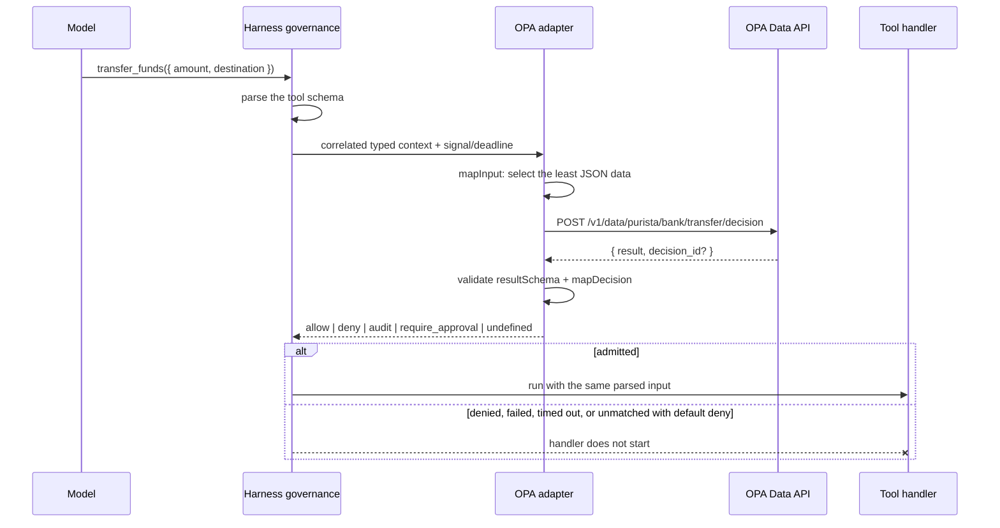

Use `@purista/harness-policy-opa` when your organization already owns Rego
policies or wants policy decisions to run outside the agent process. At the end
of this page, one typed tool occurrence is reduced to a minimal JSON document,
checked by OPA, validated locally, and admitted or denied before its handler
starts.

This package is optional. Native TypeScript rules remain the lower-effort choice
for a small application-owned rule. OPA becomes useful when policy authors,
bundle rollout, shared policy data, or several runtimes need one external
decision boundary.

Do not use an OPA result as proof of caller identity. Authentication,
principal/tenant resolution, resource loading, and final transactional
authorization remain application responsibilities.

## Follow one bounded decision path



The transport never evaluates Rego in the Harness process. The same client
works with a localhost daemon, sidecar, Kubernetes service, service-mesh route,
or hosted internal OPA because only the fixed Data API base URL changes.

## Install the focused package

```bash title="Install the OPA policy adapter"
npm install @purista/harness-policy-opa zod
```

The addon has no OPA SDK and no model-provider dependency. It uses the platform
`fetch` implementation and public Harness governance/Standard Schema contracts.
Package installation does not provision OPA, load a bundle, or configure
credentials.

## Start the maintained policy locally

The maintained example includes this Rego package:

```text title="policy/transfer.rego"
package purista.bank.transfer

default decision := {
  "matched": true,
  "effect": "deny",
  "ruleId": "opa_transfer_default_deny",
  "reasonCode": "policy_default_deny",
}

decision := {
  "matched": true,
  "effect": "allow",
  "ruleId": "opa_transfer_allow",
  "reasonCode": "policy_allow",
} if {
  input.tool == "transfer_funds"
  input.amount <= 1000
  startswith(input.destination, "acct_")
}

decision := {
  "matched": true,
  "effect": "deny",
  "ruleId": "opa_transfer_limit",
  "reasonCode": "transfer_limit",
} if {
  input.tool == "transfer_funds"
  input.amount > 1000
}
```

Run the reviewed example version from
[`examples/opa-governance`](https://github.com/puristajs/harness/tree/main/examples/opa-governance):

```bash title="Start the maintained OPA policy"
docker run --rm \
  --name purista-opa-example \
  -p 127.0.0.1:8181:8181 \
  -v "$(pwd)/policy:/policy:ro" \
  openpolicyagent/opa:1.17.0 \
  run --server --addr=0.0.0.0:8181 /policy
```

Verify the engine and any configured bundle/plugin readiness before accepting
protected work:

```bash title="Check OPA readiness"
curl --fail 'http://127.0.0.1:8181/health?bundles&plugins'
```

Pin and review the OPA image and policy bundle in production. The example tag
is a reproducible tutorial input, not an instruction to stop reviewing OPA
releases.

## Wire the typed adapter

The following is the important part of the maintained example. Its local model
is deterministic, so no model credential is needed.

```ts title="src/index.ts"
import { defineHarness } from '@purista/harness'
import { createOpaClient, opaPolicy } from '@purista/harness-policy-opa'
import { z } from 'zod'

const opaTransferDecision = z.object({
  matched: z.boolean(),
  effect: z.enum(['allow', 'deny', 'audit', 'require_approval']),
  ruleId: z.string().optional(),
  reasonCode: z.string().regex(/^[a-z][a-z0-9_]{0,63}$/).optional(),
})

const opa = createOpaClient({
  baseUrl: process.env.OPA_URL ?? 'http://127.0.0.1:8181',
  ...(process.env.OPA_TOKEN
    ? { headers: { authorization: `Bearer ${process.env.OPA_TOKEN}` } }
    : {}),
})

const harness = defineHarness()
  .tool('transfer_funds', {
      description: 'Execute a synthetic transfer after policy evaluation.',
      input: z.object({
        amount: z.number().positive(),
        destination: z.string().min(1),
      }),
      output: z.object({ accepted: z.boolean() }),
      handler: async () => ({ accepted: true }),
  })
  .governance((helpers) => ({
    mode: 'enforce',
    defaultEffect: 'deny',
    policies: [
      opaPolicy(helpers, {
        id: 'opa-transfer-policy',
        version: '2026-08-30',
        client: opa,
        decisionPath: ['purista', 'bank', 'transfer', 'decision'],
        mapInput(context) {
          if (context.toolId !== 'transfer_funds') return undefined
          return {
            tool: context.toolId,
            amount: context.input.amount,
            destination: context.input.destination,
          }
        },
        resultSchema: opaTransferDecision,
        mapDecision(result) {
          if (!result.matched) return undefined
          return {
            effect: result.effect,
            ...(result.ruleId === undefined ? {} : { ruleId: result.ruleId }),
            ...(result.reasonCode === undefined ? {} : { reasonCode: result.reasonCode }),
          }
        },
      }),
    ],
  }))
  .build()
```

This composition starts with
[`defineHarness(...)`](/handbook/api/functions/_purista_harness.defineHarness/),
registers the protected tool through
[`HarnessBuilder.tool(...)`](/handbook/api/interfaces/_purista_harness.HarnessBuilder/#tool),
attaches the typed policy registry through
[`HarnessBuilder.governance(...)`](/handbook/api/interfaces/_purista_harness.HarnessBuilder/#governance),
and materializes the immutable runtime with
[`HarnessBuilder.build()`](/handbook/api/interfaces/_purista_harness.HarnessBuilder/#build).

Every introduced field has one job:

| Call or field | Meaning |
| --- | --- |
| `createOpaClient({ baseUrl })` | Fixes the trusted OPA destination at composition. It is never selected from tool/model input. |
| `headers` | Optional static gateway authorization. Prefer workload identity or mTLS when the platform owns it. |
| `opaPolicy(helpers, ...)` | Registers a `GovernancePolicyEvaluator` while retaining all tool IDs and schema-derived inputs available at this builder stage. |
| `id` / `version` | Stable content-free source identity recorded in Harness decision evidence. Version should identify the policy/bundle rollout, not contain policy text. |
| `decisionPath` | Non-empty path segments appended below `/v1/data`; each segment is checked and URL encoded independently. |
| `mapInput(context)` | Required least-data projection. Narrowing `toolId` narrows `context.input`. `undefined` means this policy does not apply and performs no request. |
| `resultSchema` | Standard Schema validator for OPA's `result`; transforms are supported when their output remains JSON. |
| `mapDecision(result, context)` | Explicit mapping to Harness `allow`, `deny`, `audit`, `require_approval`, or `undefined`. Core validates the final closed result. |
| `defaultEffect: 'deny'` | Denies when no configured execution policy returns a decision, including OPA's undefined-document response. |

`helpers.adapter(...)` by itself is only a type-preserving registration helper.
It does not create a client. `opaPolicy(...)` is the focused implementation that
uses that helper.

## Understand the Data API envelope

For the decision path above, the adapter sends exactly one request:

```http title="OPA Data API request"
POST /v1/data/purista/bank/transfer/decision
Content-Type: application/json

{"input":{"tool":"transfer_funds","amount":250,"destination":"acct_savings"}}
```

OPA may return:

```json title="OPA Data API response"
{
  "decision_id": "optional-opa-correlation-id",
  "result": {
    "matched": true,
    "effect": "allow",
    "ruleId": "opa_transfer_allow",
    "reasonCode": "policy_allow"
  }
}
```

Unknown top-level envelope fields are ignored for OPA forward compatibility.
`decision_id` is exposed by direct `client.query(...)` results but is not added
to Harness events automatically. A success envelope with no `result` is an
undefined OPA document, not a transport error. A present JSON `null` is a
defined result and must pass the selected schema.

## Configure limits and transport

| `OpaClientOptions` field | Default | Validation and consequence |
| --- | --- | --- |
| `baseUrl` | required | Absolute credential-free HTTP(S) base URL with no query/fragment. A trailing slash is normalized. |
| `headers` | none | Static valid headers. `content-type`, `content-length`, `host`, `connection`, `transfer-encoding`, and line breaks are rejected. |
| `fetch` | platform `fetch` | Injection point for deterministic tests or a controlled application transport wrapper. |
| `timeoutMs` | `10_000` | Positive safe integer. The effective deadline is the earlier of this value and the Harness callback deadline. |
| `maxResponseBytes` | `262_144` | Positive safe integer, maximum 4 MiB. Enforced while reading the stream even if `Content-Length` is missing or false. |

Decision-path segments cannot be empty, `.`, `..`, longer than 256 characters,
or contain slash, backslash, or control characters. Redirects use
`redirect: 'error'`, and the client never retries. This prevents a trusted URL
from silently forwarding credentials/input and avoids evaluating a second
possibly different policy revision inside one immediate decision.

Harness also bounds the complete evaluator with `defaults.decisionTimeoutMs`
(default `10_000`) and the remaining tool/run budget. The adapter forwards the
linked signal and absolute deadline. A deadline stops waiting; it cannot cancel
work that an external server has already completed.

## Keep the deployment boundary explicit

| Topology | Typical `baseUrl` | Application/platform work |
| --- | --- | --- |
| Local developer OPA | `http://127.0.0.1:8181` | Start the pinned process/container and load the reviewed file. |
| Pod sidecar | `http://127.0.0.1:8181` | Sidecar lifecycle, readiness ordering, bundle source, and pod resource limits. |
| Kubernetes service | `http://opa.policy-system.svc.cluster.local:8181` | Service discovery, NetworkPolicy, workload identity/mTLS, replicas, readiness, and rollout. |
| Internal hosted OPA | fixed internal HTTPS URL | TLS trust, gateway identity, egress allowlist, availability, and incident ownership. |

In Kubernetes, gate the application Pod or workload readiness on the selected
OPA topology's `/health?bundles&plugins` response when bundles/plugins matter.
Keep runtime evaluation fail closed even after readiness succeeds. Do not add a
fallback allow path when OPA becomes unavailable.

OPA decision logs can include both input and result. Minimize `mapInput`, enable
OPA masking for sensitive fields, and define access, retention, and export
controls. The addon never logs request/response content, but it cannot control
what the OPA deployment records.

## Handle failures without leaking policy data

| Error | Meaning | What to check |
| --- | --- | --- |
| `OpaClientError` `aborted` | Parent run/tool cancellation won. | Caller cancellation and remaining run/tool budget. |
| `deadline_exceeded` | Client or inherited decision deadline expired. | OPA latency, network path, bundle/data load, and timeout sizing. |
| `transport` | Fetch/body transport failed. | DNS, service/sidecar readiness, TLS, NetworkPolicy, gateway, or connection health. |
| `http` | OPA returned non-2xx; numeric `status` is retained. | Authentication, path, policy compile/load state, and OPA logs. |
| `invalid_content_type` | Successful response was not JSON. | Proxy/route mistakes or an unexpected endpoint. |
| `response_too_large` | Body exceeded the configured stream bound. | Return a small decision object; do not raise limits to transport large policy data. |
| `malformed_response` | JSON or Data API envelope was invalid. | Endpoint compatibility and proxy response rewriting. |
| `OpaPolicyError` | Input mapping, JSON check, result validation, or decision mapping failed. | Application mapper/schema code and its deterministic fixtures. |

These errors intentionally omit URL, path, headers, request input, response
body, schema issue text, and original exception. Harness converts evaluator
failure/timeout into its fail-closed decision error; the protected handler does
not start.

## Test mapping and enforcement separately

Use the strict protocol fake for routine application tests:

```ts title="src/index.test.ts"
import { createOpaClient } from '@purista/harness-policy-opa'
import { FakeOpaDataApi } from '@purista/harness-policy-opa/testing'

const api = new FakeOpaDataApi()
api.enqueueDecision({
  matched: true,
  effect: 'deny',
  ruleId: 'opa_transfer_limit',
  reasonCode: 'transfer_limit',
})

const client = createOpaClient({
  baseUrl: 'https://opa.example.test/',
  fetch: api.fetch,
})

const result = await runOpaGovernanceScenario(
  { amount: 1_500, destination: 'acct_brokerage' },
  client,
)

expect(result.handlerCalls).toBe(0)
expect(JSON.parse(String(api.requests[0]?.init.body))).toEqual({
  input: {
    tool: 'transfer_funds',
    amount: 1_500,
    destination: 'acct_brokerage',
  },
})
api.assertExhausted()
```

`FakeOpaDataApi` scripts only the supported HTTP envelope. It does not parse
Rego. Keep two test layers:

1. Offline Harness tests prove exact minimized input, validated mapping,
   allow/deny/default-deny behavior, failure/cancellation, and handler
   suppression.
2. Selected real-OPA tests prove the deployed OPA version accepts the Rego,
   loads the intended bundle/data, and returns the expected document for
   reviewed policy cases.

Run the complete credential-free example:

```bash title="Verify the maintained example"
cd examples/opa-governance
npm install
npm run typecheck
npm test
npm run build
```

## Keep Cedar and custom engines separate

This package is not a generic policy HTTP client. Cedar defines an
authorization model rather than OPA's Data API:

| Engine | Correct integration boundary |
| --- | --- |
| Embedded Cedar | One selected in-process runtime plus application-owned policy/schema/entity snapshot lifecycle. |
| AWS Verified Permissions | AWS SDK `IsAuthorized` against a named policy store with region, credentials, quotas, and PARC/entity mapping. |
| Custom policy service | A focused application-owned `GovernancePolicyEvaluator` with its own versioned request/result schema and authenticated client. |

Do not invent a generic “Cedar URL” or send Cedar/AWS calls through the OPA
client. If another engine becomes common enough for a package, give that exact
runtime/service its own adapter, tests, security model, and operations guide.

## Verify the exact API

- [`createOpaClient(...)`](/handbook/api/functions/_purista_harness-policy-opa.createOpaClient/)
- [`opaPolicy(...)`](/handbook/api/functions/_purista_harness-policy-opa.opaPolicy/)
- [`OpaClientOptions`](/handbook/api/interfaces/_purista_harness-policy-opa.OpaClientOptions/)
- [`OpaPolicyOptions`](/handbook/api/interfaces/_purista_harness-policy-opa.OpaPolicyOptions/)
- [`OpaClientError`](/handbook/api/classes/_purista_harness-policy-opa.OpaClientError/)
- [`OpaPolicyError`](/handbook/api/classes/_purista_harness-policy-opa.OpaPolicyError/)
- [`FakeOpaDataApi`](/handbook/api/classes/_purista_harness-policy-opa_testing.FakeOpaDataApi/)
- [`GovernancePolicyEvaluator`](/handbook/api/interfaces/_purista_harness.GovernancePolicyEvaluator/)

Official engine references: [OPA REST API](https://www.openpolicyagent.org/docs/rest-api),
[integration options](https://www.openpolicyagent.org/docs/integration),
[deployment](https://www.openpolicyagent.org/docs/deployments), and
[decision logs/masking](https://www.openpolicyagent.org/docs/management-decision-logs).

Next, [test every governance path](/handbook/harness/secure-and-govern/governance-policies/test-governance-policies/) and
[record content-free audit evidence](/handbook/harness/secure-and-govern/record-audit-evidence/) before enabling
the policy in production.
