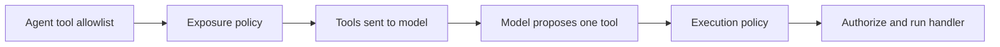

Execution policy decides whether a prepared call may run. Exposure policy acts
earlier: it decides whether a tool appears in the list sent to the model for a
step. Shadow mode lets both kinds of policy emit evidence without applying the
new restriction.

## Do not confuse exposure with authorization



Hiding a tool improves least privilege and model behavior, but it is not a
security boundary by itself. Keep execution policy and handler authorization
for any sensitive side effect.

## 1. Add an exposure rule

This rule hides `transfer_funds` unless the agent runs inside the
`approved-transfer` workflow:

```ts title="src/policy/transferExposure.ts"
createTransferAgentBuilder(provider).governance(({ exposureRule }) => ({
	exposure: {
		id: 'transfer-exposure',
		version: '1',
		defaultEffect: 'expose',
		rules: [
			exposureRule({
				id: 'hide-transfer-outside-workflow',
				tools: ['transfer_funds'],
				effect: 'hide',
				when: ({ workflowId }) => workflowId !== 'approved-transfer',
			}),
		],
	},
}))
```

The [`HarnessBuilder.governance(...)`](/handbook/api/interfaces/_purista_harness.HarnessBuilder/#governance)
callback runs after the builder knows the selected tool IDs.

| Field | Default | Runtime effect |
| --- | --- | --- |
| `exposure.id` | `governance.exposure` | Stable source identity for exposure evidence |
| `exposure.version` | none | Records the deployed exposure-policy version |
| `exposure.defaultEffect` | `expose` | Applies when no exposure rule matches |
| `rules` | none | Evaluated for each eligible tool before the model step |
| `rule.tools` | every tool | Limits the rule and narrows its typed `toolId` |
| `rule.effect` | required | `expose` keeps the tool; `hide` removes it |
| `rule.when` | always matches | Boolean or async predicate bounded by the decision deadline |

When several exposure rules match, `hide` wins. A callback error, timeout,
cancellation, or non-boolean result fails closed before the model call.

## 2. Observe a new policy in shadow mode

Set `mode: 'shadow'` while validating a policy against real execution paths:

```ts title="src/policy/transferGovernance.ts"
createTransferAgentBuilder(provider).governance(({ native, rule }) => ({
	mode: 'shadow',
	defaultEffect: 'allow',
	policies: [
		native({
			id: 'bank-transfer-policy',
			version: '2-candidate',
			rules: [
				rule({
					id: 'hard-transfer-limit',
					tools: ['transfer_funds'],
					effect: 'deny',
					when: ({ input }) => input.amount > 10_000,
					reasonCode: 'hard_limit',
				}),
			],
		}),
	],
}))
```

This is the same
[`HarnessBuilder.governance(...)`](/handbook/api/interfaces/_purista_harness.HarnessBuilder/#governance)
configuration with `mode: 'shadow'` selected.

In shadow mode:

- execution-policy allow, deny, audit, and approval decisions are evaluated and
  observable but are not enforced;
- exposure `hide` decisions are observable but the tool stays visible;
- policy-driven approval is not requested; and
- static built-in-tool permission approval still applies.

Shadow mode is not a safety control. Keep the existing enforced policy active
until the candidate is ready, or run the candidate in a separate canary
composition. Do not use shadow mode as the only protection for a sensitive
action.

## 3. Promote with evidence

Before changing `mode` to `enforce`:

1. test allow, deny, unmatched, precedence, approval, and failure paths
   deterministically;
2. verify `policy.evaluated` and `policy.exposure` counts by stable policy,
   version, rule, effect, and `enforced` status;
3. investigate unexpected matches without logging tool input;
4. verify approval and audit dependencies under timeout and cancellation; and
5. deploy the policy version to a bounded canary before broad rollout.

With an audit sink configured, shadow records use `enforced: false`. Run events
carry the same content-free distinction. A configured audit failure still fails
closed because the application declared evidence retention as required.

## 4. Test the visible tool list

Use a scripted model provider that records requests. For an enforced hide rule,
assert that `transfer_funds` is absent from the request sent to the model. For
shadow mode, assert that it remains present while a `policy.exposure` event has
`enforced: false`.

Handler-state assertions alone cannot prove exposure behavior because exposure
runs before the model proposes a tool. Continue with the complete
[governance test guide](/handbook/harness/secure-and-govern/governance-policies/test-governance-policies/).

API reference: [`GovernanceToolExposurePolicy`](/handbook/api/interfaces/_purista_harness.GovernanceToolExposurePolicy/),
[`GovernanceToolExposureRuleForTool`](/handbook/api/interfaces/_purista_harness.GovernanceToolExposureRuleForTool/), and
[`GovernanceMode`](/handbook/api/types/_purista_harness.GovernanceMode/).
