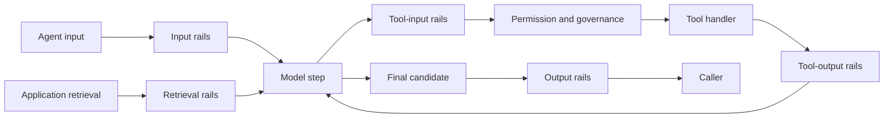

Guardrails place explicit checks around content that enters or leaves an agent,
a selected tool, or an application-owned retrieval step. Use them to block a
known unsafe value, normalize a value, remove sensitive material, or apply a
semantic content check before release.

The feature is optional. `@purista/harness` supplies the interception boundary;
the separate `@purista/harness-guardrails` package supplies typed actions,
ordered flows, sensitive-data integration, and model-backed checks.

Start with [the first guarded agent](./build-the-first-guarded-agent/). It is a
complete local program with an allowed request, a blocked request, an expected
result, and a deterministic assertion that the blocked request never reached
the model provider.

## Know what Guardrails do

Every rail returns `allow`, `block`, or a transform valid for its phase. A
block stops that path. An invalid configuration, thrown evaluator, invalid
result, timeout, or cancellation fails closed instead of silently allowing the
content.

The [Guardrails overview](/harness/guardrails/) shows the same
phase model and package boundary for technical evaluators; this handbook graph
owns the implementation steps and exact configuration.

Guardrails are not interchangeable with the other control layers:

| Question | Canonical control |
| --- | --- |
| Is this caller allowed to perform the business action? | Application authentication and authorization |
| May this prepared tool call run or require approval? | [Govern agent actions](/handbook/harness/secure-and-govern/) |
| May this exact content cross the selected phase? | Guardrails |
| May the tool access this file, process, network, or tenant boundary? | [Isolate agent execution](/handbook/harness/secure-and-govern/sandbox-and-mcp/) |

A later rail cannot undo a tool side effect that already ran. Put a check before
the side effect when its outcome must determine admission.

## Choose the phase from the value you protect

| Phase | Protected value | Runs | Transform target | Typical use |
| --- | --- | --- | --- | --- |
| `input` | Validated agent input | Before instructions and the first model request | `user_message` | Block an instruction override; normalize a question |
| `tool_input` | One selected tool's wire arguments | Before tool schema preparation, permissions, governance, approval, and handler execution | `tool_input` | Remove a secret from one exact tool field |
| `tool_output` | Schema-validated tool result | Before the result returns to the model loop | `tool_output` | Reduce an internal result to a public projection |
| `output` | Final candidate result | Before the caller receives it | `bot_message` | Remove internal markers from the final answer |
| `retrieval` | Application-supplied retrieved chunks | When application retrieval calls `filterRetrievedChunks(...)` | No content rewrite; allow or block chunks | Exclude documents that fail a release rule |

Tool actions must name a non-empty `tools` selector. Guardrails do not recurse
through arbitrary JSON or guess which field is sensitive. Validate the exact
value and bind a reviewed codec when a structured tool value needs text
inspection.

## Follow one implementation path

1. [Build the first guarded agent](./build-the-first-guarded-agent/) with one
   deterministic input action and verify the provider was not called on block.
2. [Configure actions and phase flows](./configure-actions-and-phase-flows/)
   to add ordered allow, block, and transform decisions and understand every
   action and flow option.
3. [Protect tool input and output](./protect-tool-input-and-output/)
   when one selected tool's wire arguments or validated result needs a content
   boundary.
4. [Use a model-backed Guardrail](../model-backed-guardrails/) only when a
   deterministic check cannot express the content decision. Register its model
   alias before the protected agent and evaluate its quality separately.
5. [Select a privacy detector](../privacy-detectors/) when the task is
   sensitive-data detection. Install exactly the adapter and external runtime
   the selected detector requires.
6. [Test Guardrail enforcement](../test-guardrails/) at direct-action,
   deterministic Harness, selected-adapter, and live-evaluation boundaries.

## Availability and enablement

| Capability | Default after installing `@purista/harness` | Additional requirement |
| --- | --- | --- |
| Guardrail binding and actions | Unavailable | Install `@purista/harness-guardrails`, define actions/flows, and set `guardrails` on each protected default-loop agent |
| Deterministic custom action | Available after addon installation | Application-owned TypeScript evaluator |
| Model-backed action | Available after addon installation | A separately registered Harness model alias with the capability required by the check |
| Sensitive-data actions | Available after addon installation | One application-selected `SensitiveDataDetector` implementation |
| Native privacy detector | Unavailable | Install `@purista/harness-guardrails-native-privacy`; verify platform binary support |
| Presidio detector | Unavailable | Install `@purista/harness-guardrails-presidio`; provision and secure an application-owned Presidio sidecar |
| Local NER detector | Unavailable | Install `@purista/harness-guardrails-local-ner` and its optional Transformers peer; provision model files before startup |

Installation never protects an agent automatically. Set `guardrails: rails`
inside each protected default-loop agent definition. The Harness resolves that
binding during agent registration and `.build()` validates every referenced
tool and model alias before the runtime can start.

## Observe decisions without retaining content

Each evaluation emits a content-free `GUARDRAIL` span, an outcome counter, and
a duration metric. A normal `block` is an enforcement decision, not a tracing
error. Evaluation failure is an operational error and remains fail-closed.

Keep `telemetry({ contentCaptureMode: 'NO_CONTENT' })` for production unless the
application has a reviewed retention and access policy. Record stable
`reasonCode` and failure categories—not prompts, matched text, tool values,
retrieved documents, model output, detector offsets, or callback exceptions.

Direct model calls and custom-handler agents are outside automatic enforcement;
their application code owns its own release checks. Guardrails do not inspect
opaque provider reasoning.

API reference: [`defineGuardrailAction(...)`](/handbook/api/functions/_purista_harness-guardrails.defineGuardrailAction/),
[`defineGuardrails(...)`](/handbook/api/functions/_purista_harness-guardrails.defineGuardrails/),
[`AgentDefinition.guardrails`](/handbook/api/types/_purista_harness.AgentDefinition/#signature), and
[`Guardrails.filterRetrievedChunks(...)`](/handbook/api/classes/_purista_harness-guardrails.Guardrails/#filterretrievedchunks).
